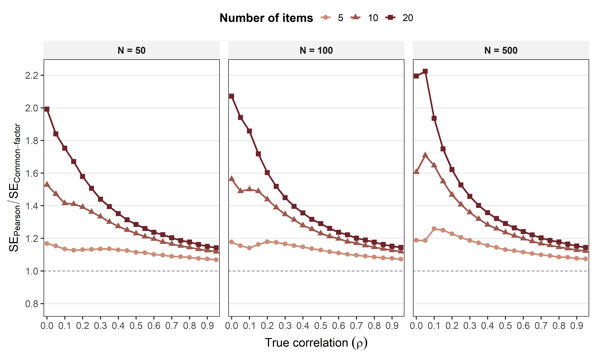
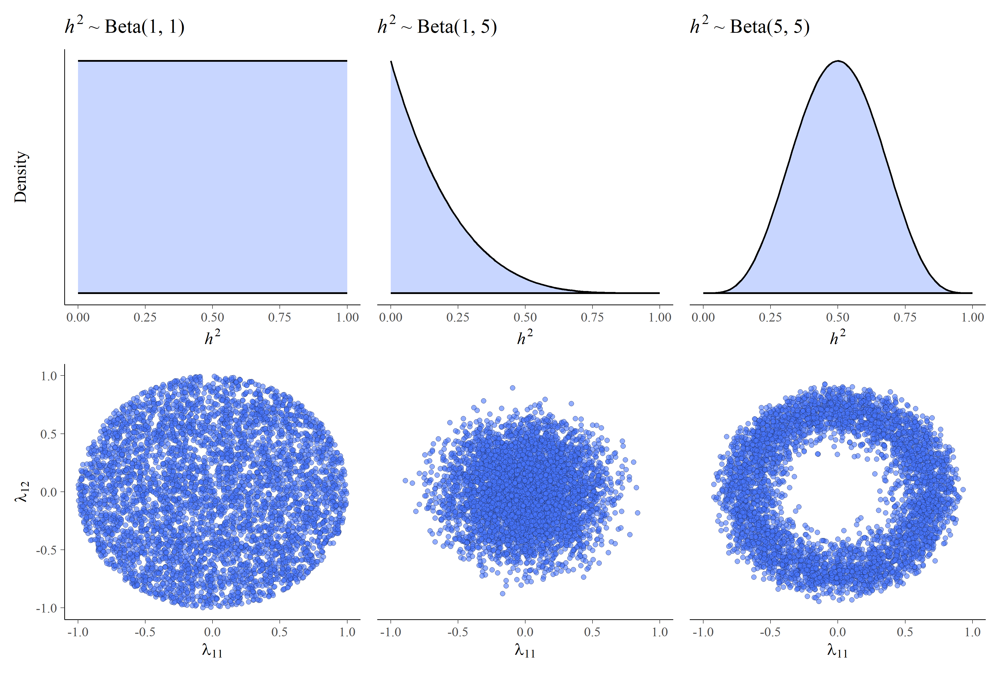
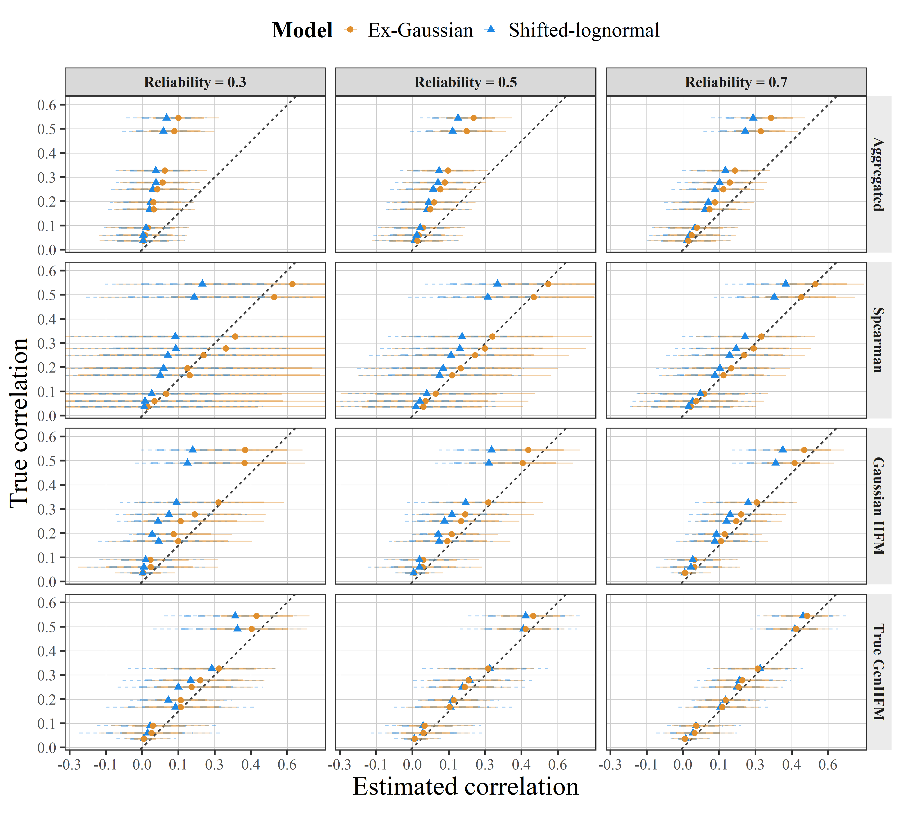
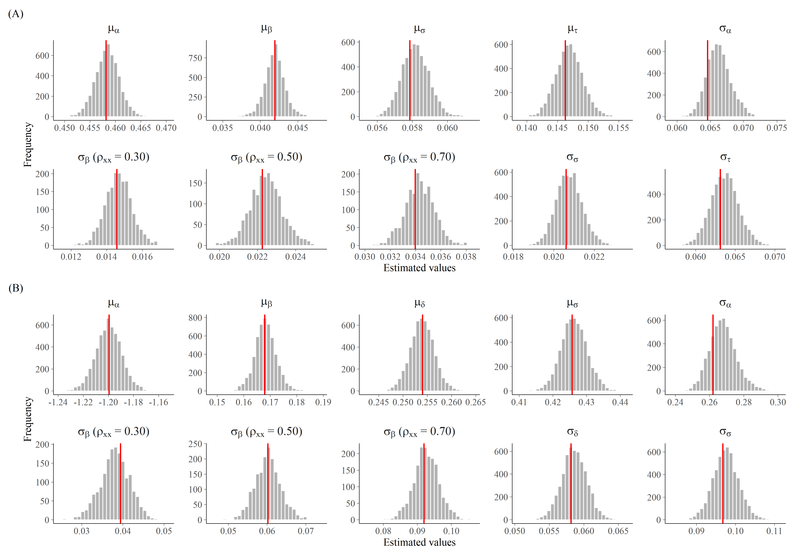
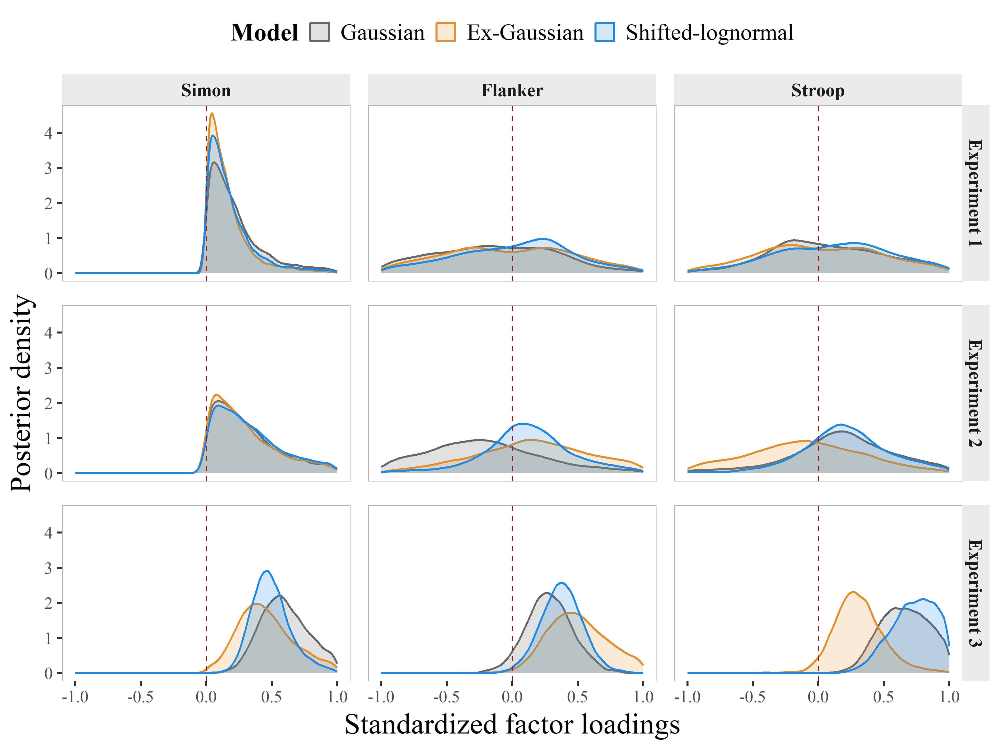
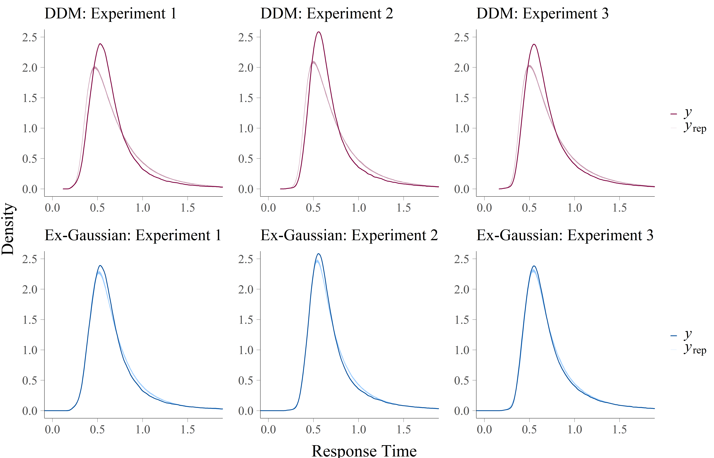
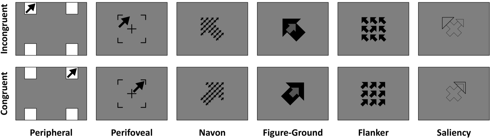

Almost seven decades ago, Cronbach [-@Cronbach1975; -@cronbach1957two] highlighted the need to unify psychology’s "two disciplines", *experimental* and *correlational*. Both branches of psychological research study variability, but at different levels of analysis: experimental psychology examines variability between *conditions*, while correlational research (also referred to as *psychometrics*) focuses on variability between *individuals*. As a result, their conceptualizations of reliability have naturally diverged [@hedge2018]. Experimental psychologists have traditionally defined *reliable effects* as those that replicate systematically across studies (reliability as replicability), whereas psychometricians define *reliable measures* as those that rank individuals consistently across assessments (reliability as consistency). In general, each discipline can address its research questions while disregarding the other’s conception of reliability. However, occasionally experimental psychologists need to rank participants based on their experimental effects (for instance, to correlate them with other variables), which forces them to step outside their comfort zone and pay heed to the psychometric conception of reliability.

Far from being anecdotal, the study of individual differences in experimental settings has gained increasing attention over the past years, spanning areas such as executive control [@ReyMermet2019; @Whitehead2020; @Viviani2024], semantic priming [@Lezama2023; @Andrews2017; @Labalesttra2021], statistical learning [@Pavlidou2019; @Bogaerts2022; @Siegelman2015], human habits [@Nebe2024; @MartinezLopez2025; @Pool2022], unconscious processing [@Vadillo2025; @Yaron2024; @franco2025replicating], and psychopathology [@Duque2015; @SanchezLopez2019; @Everaert2017], among others. Although these domains differ in topic, they rely on the same strategy for studying individual differences and, consequently, are subject to similar limitations. We illustrate this reasoning by focusing on executive control tasks, while noting that the same logic applies to all the experimental domains mentioned above.

Within the domain of executive control, a paradigmatic example is the Stroop effect [@stroop1935], one of the most replicated phenomena in psychology [@MacLeod1991]; so replicated indeed that it has been claimed "everyone Stroops" [@Haaf2017]. The size of the Stroop effect is often defined as a mean difference in response times (RTs) between the congruent condition, that is, trials in which the stimulus meaning and its visual feature align (e.g., the word "red" written in red), and the incongruent condition, in which they conflict (e.g., the word "red" written in green). Although this effect is usually tested at the group-level, numerous studies have examined whether the Stroop effect is related to participant-level variables such as personality or intelligence [@Benedek2014; @Friedman2006; @Block2005; @Johann2022]. To do so, researchers typically compute the RT difference for each participant, obtaining a measure of Stroop effects which can now be correlated. At this point, the primary concern is no longer whether the experimental effect replicates at the group level, but whether it yields consistent and reliable estimates of individual differences.

Unfortunately, experimental measures frequently exhibit low reliability [@hedge2018; @vadillo2021raising; @Enkavi2019; @HernandezGutierrez2024; @GarreFrutos2024]. When this happens and experimental measures do not consistently rank participants, their correlations with other variables are systematically underestimated [@spearman1904proof]. In such cases, a near zero correlation is the most likely outcome and not necessarily evidence of genuine independence. However, it is not uncommon in the experimental literature to find studies that draw strong theoretical conclusions from non-significant correlations. For example, @Salvador2018 concluded that memory suppression can occur unconsciously based on a non-significant correlation between performance and awareness measures in two experiments, although later analyses revealed that the reliability of performance (.59 and .72) and awareness (.26 and -.04) challenged the validity of that inference [@Malejka2021]. A similar example can be found in the habits literature, where @Nebe2024 state that “most of the associations were near zero or even negative, providing strong evidence that the six habit tasks tap into different aspects of habits” (p. 31) while, at the same time, acknowledging that “we do not know the reliability of the used paradigms [...] and it is possible that a lack thereof has led to the lack of associations between tasks” (p. 36). For this reason, low correlations offer no basis for substantive conclusions unless reliability has been properly considered. Otherwise, methodological artifacts can be misinterpreted as theoretical findings, letting unreliable measures shape psychological theories.

Several strategies have been proposed to improve the reliability of experimental measures. These include designing more sensitive or engaging task formats [@franco2025replicating; @kucina2023calibration; @Burgoyne2023AttentionControl; @Viviani2024] and reducing measurement error by replacing difference scores with alternative indices [@Draheim2019; @vandierendonck2016comparison]. Yet, regardless of how tasks are modified or measures are redefined, any attempt to capture individual differences ultimately relies on statistical modeling. And this is a critical point, because the statistical models typically used in experimental psychology were not developed to deal with unreliable measures. 

Actually, when correlations are computed between experimental effects obtained separately for each participant, researchers implicitly assume a model in which each effect is perfectly reliable. Notice that this approach is the default in experimental psychology, yet the underlying assumption that experimental effects have been measured without error is unrealistic and leads to biased correlation estimates. Although methods such as the Spearman correction for attenuation [@spearman1904proof] or hierarchical models [@rouder2019psychometrics; @Haines2025; @Chen2021] can recover the disattenuated correlation, the resulting estimates are often highly uncertain [@rouder2023], which limits the strength of the inferences that can be drawn. This problem of uncertainty has recently motivated the development of *hierarchical factor models* [HFM, @Mehrvarz2025; @Rouder2025HFM], which combine the strengths of hierarchical modeling and psychometric common-factor models to estimate true correlations with greater precision than any previous approach. 

This claim, although highly promising, rests entirely on simulation studies in which trial-level responses are assumed to follow a normal distribution -- the same assumption underlying the HFM itself. However, it remains unknown how this model would perform when applied to data that strongly deviate from normality, such as the characteristically skewed distributions of RTs. For this reason, the present work generalizes the HFM to asymmetric distributions, aiming to compare the performance of these asymmetric models with that of the original Gaussian formulation. As we will show, fitting the Gaussian HFM to asymmetric data can lead to subtle distortions or severe biases, systematically underestimating true correlations and yielding less precise estimates than asymmetric models.

In what follows, we first describe the hierarchical model and its extension into the HFM as currently established in the literature. We then generalize this framework to accommodate asymmetric RT distributions through two parameterizations: the ex-Gaussian [@hohle1965inferred] and the shifted-lognormal [@heathcote2004qmpe]. Next, we highlight another major advantage of the generalized HFM: its ability to assess how effectively each task captures the common factor shared across them, offering a systematic way to compare and validate experimental tasks on empirical grounds. Finally, to make the model more accessible for applied researchers, we reformulate its factor component using a standardized metric, aiming for a representation that is easier to understand, more transparent, and readily applicable across diverse lines of research.

## From Hierarchical to Hierarchical Factor Models

### Hierarchical models: unbiased but inefficient correlations

As noted earlier, estimating correlations between experimental effects by aggregating scores across trials (e.g., aggregated effects, Figure \ref{fig-attempts}A) leads to systematically underestimated correlations. To obtain unbiased correlations, several authors have advocated for the use of hierarchical models [@Behseta2009; @Matzke2017; @rouder2019psychometrics; @Haines2025; @Chen2021], which isolate true experimental effects from measurement error (i.e., trial-level variability arising from repeated measurements). Here, we focus on the hierarchical model proposed by @rouder2019psychometrics and @rouder2023, which has been widely applied to explore correlations across experimental domains, including visual perception [@vanGeert2022], reading [@Staub2021] and, especially, executive control [@Whitehead2020; @rouder2019psychometrics; @rouder2023; @haaf2025attentional]. This model assumes that the observed RT for participant $i$, task $j$, experimental condition $k$, and trial $\ell$ is distributed as
$$
Y_{ijk\ell}\sim\mathrm{Normal}\left(m_{ijk}, \sigma_j\right), \quad \text{where}\quad m_{ijk}=\alpha_{ij}+\beta_{ij}\cdot X_k,
$$ {#eq-rouder-01}

\noindent $X_k\in\left\{-1/2,1/2\right\}$ indicates the experimental condition, $\alpha_{ij}$ is participant $i$'s average RT in task $j$, and $\beta_{ij}$ is the key experimental effect of interest: the difference in average RTs between the two experimental conditions for participant $i$ in task $j$. The trial-level variability is accounted for by the residual standard deviation, $\sigma_j$, which can vary across tasks. 

This hierarchical model is also commonly referred to as a *multilevel*, *linear mixed-effects* or *random-effects model* [@raudenbush2002hierarchical], where $\alpha_{ij}$ and $\beta_{ij}$ are the random intercepts and slopes, respectively, with the joint distribution given by:
$$
\begin{bmatrix}
\boldsymbol{\alpha}\\
\boldsymbol{\beta}
\end{bmatrix} \sim\mathrm{MVNormal}\left(\boldsymbol
\mu = \begin{bmatrix}
\boldsymbol{\mu_\alpha}\\
\boldsymbol{\mu_\beta}
\end{bmatrix},\,\mathbf{\Sigma}=
\begin{bmatrix}
\mathbf{\Sigma}_{\boldsymbol{\alpha}} & \mathbf{\Sigma}_{\boldsymbol{\beta\alpha}}\\
\mathbf{\Sigma}_{\boldsymbol{\alpha\beta}} & \mathbf{\Sigma}_{\boldsymbol{\beta}}
\end{bmatrix}
\right),
$$ {#eq-rouder-02}


\noindent where $\boldsymbol{\mu_\alpha}$ and $\boldsymbol{\mu_\beta}$ are vectors of means (often called *fixed effects*), and $\mathbf{\Sigma}$ captures the covariances of intercepts ($\mathbf{\Sigma_\alpha}$), slopes ($\mathbf{\Sigma_\beta}$), and their cross-covariance ($\mathbf{\Sigma}_{\boldsymbol{\alpha\beta}}=\mathbf{\Sigma}_{\boldsymbol{\beta\alpha}}$) across participants and tasks. Importantly, $\mathbf{\Sigma}_{\boldsymbol{\beta}}$ is the *true* covariance matrix between experimental effects after accounting for measurement error in each task through the residual variance $\sigma_j$. In practice, this means that fitting the model automatically returns an estimate of this true covariance matrix and its associated uncertainty, without the need to estimate the reliability of the measures beforehand. The problem is that this uncertainty often remains too large, leading to wide confidence intervals that limit the precision of the estimated correlations [@rouder2023]^[The uncertainty of the correlation estimates obtained from this hierarchical model is equivalent to that of the Spearman correction for attenuation, unless Bayesian methods are used, such as those employed by @rouder2023 and @Mehrvarz2025. In that case, the difference in uncertainty between the Bayesian and frequentist approaches arises exclusively from the selected prior distributions. A demonstration of this is provided in the Supplementary Material.].

When correlations between experimental effects are estimated using hierarchical models (Figure \ref{fig-attempts}B), researchers implicitly assume that each correlation must be inferred independently, without borrowing information across tasks. However, this assumption is weakly informed, which partly explains why the resulting correlation estimates are often imprecise. Although researchers know they are studying correlations between tasks that should reflect a common underlying process (e.g., inhibition), this theoretical information is not yet incorporated into the model. Clearly, an alternative model is needed.

{#fig-attempts fig-align="center" apa-note="NoNote \fontsize{10}{12}\selectfont \textit{Note.} Squares and circles denote observed and latent variables, respectively. (A) Correlations between observed mean differences (assuming perfect reliability). (B) Correlations between latent random slopes, $\beta_j$, which represent the mean differences in (A) disattenuated for trial-level measurement error. (C) A common latent factor, $\eta$, capturing the shared variance underlying the true correlations."}

### Hierarchical factor models: unbiased and more efficient correlations

Fortunately, psychometricians have spent nearly a century developing factor models designed to explain correlations through latent common causes, as in the measurement of intelligence [@spearman1904general] and personality [@Costa1992]. Psychometricians use factor models to study how many psychological constructs underlie a set of items, and how well each item reflects each construct. Experimental psychologists have similarly used factor models to address these questions in domains including executive functions [@Miyake2000; @Friedman2004], statistical learning [@Siegelman2017; @Kaufman2010], and working memory [@Foster2015; @Burgoyne2025]. Yet, as commonly applied, factor models are not well suited for experimental settings because they rely on correlations between aggregated scores. When attenuation pulls those correlations toward zero, latent dimensions cannot be recovered reliably, which may help explain the lack of stable factor solutions in those domains [see, e.g., @karr2018unity].

Beyond identifying latent dimensions, factor models offer a second, often overlooked advantage. When the underlying factors explain the correlations among the observed variables, the factor model yields more precise estimates of those correlations than conventional pairwise methods such as the Pearson product–moment formula. To illustrate this efficiency gain, we conducted a simple simulation that varied sample size, number of observed variables, and the true correlation $\rho$, equal for all pairs. This pattern is consistent with a one-factor tau-equivalent structure. We generated $R=10,000$ datasets per condition and estimated $R$ correlation matrices using (1) the Pearson product–moment formula and (2) a single-factor model. Finally, we computed the standard error (SE) of each estimator as the standard deviation across the $R$ replications, and we averaged these SEs over pairs to obtain $\overline{SE}_\text{Pearson}$ and $\overline{SE}_\text{Common-factor}$. Figure \ref{fig-SEs} plots the ratio $\overline{SE}_\text{Pearson}\,/\,\overline{SE}_\text{Common-factor}$, where values above 1 indicate higher precision for the factor approach. As shown, increasing the number of observed variables markedly improves precision under the factor model, especially at small $\rho$, where distinguishing small correlations from zero is more difficult. 

{#fig-SEs width="100%" fig-align="center"}

Given that factor models can yield more efficient estimates of correlations, the previous hierarchical model can be reformulated to express the true covariance matrix $\mathbf{\Sigma}_\beta$ (Equation \ref{eq-rouder-02}) in terms of the factor model parameters: 
$$
\mathbf{\Sigma}_{\boldsymbol{\beta}} = \mathbf{\Lambda}\cdot\mathbf{\Phi}\cdot\mathbf{\Lambda}^\prime + \mathbf{\Psi},
$$ {#eq-rouder-03}

\noindent where $\mathbf{\Lambda}$ is the $J\times M$ factor loading matrix that encodes the regression slopes linking the latent factor $m$ to the experimental effect of task $j$ (see Figure \ref{fig-attempts}C), $\mathbf{\Phi}$ is the $M\times M$ common-factors covariance matrix, and $\mathbf{\Psi}$ is a $J\times J$ diagonal matrix of task‐specific unique variances. This decomposition, originally formalized by @Thurstone1947, distinguishes three sources of variance: common variance (shared across the $J$ experimental effects, i.e., $\mathbf{\Lambda}\cdot\mathbf{\Phi}\cdot\mathbf{\Lambda}^\prime$), task‐specific variance ($\mathbf{\Psi}$), and measurement error variance ($\sigma^2_j$, in Equation \ref{eq-rouder-01}).

When we decompose $\mathbf\Sigma_\beta$ as in Equation \ref{eq-rouder-03}, the resulting hierarchical model becomes what @Rouder2025HFM and @Mehrvarz2025 have named "*hierarchical factor models*", which combine hierarchical modeling to capture individual variability with factor modeling to capture shared cognitive processes. This framework is particularly well suited to experimental psychology: it naturally accounts for hierarchical data structures, improves the identification of latent dimensions, and allows researchers to enhance precision through both larger samples and a greater number of tasks. Beyond these practical benefits, however, some of its underlying assumptions remain worth revisiting.

When correlations between experimental effects are estimated using current HFMs, researchers typically assume that the dependent variables (such as RTs) follow a Gaussian distribution. However, this assumption may be unrealistic, as empirical RTs are known to follow skewed distributions [@baayen2010analyzing; @heathcote1991analysis], better approximated by the ex-Gaussian [@hohle1965inferred] or the lognormal [@heathcote2004qmpe]^[An alternative approach is to model RTs using theoretically grounded cognitive process models, such as the drift diffusion model [DDM, @ratcliff1978theory]. In fact, HFMs have already been proposed to estimate individual differences in DDM parameters [@Stevenson2024; @Stevenson2025group].]. @Rouder2025HFM have already acknowledged this potential adaptation to the model. Since the consequences of using Gaussian HFM for skewed RTs are yet unknown, incorporating more realistic distributions into the model was the first main purpose of this work. 

## A generalized and standardized formulation of the Hierarchical Factor Model

The present work has two main goals. First, as mentioned above, we intend to study the impact of using Gaussian assumptions when modeling skewed data, and -- if the impact proves detrimental -- whether the Generalized HFM (GenHFM) can improve parameter estimation. Second, and perhaps more important, to devise a technical architecture for the HFM that enables researchers to easily interpret, not only the correlations between experimental effects, but also the factor loadings themselves. To achieve this, we present a standardized version of the model, which overcomes several challenges specific to Bayesian and exploratory contexts. Details of the model specification will be presented in the following sections, along with a simulation study assessing its feasibility, model fit, and parameter recovery.

Our goal is that, instead of merely interpreting how experimental effects are correlated across tasks, researchers could now assess how *strongly* each task reflects a common process (e.g., inhibition), through the interpretation of standardized factor loadings. Unlike typical approaches in experimental psychology that implicitly assume all tasks measure the same latent process equally well, the HFM explicitly quantifies each task's discriminative power. This quantification allows researchers to compare tasks objectively and to evaluate which ones best capture the measured construct, thus providing a formal and integrated framework for assessing construct validity in experimental psychology. 

As an illustration of the potential of this statistical approach to clarify long-standing problems in experimental research, we use this framework to address a classic question: Do the Stroop, Flanker, and Simon tasks measure the same cognitive construct? [@Whitehead2020]. What happens when we add related tasks such as Peripheral or Perifoveal inhibition? [@Viviani2024]. Crucially, do all these tasks measure the construct equally well? Empirical illustrations of both examples are presented at the end of this work.

# Generalized Hierarchical Factor Model

## Modeling with alternative distributions for response times

The GenHFM modifies only the distributional assumption of RTs in Equation \ref{eq-rouder-01}, while leaving Equations \ref{eq-rouder-02} and \ref{eq-rouder-03} unchanged. Specifically, we replace the Gaussian distribution with two widely used alternatives for modeling RTs: the ex-Gaussian and the shifted lognormal. Other distributional families, such as the gamma, inverse Gaussian, or Weibull, can also be implemented in these models in a straightforward manner.

### Ex-Gaussian hierarchical factor model

Under the ex-Gaussian HFM, RT for participant $i$, task $j$, condition $k$, and trial $\ell$, $Y_{ijk\ell}$, arises from the convolution of Gaussian and exponential distributions [@matzke2009psychological]:
$$
Y_{ijk\ell}\sim\mbox{ex-Gaussian}\left(m_{ijk}, \sigma_{ij},\tau_{ij}\right), \quad \text{where}\quad m_{ijk}=\alpha_{ij}+\beta_{ij}\cdot X_k,
$$ {#eq-GenHFM-01}

The location parameter $m_{ijk}$ defines the mean of the Gaussian component and is decomposed as in @eq-rouder-01: $\alpha_{ij}$ represents the central tendency of the Gaussian component across conditions, and $\beta_{ij}$ captures the experimental effect. The model also includes two additional parameters: $\sigma_{ij}$, the standard deviation of the Gaussian component, and $\tau_{ij}$, the inverse of the exponential rate parameter. Both parameters are allowed to vary across individuals and tasks and, since neither can be negative, we modeled them using normal distributions truncated at zero^[Throughout the manuscript, we use the superscript "+" to denote distributions truncated below at zero, that is, with support $(0, \infty)$. In cases where the upper limit is finite, it will be specified explicitly.]:
$$
\sigma_{ij}\sim\mbox{Normal}^+\left(\mu_{\sigma_j},\,\sigma_{\sigma_j}\right)\quad\mbox{and}\quad\tau_{ij}\sim\mbox{Normal}^+\left(\mu_{\tau_j},\,\sigma_{\tau_j}\right)
$$ {#eq-GenHFM-02}

This formulation accounts for individual and task-level heterogeneity in both components of the RT distribution. Notably, when $\tau_{ij} = 0$, the ex-Gaussian is equivalent to a Gaussian distribution, making the GenHFM equivalent to the Gaussian version.

The parameters of this model can be translated into quantities easier to interpret, such as the mean and variance of RTs in milliseconds, given by
$$
\mathbb{E}[Y_{ijk\ell}] = m_{ijk} + \tau_{ij}\quad\mbox{and}\quad\mathbb{V}[Y_{ijk\ell}]=\sigma^2_{ij} + \tau^2_{ij}.
$$ {#eq-GenHFM-03}

### Shifted-lognormal hierarchical factor model

Under the shifted-lognormal HFM, RT for participant $i$, task $j$, condition $k$, and trial $\ell$ follows a lognormal distribution shifted by a non-decision time parameter:
$$
Y_{ijk\ell}\sim\mbox{Shifted-lognormal}\left(m_{ijk}, \sigma_{ij},\delta_{ij}\right), \quad \text{where}\quad m_{ijk}=\alpha_{ij}+\beta_{ij}\cdot X_k.
$$ {#eq-GenHFM-04}

The location parameter, $m_{ijk}$, determines the mean of the Gaussian distribution on the log-transformed RT scale^[Alternatively, the shifted-lognormal model can be represented as  $\log\left(Y_{ijk\ell}-\delta_{ij}\right)\sim\mbox{Normal}\left(m_{ijk},\sigma_{ij}\right)$,  where $m_{ijk}=\alpha_{ij} + \beta_{ij}\cdot X_k$.]. $\alpha_{ij}$ represents the average log-RT, $\beta_{ij}$ represents the experimental effect in log units, and $\sigma_{ij}$ represents trial-level variability also in log units, for participant $i$ in task $j$. In addition, the shift parameter, $\delta_{ij}$, ensures that predicted RTs remain strictly positive and is commonly interpreted as the duration of non-decision processes such as perceptual encoding or motor execution [@heathcote2004qmpe].

Both $\sigma_{ij}$ and $\delta_{ij}$ vary across individuals and tasks. As in the ex-Gaussian model, we use normal distributions truncated at zero for these parameters. Since $\delta_{ij}$ must not exceed the observed RTs, it is further constrained to lie between zero and the minimum RT for each participant-task combination:
$$
\sigma_{ij}\sim\mbox{Normal}^+\left(\mu_{\sigma_j},\,\sigma_{\sigma_j}\right)\quad\mbox{and}\quad\delta_{ij}\sim\mbox{Normal}^+\left(\mu_{\tau_j},\,\sigma_{\tau_j}\right),\quad\text{with}\quad\delta_{ij}\in\left(0,\,\mbox{min}(Y_{ij\bullet\bullet})\right).
$$ {#eq-GenHFM-05}

In the shifted-lognormal model, the interpretable moments (mean and variance) in the original RT metric are
$$
\mathbb{E}[Y_{ijk\ell}] = \delta_{ij} + \exp\left(m_{ijk} + \frac{\sigma^2_{ij}}{2}\right) \quad\mbox{and}\quad
\mathbb{V}[Y_{ijk\ell}]=\left(\exp(\sigma^2_{ij}) - 1\right) \cdot\exp\left(2\cdot m_{ijk}+\sigma^2_{ij}\right).
$$ {#eq-GenHFM-06}

### Data-generation process under each model

Although both distributions capture the skewed shape of RT data, they reflect different assumptions about how responses are generated. The ex-Gaussian model describes RTs as the sum of two independent components: a symmetric Gaussian component and an exponential component that adds positive skewness. This formulation implies an additive structure in real time [@matzke2009psychological], although it allows for negative RT predictions. In contrast, the shifted-lognormal model naturally constrains RTs to positive values by assuming that log-transformed RTs follow a Gaussian distribution, so that observed RTs result from multiplicative interactions among processing rates, followed by the addition of a shift parameter reflecting non-decision processes [@heathcote2004qmpe]. Choosing between them involves more than statistical fit, as it reflects different theoretical commitments about how cognitive processes unfold over time.

### Reliability in generalized hierarchical factor models

The reliability of experimental effects depends jointly on three elements [@rouder2019psychometrics]: the magnitude of true effect variance ($\sigma^2_\beta$), the amount of trial-level variability ($\sigma^2$), and the number of trials ($L$). Given that $L$ varies widely across experimental designs, @rouder2023 proposed the signal-to-noise ratio (SNR, henceforth denoted as $\gamma^2$) as a trial-independent index of reliability. Specifically, $\gamma^2$ is defined as the ratio between the variance of individual-level effects (signal) and residual variance at the trial level (noise).

For the Gaussian hierarchical model, this ratio simplifies to $\gamma^2=\sigma^2_\beta/\mu^+_{\sigma^2}$^[Throughout the paper, $\mu^+_\bullet$ and $\sigma^+_\bullet$ denote the mean and standard deviation of the zero-truncated normal. The Supplementary Material details their mapping to the untruncated parameterization.]. The same definition holds for the shifted-lognormal model, with the variance terms now defined on a logarithmic scale [@donzallaz2025modeling]. In contrast, the ex-Gaussian model includes two sources of trial-level variability: Gaussian ($\sigma^2$) and exponential ($\tau^2$), both defined on the RT scale. Based on @eq-GenHFM-03, we define the SNR for the ex-Gaussian model as $\gamma^2 = \sigma^2_\beta / \left(\mu^+_{\sigma^2} + \mu^+_{\tau^2}\right)$^[Note that $\mu^+_{\sigma^2}$ and $\mu^+_{\tau^2}$ denote the expected values of $\sigma^2$ and $\tau^2$, which differ from $(\mu^+_{\sigma})^2$ and $(\mu^+_{\tau})^2$ by Jensen’s inequality (see Supplementary Material).].

Given a specific $\gamma^2$ and a certain number of experimental trials, reliability can be approximated in each model using the following expression:
$$
\mathbb{E}[r]\approx\frac{\gamma^2}{\gamma^2 + \frac{2}{L}},
$$ {#eq-GenHFM-07}

\noindent where $\mathbb{E}[r]$ corresponds to the expected value of test–retest reliability coefficient under repeated sampling [@rouder2024hierarchical].

## Bayesian framework for these models 

While the gaussian HFM has been developed within the Bayesian framework, it can also be estimated using frequentist methods in specialized software, such as Mplus [@mplus2024]. However, there are several reasons why we recommend using the Bayesian approach instead of the frequentist one. First, it is often difficult to obtain large samples in experimental research due to the cost of collecting trial-level data. Fortunately, Bayesian models can provide valid inferences even with small samples [@miocEvic2020introduction; @Wagenmakers2008], because Bayesian estimation does not rely on asymptotic assumptions like frequentist statistics [@Gelman2013, Chapter 4; @mcelreath2020, p.31]. Yet, this advantage is not free: it depends on the specification of the prior distributions, which helps stabilize estimation under limited data conditions [@vandeschoot2017systematic; @Smid2020]. As the number of observations increases, the influence of the priors diminishes, and the posterior distribution converges to a multivariate normal distribution centered on the parameter values that best approximate the data-generating process [@Gelman2013, Section 4.2]. This convergence implies that Bayesian inference and maximum likelihood estimation tend to yield similar results in large samples. Therefore, while both approaches may perform similarly when sample sizes are large, the Bayesian approach may be the only viable option when data are limited.

Second, the Bayesian approach does not rely on a single point estimate but instead yields a full posterior distribution for each model parameter, allowing researchers to quantify uncertainty in a more intuitive and informative way [@wagenmakers2018bayesian]. And third, Bayesian models can be estimated even when the likelihood function does not admit a closed-form expression, or when it does but the frequentist model fails to converge^[This is because MCMC algorithms can sample directly from the posterior distribution without requiring analytic integration of the likelihood. Consequently, many researchers adopt Bayesian methods not out of philosophical preference, but simply to overcome computational barriers in complex modeling scenarios [@LevyMcNeish2023].]. In fact, the models we present in this work cannot be easily estimated under the frequentist framework, whereas their specification and estimation under the Bayesian framework are straightforward.

## Standardized latent structure parameterization

In the original HFM, parameters are expressed in raw measurement units, so the interpretation of each loading depends on the measurement scale. For example, if RTs are recorded in milliseconds, a loading of $\lambda_{jm}=50$ means that a one–standard deviation increase in the latent factor corresponds to a 50-millisecond change in the observed effect. Yet the plausibility of such a value differs across tasks, as some manipulations may yield effects of only a few milliseconds while others produce much larger differences. This joint dependence on scale and task-specific variability makes it particularly difficult to specify a prior for a factor loading: it becomes harder to determine how informative the prior is, how to adjust its informativeness, and how to compare this level of informativeness across studies. These challenges can, in practice, discourage experimental psychologists from implementing such models in empirical research.

In psychometrics, by contrast, it is customary to work with standardized parameters. The reason for this convention is simple: with the standardized metric, each loading $\lambda_{jm}$ represents the correlation between the experimental effect $j$ and the common factor $m$. The substantive interpretation of these parameters becomes intuitive and direct, and their shared scale enables straightforward comparison of association strength between effects and constructs across different theoretical domains. Moreover, because factor loadings are constrained to [-1,1], prior specification becomes both transparent and straightforward, allowing researchers to control the degree of informativeness more easily. For these reasons, we develop the standardized factor component of the GenHFM.

In contrast to the unstandardized model, which decomposes the true covariance matrix $\mathbf{\Sigma}_{\boldsymbol{\beta}}$ (Equation \ref{eq-rouder-03}), the standardized version decomposes the true correlation matrix, $\mathbf{R}_{\boldsymbol{\beta}}$:
$$
\mathbf{R}_{\boldsymbol{\beta}} = \mathbf{\Lambda}\cdot\mathbf{\Phi}\cdot\mathbf{\Lambda}^\prime + \mathbf{\Psi},
$$ {#eq-std-01}

\noindent where all quantities are defined in the standardized metric, so that $\mathbf{\Lambda}\cdot\mathbf{\Phi}\cdot\mathbf{\Lambda}^\prime$ represents the model-implied correlation matrix generated by the common factors. The diagonal elements, $h_j^{2}=(\mathbf{\Lambda}\cdot\mathbf{\Phi}\cdot\mathbf{\Lambda}^\prime)_{jj}$, quantify the proportion of explained variance for each experimental effect (communality), while $\mathbf{\Psi}$ accounts for the proportion of unexplained variance (uniqueness). 

As explained and unexplained variances are proportions on a standardized scale, they must add up to 1 for all tasks ($h^2_j + \psi_{jj} = 1$). This provides a practical advantage over the unstandardized model: once we estimate the communality, the uniqueness is automatically determined as $\psi_{jj} = 1 - h^2_j$, so the standardized model does not require a prior for $\mathbf\Psi$. In this framework, the true standard deviation of experimental effects, $\boldsymbol\sigma_\beta$, is assigned a prior and estimated jointly with the rest of the model parameters. This allows the model to rescale the true correlation matrix, $\mathbf{R}_{\boldsymbol{\beta}}$, and recover the true covariance matrix,
$$
\mathbf{\Sigma}_{\boldsymbol{\beta}} = \mbox{diag}\left(\boldsymbol{\sigma_\beta}\right)  \cdot\mathbf{R}_{\boldsymbol{\beta}}\cdot\mbox{diag}\left(\boldsymbol{\sigma_\beta}\right),
$$ {#eq-std-02}
 
\noindent where $\mbox{diag}(\mathbf{x})$ is the diagonal matrix with $\mathbf{x}$ on the main diagonal and zeros elsewhere. 

In this parameterization, hierarchical parameters ($\boldsymbol{\mu_\alpha}$, $\boldsymbol{\mu_\beta}$, $\mathbf{\Sigma}_\alpha$, and $\mathbf{\Sigma}_\beta$) are fully separated from the latent model parameters ($\mathbf{\Lambda}$, $\mathbf{\Phi}$, and $\mathbf{\Psi}$). This distinction is crucial because it allows us to specify weak or diffuse priors for the latent parameters (for which we currently lack empirical knowledge), while assigning more informative priors to the hierarchical parameters (for which prior knowledge can be obtained from already published experiments).

### Unidimensional and multidimensional factor models

As in any other factor model, researchers should decide how many factors and which loading structure best describes the relationships between tasks. A unidimensional HFM (Figure \ref{fig-dimensions}A) is the most simple one, in which all experimental effects are attributed to a single latent variable.

{#fig-dimensions width="100%" fig-align="center" apa-note="NoNote \fontsize{10}{12}\selectfont \textit{Note.} Without loss of generalizability, we show only the connections between the common factors, $\eta_{\bullet}$, and the experimental effects, $\beta_{\bullet}$, from the hierarchical component."}

For identification, the unidimensional model requires at least three tasks per factor, and the factor variance is fixed to 1 to define the metric. Consequently, the covariance matrix of latent factors, $\mathbf{\Phi}$, reduces to the scalar $\mathbf{\Phi}=1$ and @eq-std-01 reduces to $\mathbf{R_\beta} =\mathbf\Lambda\cdot\mathbf\Lambda^\prime + \mathbf\Psi$. Given that uniqueness is completely determined by factor loadings (Equation \ref{eq-std-02}), elements in $\mathbf\Lambda$ are the only latent factor parameters that must be sampled in this model.

Although some psychological constructs are well captured by a single common factor -- such as global self-esteem [@Tomas1999] or satisfaction with life [@Diener1985] -- many phenomena are inherently multidimensional, such as personality [@Costa1992; @Ashton2007] or intelligence [@Schneider2012]. Likewise, experimental psychology also includes multidimensional constructs. For example, @Miyake2000 evaluated whether executive functions could be described by multiple correlated components (updating, shifting, and inhibition), and @Kane2004 evaluated a multidimensional structure for working memory capacity, examining the contributions of a domain-general executive-attention factor and distinct verbal and visuospatial storage processes. In such cases, multidimensional factor models are needed to estimate several latent dimensions jointly and to study their relations. These models are distinguished not only by the number of latent dimensions but also by the constraints imposed on $\mathbf{\Lambda}$, which place them along the exploratory–confirmatory continuum [@Najera2025].

On one end, confirmatory models (Figure \ref{fig-dimensions}B) explicitly assign each task to a single latent factor based on substantive theory. All cross-loadings of that same task on the other factors are fixed to zero and uniquenesses are assumed to be uncorrelated. As in the unidimensional case, all factor variances are fixed to one, which turns the factor covariance matrix $\mathbf{\Phi}$ into a correlation matrix whose off-diagonal elements summarize the relationships among the latent factors.

On the opposite end, exploratory models (Figure \ref{fig-dimensions}C) estimate the full $J\times M$ factor loading matrix $\mathbf{\Lambda}$ without any pre-specified constraints, allowing every task to load on every latent factor. For identification, uniquenesses are assumed uncorrelated and the latent covariance matrix is fixed to the identity ($\mathbf{\Phi}=\mathbf{I}$). This flexibility enables the model to capture complex data structures without prior assumptions, but also introduces rotational indeterminacy: infinitely many combinations of $\mathbf{\Lambda}$ and $\mathbf{\Phi}$ can fit the data equally well [@LawleyMaxwell1962]. Consequently, orthogonal [e.g., Varimax, @kaiser1958varimax] and oblique rotations [e.g., Oblimin, @JennrichSampson1966] are applied to transform the factor loading matrix in order to facilitate interpretation without modifying model fit.

Under the Bayesian framework, this same indeterminacy becomes more challenging to address. In frequentist settings, rotation is applied once to a single loading matrix, but in Bayesian estimation, it must be applied coherently across an entire posterior distribution of loading matrices. Each MCMC draw may represent a differently rotated version of $\mathbf{\Lambda}$, leading to permutations of factor columns or sign reversals (the latter also affecting confirmatory models). Unless these rotations and sign ambiguities are corrected, the posterior distribution of the factor loadings remains unidentified and cannot be coherently summarized [@anderson1956inference; @papastamoulis2022]. Full details of our alignment and sign-correction procedures are provided in the Supplementary Material.

## Specification of Bayesian Generalized Hierarchical Factor Models

So far, we have presented a model with two components: the hierarchical component (either Gaussian,
ex-Gaussian, or shifted-lognormal) and the latent factor component (either unidimensional or multidimensional, the latter either confirmatory or exploratory; Figure \ref{fig-dimensions}). Figure \ref{fig-BGenHFM}
shows the joint diagram, flexible for all combinations of these components. In the
hierarchical component, the parameters $\boldsymbol{\mu}$ are modeled with normal or half-normal prior distributions, while the parameters $\boldsymbol{\sigma}$ use half-Student-t, following the
recommendation of @gelman2006prior to robustly accommodate variances close to zero. Within this hierarchical structure, the correlation between experimental measures is captured
through the factor component of the model, where the differences between models become particularly relevant.

{#fig-BGenHFM apa-note="NoNote \fontsize{10}{12}\selectfont \textit{Note.} The graph structure indicates dependencies between the nodes. Circles are continuous variables, squares are discrete variables and diamonds represent an entire set of model parameters (exploratory or confirmatory model). Shaded and unshaded nodes represent observed and latent variables, respectively. Nodes with just one line represent sampled parameters, while those with two lines represent transformed parameters. LKJ = Lewandowski-Kurowicka-Joe distribution; RPG = Radial–Penalized Gaussian distribution (see Appendix A)."}

When the factor component is a unidimensional or a confirmatory factor model, factor
loadings follow a flexible four-parameter Beta distribution^[The distribution we describe as a four-parameter Beta is formally known as Pearson's Type I distribution [@pearson1895]; we adopt the Beta naming convention for ease of interpretation.] that extends the standard Beta from the $[0,1]$ interval to an arbitrary range $[a,b]$ [@johnson1995continuous, p. 210]. In our case, the domain is set to $[-1,1]$, corresponding to the natural bounds of standardized factor loadings. Specifically for the multidimensional confirmatory model, the correlation matrix $\mathbf{\Phi}$ is assigned a Lewandowski-Kurowicka-Joe (LKJ) prior distribution [@lewandowski2009generating] with shape parameter $\eta_{\mathbf{\Phi}}$, which ensures positive-definiteness and provides intuitive control over the degree of shrinkage toward the identity matrix. Since uniqueness is fully determined by communality through Equation \ref{eq-std-02}, its prior distribution is implicitly defined by the priors placed on $\mathbf{\Lambda}$ and $\mathbf{\Phi}$.

Unfortunately, the priors described above cannot be directly used when the factor component is a standardized exploratory model. In this case, each task loads on several latent factors, just like a dependent variable predicted by multiple independent variables in a regression model. The factor loadings can thus be understood as conditional regression slopes, which are inherently dependent on one another. For instance, if the first predictor (i.e., latent factor) already accounts for 70% of the variance, the second cannot explain another 60%, as together they would exceed the total variance available. Since the residual variance represents the proportion of variance left unexplained by the factors, exceeding the total variance necessarily implies a negative uniqueness term. Such impossible solutions are known in psychometrics as *Heywood cases* [@heywood1931finite].

To address this issue, our exploratory factor model samples only one parameter per task: the communality, $h^2_j$, drawn from a Beta prior that represents the proportion of variance explained by the latent factors. The corresponding factor loadings are then derived so that their squared sum equals $h^2_j$, ensuring that all combinations remain within admissible bounds (see @apx-a for details). Because the loadings are obtained from $h^2$, the prior on $h^2$ implicitly defines a coherent joint prior over the factor loadings, as illustrated in Figure \ref{fig-UVP}. Assuming a uniform prior on $h^2$ (i.e., $h^2 \sim \mathrm{Beta}(1,1)$) means that, a priori, all proportions of explained variance are considered equally plausible and all valid combinations of loadings within their admissible range are equally likely. When lower communalities are expected (e.g., $h^2 \sim \mathrm{Beta}(1,5)$), smaller loadings become more probable; conversely, when higher communalities are expected (e.g., $h^2 \sim \mathrm{Beta}(5,5)$), larger loadings are favored and combinations where both are near zero become implausible.

{#fig-UVP}

Finally, because $h^2$ and uniqueness are complementary, the prior on $h^2$ also determines the prior on $\mathbf{\Psi}$. This implies that a single, simple Beta prior defined on the [0, 1] domain is sufficient for the entire exploratory factor model, and when it is uniform over $h^2$, this prior naturally propagates its uniformity to all model parameters.

# Model evaluation and empirical illustrations

To evaluate GenHFMs, we conducted a simulation study with three main goals. The first was to evaluate the performance of the data-generating models in terms of parameter recovery, convergence, and sampling efficiency. The second was to quantify the consequences of assuming Gaussian RT distributions when the true data-generating process is skewed, by comparing the bias and uncertainty of the recovered correlations and factor loadings between the Gaussian and the true generating models. Finally, since potential differences between models require a principled way to select the most appropriate trial-level distribution, our third goal was to evaluate the performance of cross-validation methods in identifying the true data-generating model. Specifically, we examined Pareto Smoothed Importance Sampling Leave-One-Out Cross-Validation [PSIS‑LOO, @vehtari2017] as a representative predictive-validity approach for model comparison. Finally, we conducted two empirical illustrations to demonstrate the practical capabilities of these models in applied research settings.

# Simulation study

## Method

### Design

In our simulation study, we manipulated five independent design factors: data-generating model (ex-Gaussian or shifted-lognormal), sample size (100 or 200 subjects), latent factor structure (unidimensional or two-factor, either confirmatory or exploratory), reliability (.3, .5, or .7), and factor loadings (.3, .5, or .7, always tau-equivalent). Across all models, these main loadings imply true correlations of approximately .09, .25, and .49 for loadings of .3, .5, and .7, respectively. In the exploratory condition, cross-loadings were allowed and set to 1/3 of the corresponding main loading, and in the confirmatory condition the correlation between the two factors was fixed at .50; in both multidimensional settings, these features introduce additional task correlations that are weaker, typically about half the magnitude of those induced by the main loadings (all population correlation matrices are provided in the Supplementary Material). Crossing all levels of the design factors resulted in a fully balanced $2\times2\times3\times3\times3=108$ condition design, with 100 replications per condition.

To ensure that the simulations were based on empirically valid parameters, we conducted a meta-analysis of 59 published datasets [@haaf2025attentional] involving three well-known inhibition tasks: Stroop, Flanker, and Simon. For each dataset, we fitted Gaussian (Equation \ref{eq-rouder-01}), ex-Gaussian (Equation \ref{eq-GenHFM-01}), and shifted-lognormal (Equation \ref{eq-GenHFM-04}) Bayesian hierarchical models, all specified with deliberately diffuse priors (full Bayesian model specifications are reported in the Supplementary Material). From each fitted model, we extracted posterior means as point estimates and posterior variances as measures of uncertainty, and then performed a random-effects meta-analysis [@raudenbush2009analyzing] across all experiments, including task type as a moderator. The resulting pooled estimates are summarized in Table \ref{tab:hierarchical-meta}. See the Supplementary Material for further details of the meta-analysis.

\renewcommand{\arraystretch}{0.9}

```{r}
#| message: false
#| warning: false

# Necessary packages
library(dplyr)
library(kableExtra)
load("../Results/Rdata/Meta-parameters/meta_parameters.rdata")

# Prepare data for the meta-table: gaussian
dat_gauss <- meta_parameters$meta_gaussian |>
  transmute(
    Task = tools::toTitleCase(task), 
    mu_a = mu_alpha, mu_b = mu_theta, mu_s = mu_sigma, 
    sd_a = sd_alpha, sd_b = sd_theta, sd_s = sd_sigma
  )

# Prepare data for the meta-table: ex-gaussian
dat_exg <- meta_parameters$meta_exgaussian_tau |>
  left_join(meta_parameters$meta_exgaussian_rate |> 
              dplyr::select(task, mu_l = mu_lambda, sd_l = sd_lambda), 
            by = "task") |>
  transmute(
    Task = tools::toTitleCase(task), 
    mu_a = mu_alpha, mu_b = mu_theta, mu_s = mu_sigma, 
    sd_a = sd_alpha, sd_b = sd_theta, sd_s = sd_sigma, 
    mu_t = mu_tau,   sd_t = sd_tau,
    mu_l = mu_l,     sd_l = sd_l
  )

# Prepare data for the meta-table: shifted-lognormal
dat_shln <- meta_parameters$meta_shlognormal |>
  transmute(
    Task = tools::toTitleCase(task), 
    mu_a = mu_alpha, mu_b = mu_theta, mu_s = mu_sigma, 
    sd_a = sd_alpha, sd_b = sd_theta, sd_s = sd_sigma,
    mu_d = mu_delta, sd_d = sd_delta
  )

# Final meta-parameters table
meta_parameters_table <- bind_rows(dat_gauss, dat_exg, dat_shln) |>
  dplyr::select(Task, mu_a, mu_b, mu_s, sd_a, sd_b, sd_s, mu_t, sd_t, mu_l, sd_l, mu_d, sd_d) |>
  mutate(across(where(is.numeric), ~ sprintf("%.3f", .x))) |>
  mutate(across(everything(), ~ gsub("NA", "--", .x)))

# LaTeX Table
kable(meta_parameters_table,
      format = "latex",
      booktabs = TRUE,
      align = "cccccccccccc",
      col.names = c("Task", 
                    "$\\mu_\\alpha$", "$\\mu_\\beta$", "$\\mu_\\sigma^+$", 
                    "$\\sigma_\\alpha$", "$\\sigma_\\beta$", "$\\sigma_\\sigma^+$", 
                    "$\\mu_\\tau^+$", "$\\sigma_\\tau^+$", 
                    "$\\mu_\\lambda^{+\\,\\dagger}$", "$\\sigma_\\lambda^{+\\,\\dagger}$", 
                    "$\\mu_\\delta$", "$\\sigma_\\delta$"),
      escape = FALSE,
      caption = "Meta-analysis: hierarchical model parameters pooled point estimates", 
      label = "hierarchical-meta") |>
  kable_styling(latex_options = c("hold_position", "scale_down")) |>
  pack_rows("Gaussian model", 1, 3, hline_after = TRUE) |>
  pack_rows("Ex-Gaussian model", 4, 6, hline_after = TRUE, hline_before = TRUE) |>
  pack_rows("Shifted-lognormal model", 7, 9, hline_after = TRUE, hline_before = TRUE) |>
  footnote(general = "$\\\\textit{Note.}$ $^\\\\dagger$ This parameter was estimated using an Ex-Gaussian model with rate ($\\\\lambda$) parameterization.",
           general_title = "", escape = FALSE,
           threeparttable = TRUE)
```

In the simulation study, all population parameters were set to their meta-analytic values except for the true variance of the experimental effect. Because trial-level variability was fixed to its meta-analytic value and the number of trials was held constant ($L = 100$), differences in reliability across conditions were implemented by adjusting the magnitude of the true effect variance. Finally, we specified uniform priors for the latent factor component and diffuse priors for the hierarchical component (Table \ref{tab-priors-sim}).

\begin{table}[H]
\renewcommand{\arraystretch}{0.7}
\centering
\footnotesize
\begin{threeparttable}
\caption{Prior distributions used in the simulation study}
  \label{tab-priors-sim}
\setlength{\tabcolsep}{4.5pt}
\begin{tabular}{P{0.15\textwidth} P{0.21\textwidth} P{0.19\textwidth} P{0.21\textwidth} P{0.19\textwidth}}
\toprule
 & \multicolumn{2}{c}{\textbf{Exploratory}} & \multicolumn{2}{c}{\textbf{Unidimensional/Confirmatory}} \\
\cmidrule(r){2-3}\cmidrule(l){4-5}
\textbf{Model} & \textbf{Parameter} & \textbf{Prior} & \textbf{Parameter} & \textbf{Prior} \\
\midrule

% ======================= GAUSSIAN (12 rows) =======================
\multirow[t]{12}{*}{Gaussian}
  & $\mu_{\alpha},\ \mu_{\beta}$ & $\mathrm{Normal}(0,1)$
  & $\mu_{\alpha},\ \mu_{\beta}$ & $\mathrm{Normal}(0,1)$ \\
  & $\mathrm{shift}_{\sigma}$ & $\mathrm{Normal}^+(0,1)$
  & $\mathrm{shift}_{\sigma}$ & $\mathrm{Normal}^+(0,1)$ \\
  & $\sigma_{\alpha},\ \sigma_{\beta},\ \mathrm{scale}_{\sigma}$ & $\mathrm{Student}\text{-}t^+(4,0,0.5)$
  & $\sigma_{\alpha},\ \sigma_{\beta},\ \mathrm{scale}_{\sigma}$ & $\mathrm{Student}\text{-}t^+(4,0,0.5)$ \\
  & $\mathrm{R}_{\alpha}$ & $\mathrm{LKJ}(1)$
  & $\mathrm{R}_{\alpha},\ \mathbf{\Phi}$ & $\mathrm{LKJ}(1)$ \\
  & $h^2$ & $\mathrm{Beta}(1,1)$
  & — & — \\
  & $Z_{\text{norm}}$ & $\mathrm{RPG}(100)$
  & — & — \\
  & — & —
  & $\mathrm{\Lambda}$ & $\text{scaled-}\mathrm{Beta}(1,1)$ \\
  & $\tilde{\alpha},\ \tilde{\beta}$ & $\mathrm{Normal}(0,1)$
  & $\tilde{\alpha},\ \tilde{\beta}$ & $\mathrm{Normal}(0,1)$ \\
  & $\tilde{\sigma}$ & $\mathrm{Normal}^+(0,1)$
  & $\tilde{\sigma}$ & $\mathrm{Normal}^+(0,1)$ \\
\midrule

% ======================= EX-GAUSSIAN (13 rows) ====================
\multirow[t]{13}{*}{ex-gaussian}
  & $\mu_{\alpha},\ \mu_{\beta}$ & $\mathrm{Normal}(0,1)$
  & $\mu_{\alpha},\ \mu_{\beta}$ & $\mathrm{Normal}(0,1)$ \\
  & $\mathrm{shift}_{\sigma},\ \mathrm{shift}_{\tau}$ & $\mathrm{Normal}^+(0,1)$
  & $\mathrm{shift}_{\sigma},\ \mathrm{shift}_{\tau}$ & $\mathrm{Normal}^+(0,1)$ \\
  & $\sigma_{\alpha},\ \sigma_{\beta},\ \mathrm{scale}_{\sigma},\ \mathrm{scale}_{\tau}$ & $\mathrm{Student}\text{-}t^+(4,0,0.5)$
  & $\sigma_{\alpha},\ \sigma_{\beta},\ \mathrm{scale}_{\sigma},\ \mathrm{scale}_{\tau}$ & $\mathrm{Student}\text{-}t^+(4,0,0.5)$ \\
  & $\mathrm{R}_{\alpha}$ & $\mathrm{LKJ}(1)$
  & $\mathrm{R}_{\alpha},\ \mathbf{\Phi}$ & $\mathrm{LKJ}(1)$ \\
  & $h^2$ & $\mathrm{Beta}(1,1)$
  & — & — \\
  & $Z_{\text{norm}}$ & $\mathrm{RPG}(100)$
  & — & — \\
  & — & —
  & $\mathrm{\Lambda}$ & $\text{scaled-}\mathrm{Beta}(1,1)$ \\
  & $\tilde{\alpha},\ \tilde{\beta}$ & $\mathrm{Normal}(0,1)$
  & $\tilde{\alpha},\ \tilde{\beta}$ & $\mathrm{Normal}(0,1)$ \\
  & $\tilde{\sigma},\ \tilde{\tau}$ & $\mathrm{Normal}^+(0,1)$
  & $\tilde{\sigma},\ \tilde{\tau}$ & $\mathrm{Normal}^+(0,1)$ \\
\midrule

% ======================= SHIFTED-LOGNORMAL (15 rows) ====================
\multirow[t]{15}{*}{Shifted-lognormal}
  & $\mu_{\alpha}$ & $\mathrm{Normal}(0,5)$
  & $\mu_{\alpha}$ & $\mathrm{Normal}(0,5)$ \\
  & $\mu_{\beta}$ & $\mathrm{Normal}(0,1)$
  & $\mu_{\beta}$ & $\mathrm{Normal}(0,1)$ \\
  & $\mathrm{shift}_{\sigma}$ & $\mathrm{Normal}^+(0,5)$
  & $\mathrm{shift}_{\sigma}$ & $\mathrm{Normal}^+(0,5)$ \\
  & $\mu_{\delta}^{\ddagger}$ & $\mathrm{Normal}^+(0,1)$
  & $\mu_{\delta}^{\ddagger}$ & $\mathrm{Normal}^+(0,1)$ \\
  & $\sigma_{\alpha},\ \sigma_{\beta},\ \mathrm{scale}_{\sigma},\ \sigma_{\delta}$ & $\mathrm{Student}\text{-}t^+(4,0,0.5)$
  & $\sigma_{\alpha},\ \sigma_{\beta},\ \mathrm{scale}_{\sigma},\ \sigma_{\delta}$ & $\mathrm{Student}\text{-}t^+(4,0,0.5)$ \\
  & $\mathrm{R}_{\alpha}$ & $\mathrm{LKJ}(1)$
  & $\mathrm{R}_{\alpha},\ \mathbf{\Phi}$ & $\mathrm{LKJ}(1)$ \\
  & $h^2$ & $\mathrm{Beta}(1,1)$
  & — & — \\
  & $Z_{\text{norm}}$ & $\mathrm{RPG}(100)$
  & — & — \\
  & — & —
  & $\mathrm{\Lambda}$ & $\text{scaled-}\mathrm{Beta}(1,1)$ \\
  & $\tilde{\alpha},\ \tilde{\beta}$ & $\mathrm{Normal}(0,1)$
  & $\tilde{\alpha},\ \tilde{\beta}$ & $\mathrm{Normal}(0,1)$ \\
  & $\tilde{\sigma}$ & $\mathrm{Normal}^+(0,1)$
  & $\tilde{\sigma}$ & $\mathrm{Normal}^+(0,1)$ \\
  & $\delta^{\dagger}$ & $\mathrm{Normal}^+(\mu_{\delta},\sigma_{\delta})$
  & $\delta^{\dagger}$ & $\mathrm{Normal}^+(\mu_{\delta},\sigma_{\delta})$ \\
\bottomrule
\end{tabular}
\begin{tablenotes}[para,flushleft]
\footnotesize
\textit{Note}. \(\mathrm{RPG}\) denotes the Radial–Penalized Gaussian (see Appendix~A). \textbf{Units:} the parameter metric is seconds; in the shifted–lognormal model, all parameters except \(\delta\), \(\mu_{\delta}\), and \(\sigma_{\delta}\) are on the log-seconds scale. \textbf{Non-centered:} all tilde parameters are non-centered and re-scaled to the natural metric; for \(\sigma,\tau\): \(\sigma=\mathrm{shift}_{\sigma}+\mathrm{scale}_{\sigma}\tilde{\sigma}\), \(\tau=\mathrm{shift}_{\tau}+\mathrm{scale}_{\tau}\tilde{\tau}\); \(\mathrm{shift},\mathrm{scale}\) are location terms (see Supplementary Materials). \textbf{Constraints:} \(\delta_{ij}\) has upper bound equal to the smallest observed RT for participant \(i\) in task \(j\); \(\mu_{\delta_j}\) has upper bound equal to the largest, within task \(j\), of those participant-specific smallest observed RT.
\end{tablenotes}
\end{threeparttable}
\end{table}

### Model implementation

All models were implemented in Stan [@stan2024], which provides diagnostic metrics (e.g., divergences, treedepth, energy) that help detect sampling issues often missed by other inference algorithms [@mcelreath2020], and its efficient Hamiltonian Monte Carlo sampler allows reliable inference with relatively few iterations. To reduce estimation time for large datasets, we adopted the same programming strategy as @Haines2025 in their hierarchical models^[For example, fitting the Gaussian HFM to a dataset with 240,000 rows (200 subjects, 6 tasks, 100 trials per task) takes between 5 and 10 minutes, whereas estimating the same model with `{brms}` [@brms] requires about 40 hours.]. The efficiency granted by this method was essential for the simulation study and makes these models viable in empirical research.

Because our model comparison relies on leave-one-out estimates of predictive performance, we need pointwise log-likelihood values for each observation and posterior draw. However, in applied settings, and also in our simulation study, datasets are often large enough that exporting and storing the full matrix of pointwise log-likelihoods from Stan becomes infeasible. To address this, we implemented model-specific log-likelihood functions in R and used the `{loo}` package [@loo_pkg] to estimate each model’s expected log predictive density (ELPD) -- a measure of a model’s out-of-sample predictive accuracy -- directly from the posterior draws. In the simulation study, we relied on standard PSIS-LOO to estimate the ELPD and compare model performance, but we also implemented two robust extensions in R for future empirical applications: moment matching [@Paananen2021], which improves PSIS-LOO accuracy when individual Pareto-$k$ diagnostics are high, and mixture importance sampling [@Silva2023], designed for greater stability in high-dimensional parameter spaces or in the presence of outliers.

### Procedure

For each replication, we first simulated data from an asymmetric model (ex-Gaussian or shifted-lognormal). We then computed Pearson correlations between aggregated experimental effects and corrected them for attenuation using Spearman's disattenuation formula [@spearman1904proof]. Next, we fitted both the Gaussian HFM and the corresponding GenHFM used to generate the data (2 chains, 1000 warmup iterations, 1000 sampling iterations), and we stored the estimated $\mathbf{\Lambda}$, the correlation matrix $\mathbf{R}_\beta$, and all hierarchical parameters of the generating GenHFM for later recovery analyses. To assess predictive performance, we estimated the ELPD of each model using PSIS-LOO and conducted ELPD-based model comparisons within each replication to determine how often the true data-generating distribution was correctly identified.

The simulation study was programmed in R [@Rcite], version 4.4.3, using Stan version 2.36.0. For each replication, we extracted convergence and sampling diagnostics for both models, gausian HFM and GenHFM. These included the potential scale reduction factor ($\widehat{R}$) and effective sample sizes for all parameters, as well as model-level diagnostics such as the number of divergent transitions and the maximum treedepth reached. These metrics were used to evaluate model performance across conditions.

### Analysis

To evaluate parameter recovery, we computed a set of indices across all freely estimated group-level parameters. Specifically, we estimated the Average Root Mean Square Error (ARMSE), Average Absolute Bias (AAB), Average Posterior Standard Deviation (APSD) -- or Average Standard Error (ASE) for frequentist estimates --, Average Empirical Coverage Rate (AECR), Average Standardized Root Mean Square Residual (ASRMR) for correlation matrices, and Tucker’s congruence coefficients $\phi$ [@tucker1951method] for factor loadings. These indices were computed separately for each parameter type, and their detailed description is provided in @apx-b.

To evaluate how the simulation factors influenced parameter recovery, we fitted a series of ANOVA metamodels [@skrondal2000montecarlo]. For each parameter type and recovery index, we treated the index as the dependent variable and modeled it as a function of the five simulation factors and the estimation method -- four for correlations (aggregated effects, Spearman correction, Gaussian HFM, GenHFM) and two for factor loadings (Gaussian HFM, GenHFM) ---, with all main and interaction effects. Given the fixed number of replications per condition and the large total sample size, we focused on partial omega-squared ($\omega^2_p$) rather than p-values, interpreting values of approximately .01, .06, and .14 as small, medium, and large effects, respectively [@cohen1992power]. In the main text, we report the largest effect sizes observed across all indices for the highest-order interactions involving the estimation method; full ANOVA results are provided in the Supplementary Material.

## Results

Across all simulation conditions, $\hat{R}$ values were consistently below 1.05 (mean $\hat{R}=1.002$, SD = 0.001), regardless of parameter type or estimated model (Gaussian or skewed). The proportion of draws exceeding the maximum treedepth was virtually zero in both the Gaussian (0.0033%) and skewed (0.0002%) models. Similarly, the average proportion of divergent transitions was negligible for both model types (0.0001% in each case). Finally, PSIS-LOO model comparison always selected the true data-generating model in every condition and replication.

### Correlation matrix

Table \ref{tab:sim-results-cors} summarizes the estimated marginal means of AAB, APSD/ASE, ASRMR, and AECR across all methods and simulation conditions. As expected, correlations computed from aggregated effects substantially underestimated the true correlation (high AAB) while becoming increasingly overconfident in this incorrect value (low ASE), leading to a clearly suboptimal estimator overall (high ASRMR). Consequently, AECR fell far below the nominal .95 level for every condition except when $\Lambda = .30$, where adequate coverage became trivial because the true correlation was near zero. 

Spearman-corrected correlations greatly reduced this bias (lower AAB), but at the cost of substantially increased uncertainty (higher ASE), producing high ASRMR values driven by inefficiency. As a result, individual estimates frequently deviate from the true value. Unexpectedly, confidence intervals remained too narrow, resulting in coverage below the .95 level and indicating only partial recovery. As shown below, this pattern is driven by Spearman’s poor performance on shifted-lognormal data, which lowers the average AECR.

::: {.landscape}

\renewcommand{\arraystretch}{0.8}
```{r}
#| message: false
#| warning: false

library(kableExtra)
load(file = "../Results/Rdata/Tables/emmeans_rho.rdata")
colnames_final_rho <- c("", rep(c("A", "S", "G", "T"), times = 4))
row_info_rho <- table(marginal_means_rho_latex$Factor_Name)[unique(marginal_means_rho_latex$Factor_Name)]

# Final latex table
marginal_means_rho_latex[, 2:18] |> 
  kable(
    format = "latex", 
    booktabs = TRUE,
    escape = FALSE,          
    align = "lcccccccccccccccc",
    caption = "Estimated Marginal Means for True Correlations Bias and Uncertainty Measures",
    label = "sim-results-cors",
    col.names = colnames_final_rho,
  ) |> 
  kable_styling(font_size = 10, latex_options = c("hold_position", "scale_down")) |> 
  add_header_above(c( " " = 1,  "ASRMR" = 4, "AAB" = 4, "APSD/ASE" = 4, "AECR" = 4)) |> 
  { \(x) {
    start_row <- 1
    for(i in seq_along(row_info_rho)) {
      x <- pack_rows(x, names(row_info_rho)[i], 
                     start_row, start_row + row_info_rho[i] - 1, 
                     escape = FALSE)
      start_row <- start_row + row_info_rho[i]
    }
    x
  }}() |> footnote(general = "$\\\\textit{Note.}$ A = Aggregated scores; S = Spearman correction for attenuation; G = Gaussian HFM; T = True GenHFM. The lowest SRMR, AAB, and APSD values, and the ECR value closest to .95, are highlighted in bold.",
                   general_title = "", escape = FALSE,
                   threeparttable = TRUE)
```


:::

The Gaussian HFM achieved bias levels comparable to the Spearman correction (similar AAB) with much better precision (lower APSD), resulting in substantially improved overall estimation performance (lower ASRMR). This makes the Gaussian model a clear advancement over previous methods, as it retains low bias while controlling uncertainty more effectively. However, this benefit was not universal: when the data were generated from shifted-lognormal model, its behavior deteriorated sharply: AAB and AECR became worse than with Spearman correction, despite the latter being far simpler. Thus, the superiority of the Gaussian model depended critically on the data-generating mechanism.

In contrast, the true GenHFM systematically produced the lowest bias and AECR values closest to the nominal .95 level, making it the only method that consistently recovered the true correlations. In terms of uncertainty, it was generally the second-most precise approach: aggregated correlations yielded a smaller APSD overall, and under the shifted-lognormal data-generating process the Gaussian HFM occasionally showed a slightly smaller APSD. However, these apparent gains in precision did not translate into better inference, as both the aggregated and Gaussian methods suffered from either severe bias or undercoverage. By simultaneously controlling both bias and uncertainty, the true model obtained the lowest ASRMR values in every single simulation condition, making it the best-performing method overall.

The ANOVA metamodels revealed the same four-way interaction for ASRMR, AAB, and AECR, involving estimation method, true factor loadings, data-generating distribution, and reliability (ASRMR: $\omega^2_p = .70$; AAB: $\omega^2_p = .70$; APSD: $\omega^2_p = .43$ AECR: $\omega^2_p = .89$). Although this interaction was further moderated by sample size, we focused our analysis on the four-way interaction because the effect of increasing sample size is well established, with larger samples leading to reduced bias and uncertainty.

Figure \ref{fig-SRCORS} displays the distributions of estimated versus true correlations for the ex-Gaussian and shifted-lognormal HFMs. Under the ex-Gaussian model, discrepancies across methods manifest mainly as differences in precision: estimates fall close to the diagonal, whereas alternative approaches simply spread out more. The shifted-lognormal model paints a far more

{#fig-SRCORS}

\noindent troubling picture. When reliability is low, several methods collapse dramatically: aggregated effects, Spearman-corrected correlations, and the Gaussian HFM all underestimate the true correlations by a wide margin. For example, when the true correlation is around .50 in the lowest-reliability condition, the Gaussian HFM retrieves values between .10 and .20. Importantly, this bias does not vanish when reliability improves. Even at higher reliability levels, the same methods continue to underestimate correlations, most noticeably for the largest true values, which are systematically pulled downward. Only the shifted-lognormal HFM manages to maintain a reasonable correspondence between estimated and true values across all reliability levels.

### Factor loadings

Across all design factors, the true GenHFM consistently outperformed the Gaussian HFM in recovering factor loadings, yielding lower ARMSE, AAB, and APSD values, alongside higher Tucker’s $\phi$ (Table \ref{tab:sim-results-loads}). Although its AECR values were not always the closest to the nominal .95, they consistently fell between .95 and 1.00 across all conditions; this indicates that the true data-generation model achieves reliable coverage in practice while preserving superior accuracy in parameter recovery. While larger sample sizes, higher reliability, and stronger loadings benefited both models, the true GenHFM consistently provided more accurate and precise parameter estimates.

\renewcommand{\arraystretch}{0.8}
```{r}
#| message: false
#| warning: false

load(file = "../Results/Rdata/Tables/emmeans_lambda.rdata")
colnames_final_lam <- c("", rep(c("Gaussian", "True"), times = 5))
row_info_lam <- table(marginal_means_lam_latex$Factor_Name)[unique(marginal_means_lam_latex$Factor_Name)]

# Final latex table
marginal_means_lam_latex[, -1] |>  
  kable(
    format = "latex", 
    booktabs = TRUE,
    escape = FALSE,          
    align = "lcccccccc",
    col.names = colnames_final_lam,
    caption = "Estimated Marginal Means for Factor Loadings Bias and Uncertainty Measures", 
    label = "sim-results-loads"
  ) |> 
  kable_styling(font_size = 10, latex_options = c("hold_position", "scale_down")) |> 
  add_header_above(c(
    " " = 1, 
    "ARMSE" = 2, 
    "AAB" = 2, 
    "APSD" = 2, 
    "Tucker's $\\\\phi$" = 2,
    "AECR" = 2
  ), escape = FALSE) |> 
  { \(x) {
    start_row <- 1
    for(i in seq_along(row_info_lam)) {
      x <- pack_rows(x, names(row_info_lam)[i], 
                     start_row, start_row + row_info_lam[i] - 1, 
                     escape = FALSE)
      start_row <- start_row + row_info_lam[i]
    }
    x
  }}() |> 
  column_spec(2:11, width = "0.9cm") |> 
  footnote(general = "$\\\\textit{Note.}$ The lowest RMSE, AAB, and APSD values, the highest Tucker's $\\\\phi$ values, and the ECR value closest to .95 are in bold.", general_title = "", threeparttable = TRUE, escape = FALSE)
```

Method differences were most evident in the more demanding settings (such as low reliability, small loadings, and especially shifted-lognormal data-generation model), where the Gaussian model showed inflated bias and uncertainty, lower factor congruence, and higher ARMSE due to distributional misspecification. Even in the more favourable conditions of the design, the Gaussian model performance was always lower compared with the true GenHFM. 

Factor loadings showed the same four-way interaction as correlations (ARMSE: $\omega^2_p=.27$; AAB: $\omega^2_p=.09$; APSD: $\omega^2_p=.07$; AECR: $\omega^2_p=.41$; Tucker's $\phi$ $\omega^2_p=.09$). Figure \ref{fig-SRLOADS} depicts this interaction, showing how factor loading estimates vary across these factors, with accuracy deteriorating sharply as reliability decreases and culminating in a systematic 50% underestimation of the true loadings when shifted-lognormal data are fitted with the Gaussian model.

{#fig-SRLOADS}

### Hierarchical parameters

Across both ex-Gaussian and shifted-lognormal GenHFM specifications, recovery of the group-level hierarchical parameters was consistently accurate. AAB, ARMSE and APSD were systematically low for all parameters, and AECR remained very close to the nominal .95 value across conditions (see Supplementary Material). Figure \ref{fig-HPR} displays the distributions of the posterior mean estimates obtained for each parameter across all simulation replications and design conditions, along with their corresponding true values. Although the estimates for all parameters lie very close to their generating values, the plots reveal a slight overestimation for $\sigma_\alpha$ in both models. This overestimation is small in magnitude, with an average relative bias of approximately 5% across conditions, and does not compromise the overall accuracy of parameter recovery.

{#fig-HPR apa-note="Vertical red lines represent true population values."}

\newpage

# Empirical illustration

## Whitehead et al.'s inhibition tasks loading onto a latent common factor

@Whitehead2019Reliable were interested in assessing whether different measures of inhibition relied on the same unitary attentional control process, assessed indirectly through correlations between experimental effects. Rather than using standard condition-based contrasts, they focused on sequential effects that depend on the relationship between consecutive trials. They conducted three experiments (Ns = 178, 195, and 210; 720, 720, and 600 trials per task, respectively), each containing Stroop, Flanker, and Simon tasks whose structure was progressively refined from Experiment 1 to Experiment 3 to improve the reliability of the sequential effects, but their findings offered little evidence for a shared control mechanism. Building on this, @Whitehead2020 reanalysed the combined dataset using standard condition-based conflict effects, arguing that the three tasks were deliberately designed to have maximal overlap in their conflict sources and could therefore be pooled to increase statistical power. Aware of reliability concerns, the authors fitted trial-level frequentist hierarchical models for each task, extracted participant-specific conflict effects (i.e., random slopes for the incongruent–congruent contrast, $\beta_i$), and correlated these across tasks. Even under these favourable conditions, true correlations remained low, leading the authors to conclude that attentional control is more likely to be task- or domain-specific than genuinely unitary.

Several factors may help explain the weak correlations reported in the Whitehead analyses. First, @Whitehead2020 modelled RTs using Gaussian hierarchical linear models, which ignore skewness and may yield less precise trial-level estimates. Second, they relied on a two-step procedure: estimating participant-specific random slopes for each task and then correlating these estimates across tasks. This matters because, unless reliability is perfect, the covariance matrix of the estimated slopes, $\beta_{ij}$, does not match the model-implied covariance matrix, $\mathbf{\Sigma}_\beta$ [@skrondal2004generalized]. When reliability is less than perfect, correlations computed using $\beta_{ij}$ will be biased estimates of the true covariance matrix $\mathbf{\Sigma}_\beta$^[Hierarchical models estimate each person's latent score, $\beta_i$, using both their own data and the information they share with the rest of the group. This produces the shrinkage effect characteristic of hierarchical models: the less reliable an individual's observed experimental effect, the closer the latent score estimate, $\beta_i$, moves toward the group mean, $\mu_\beta$ [@raudenbush2002hierarchical]. From a psychometric perspective, shrinkage is useful because the group mean is unaffected by measurement error; however, shrinkage also reduces the variance of the estimated $\beta_i$, which implies that $\text{Var}\left(\beta_i\right)<\sigma^2_\beta$, where $\sigma^2_\beta$ is the model-implied variance [@skrondal2004generalized]. Since $\beta_i$ will have an attenuated variance compared to $\sigma^2_\beta$, the use of $\beta_i$ in subsequent analysis, such as correlations or regressions, will introduce bias in parameter estimates [@Skrondal2001; @Devlieger2016; @Rosseel2024].]. Fortunately, GenHFMs automatically solve these limitations.

To assess whether distributional assumptions affect the conclusions drawn from these data, we reanalysed the dataset from @Whitehead2020, applying the same data-inclusion criteria as in their study. For each conflict task, we fitted Gaussian, ex-Gaussian, and shifted-lognormal HFMs with a single latent common factor, both (i) separately for each of the three experiments, as in @Whitehead2019Reliable, and (ii) on the pooled data from all experiments combined, as in @Whitehead2020. In both cases, we used the same weakly informative priors as in our simulation study. Model comparison relied on ELPD differences ($\Delta\text{ELPD}$) computed with Mixture Importance Sampling, which provides more stable estimates in high-dimensional hierarchical models. In all analyses, the ex-Gaussian HFM showed the best predictive performance (Table \ref{tab:elpd-whitehead}). Using the standard normal approximation to $\Delta\text{ELPD}$ [@Sivula2025], the probability that predictions from the ex-Gaussian model outperformed the Gaussian and shifted-lognormal HFMs exceeded .999 in all comparisons.

\renewcommand{\arraystretch}{0.9}

```{r}
#| message: false
#| warning: false
# LaTeX table
load(file = "../Results/Rdata/Tables/whitehead_ELPDs_table.rdata")
kbl(ELPDs_table, 
    format = "latex",
    col.names = c("Model", 
                  rep(c("$\\Delta\\text{ELPD}$", 
                        "$\\text{SE}_{\\Delta\\text{ELPD}}$"),
                      times = 4)),
    escape = FALSE, 
    booktabs = TRUE,
    align = c("l", "c", "c", "c", "c", "c", "c", "c", "c"), 
    caption = "Comparison of predictive performance based on ELPD differences across the three HFMs", 
    label = "elpd-whitehead") |> 
  kable_styling(font_size = 10, latex_options = c("hold_position", "scale_down")) |> 
  add_header_above(c(" " = 1, "Experiment 1" = 2, "Experiment 2" = 2, 
                     "Experiment 3" = 2, "All experiments" = 2)) |>
  footnote(general = "$\\\\textit{Note.}$ ELPD = Expected Log-Pointwise Predictive Density. Models are ranked by predictive performance. $\\\\Delta \\\\text{ELPD}$ represents the difference in ELPD relative to the best-fitting model (Ex-Gaussian), where a value of 0 indicates the reference model. Larger differences indicate worse predictive accuracy compared to the best model. $\\\\text{SE}_{\\\\Delta \\\\text{ELPD}}$ denotes the standard error of the difference", general_title = "", threeparttable = TRUE, escape = FALSE)
```

Table \ref{tab:cors-whitehead} summarises the correlation estimates implied by the three HFMs. When pooling data across all three experiments, the GenHFM performs exactly as expected: correlation estimates are stronger and their credible intervals sit entirely above than those reported by @Whitehead2020, which found values of .22 for Simon-Flanker, .29 for Simon-Stroop, and .16 for Flanker-Stroop. Among our models, the ex-Gaussian HFM provides the best predictive performance, and therefore its correlation structure carries the strongest empirical support. Under this specification, an interesting pattern emerges: the credible intervals for both the Simon–Flanker and the Flanker–Stroop correlations lie entirely above Whitehead et al.’s estimates, and even above the corresponding Gaussian HFM estimates. 


\renewcommand{\arraystretch}{0.9}

```{r}
#| message: false
#| warning: false
# LaTeX table
load(file = "../Results/Rdata/Tables/whitehead_cors.rdata")
kbl(whitehead_cors, 
    format = "latex",
    col.names = c("Experiment", "Pair", 
                  "$\\hat{\\rho}$", "95\\% CI", 
                  "$\\hat{\\rho}$", "95\\% CI", 
                  "$\\hat{\\rho}$", "95\\% CI"),
    escape = FALSE, 
    booktabs = TRUE,
    align = c("l", "l", "c", "c", "c", "c", "c", "c"), 
    caption = "Model-implied correlation estimates for the three HFMs across experiments", 
    label = "cors-whitehead") |> 
  kable_styling(font_size = 10, latex_options = c("hold_position", "scale_down")) |> 
  add_header_above(c(" " = 2, "Gaussian" = 2, "Ex-Gaussian" = 2, "Sh-lognormal" = 2)) |>
  collapse_rows(columns = 1, valign = "middle", latex_hline = "major") |> 
  footnote(general = "$\\\\textit{Note.}$ $\\\\hat\\\\rho$ represents posterior means and 95\\\\% CIs indicate 95\\\\% credible intervals", general_title = "", threeparttable = TRUE, escape = FALSE)
```

This clearly illustrates the consequences of ignoring RT skewness in experimental settings. But it raises an important question: how valid is it to interpret these pooled correlations at all? In Experiments 1 and 2, all correlations are essentially zero, with wide intervals including zero across all HFMs. Only Experiment 3 shows moderate, credibly positive correlations, and their exact magnitude varies across GenHFM specifications. This suggests that the tasks in Experiment 3 are not behaving in the same way as those in the first two experiments. Fortunately, examining the pattern of factor loadings can help clarify what is driving these differences (Table \ref{tab:loads-whitehead}).

\renewcommand{\arraystretch}{0.9}

```{r}
#| message: false
#| warning: false
# LaTeX table
load(file = "../Results/Rdata/Tables/whitehead_loads.rdata")
kbl(whitehead_loads, 
    format = "latex",
    col.names = c("Experiment", "Pair", 
                  "$\\hat{\\lambda}$", "95\\% CI",
                  "$\\hat{\\lambda}$", "95\\% CI", 
                  "$\\hat{\\lambda}$", "95\\% CI"),
    escape = FALSE, 
    booktabs = TRUE,
    align = c("l", "l", "c", "c", "c", "c", "c", "c"), 
    caption = "Model-implied factor loadings estimates for the three HFMs across experiments", 
    label = "loads-whitehead") |> 
  kable_styling(font_size = 10, latex_options = c("hold_position", "scale_down")) |> 
  add_header_above(c(" " = 2, "Gaussian" = 2, "Ex-Gaussian" = 2, "Sh-lognormal" = 2)) |>
  collapse_rows(columns = 1, valign = "middle", latex_hline = "major") |> 
  footnote(general = "$\\\\textit{Note.}$ $\\\\hat\\\\lambda$ represents posterior means and 95\\\\% CIs indicate 95\\\\% credible intervals. The factor loading for the Simon task was constrained to be positive to identify factor reflection", general_title = "", threeparttable = TRUE, escape = FALSE)
```

In all experiments, the Simon loading is constrained to be positive for identification, so its being above zero is not informative on its own. In Experiments 1 and 2, the standardized loadings for all three tasks are close to zero with wide credible intervals, a pattern that is compatible with the absence of a common factor. In Experiment 3, by contrast, the loadings for Simon, Flanker, and Stroop are clearly positive and separated from zero under all three HFMs, which is instead compatible with the presence of a common latent factor, although the exact pattern is model-dependent. In particular, in Experiment 3 the Stroop loading is clearly smaller under the ex-Gaussian HFM ($\hat\lambda = .31$, 95% CI $[-0.03, 0.74]$) than under the shifted-lognormal HFM ($\hat\lambda = .72$, 95% CI $[0.35, 0.98]$), whose posterior is strongly concentrated on large positive values. When all experiments are pooled, all three tasks display large loadings under every model, with the ex-Gaussian HFM assigning an especially strong loading to the Flanker task ($\hat\lambda = .76$, 95% CI $[0.61, 0.92]$), higher than under the Gaussian or shifted-lognormal HFMs.

Clearly, something is happening in Experiment 3 that does not occur in Experiments 1 and 2. To better understand this pattern, Figure \ref{fig-WPD} shows the posterior distributions of the standardized factor loadings for each task, experiment, and model. In Experiment 1, the posteriors for Flanker and Stroop are extremely flat and diffuse, while the Simon loading collapses against the identification boundary at zero, together indicating that the data provide essentially no evidence for a common latent factor. In Experiment 2, the distributions remain broad and diffuse, but they shift slightly toward positive values. This pattern is still fully compatible with the absence of a common factor, yet the subtle differences relative to Experiment 1 may reflect the design changes introduced between the two experiments. In Experiment 3, by contrast, all three tasks show posterior distributions that have an approximately normal shape and are clearly concentrated above zero, exactly the pattern one would expect if the data supported a common latent factor.

{#fig-WPD apa-note="NoNote \fontsize{10}{12}\selectfont \textit{Note.} The factor loading for the Simon task was constrained to be positive to identify factor reflection"}

Taken together, these patterns point to a simple conclusion: the tasks in Experiment 3 are better designed to capture individual differences in conflict effects than the corresponding tasks in Experiments 1 and 2. At the same time, the results qualify the idea of a single factor underlying all conflict tasks: there is empirical support for a common factor, but not all task variants contribute to it to the same extent. However, one might argue that our conclusions are tied to relatively simple measurement models, and that more realistic psychological process models might offer a more appropriate framework for testing whether a genuine latent control construct exists. Recent work has taken exactly this approach by fitting DDMs to executive function tasks and then estimating latent factors that capture shared variance in drift rates across tasks [@Weigard2021CognitiveEfficiency; @Yanguez2024BetterPracticeEF; @Loffler2024ExecutiveFunctions; @ReyMermet2025]. Fortunately, this is an empirical question that can be addressed in exactly the same way that we have compared alternative RT distributions in this paper: if DDMs provide a better description of the underlying decision processes, they should also yield more accurate predictions of the observed data than the ex-Gaussian or shifted-lognormal models considered here.

@ReyMermet2025 recently fitted hierarchical Bayesian DDMs to the three experiments reported by @Whitehead2019Reliable to test for common latent factors. Their fitted models, together with 500 posterior predictive draws per model and experiment, are openly available at <https://osf.io/tyv9g/>. Using exactly the same data-inclusion criteria as Rey-Mermet et al., we refitted our GenHFMs and compared the posterior predictive RT distributions from both modelling approaches with the empirical RT distributions (Figure \ref{fig-PPC}). The DDMs do not predict the data particularly well: their posterior predictive distributions remain clearly distinguishable from the empirical ones. In contrast, the ex-Gaussian GenHFM provides a much closer match, with posterior predictive distributions that are nearly indistinguishable from the observed RTs in our summary plots. Consistent with the rest of our analyses, this pattern indicates that, for these data, GenHFMs receive stronger empirical support than DDMs as candidate measurement models for conflict tasks.

{#fig-PPC}

## Viviani et al.'s bidimensional structure of Spatial Stroop Tasks

@Viviani2024 developed six spatial Stroop tasks (Peripheral, Perifoveal, Navon, Figure-Ground, Flanker, and Saliency, see Figure \ref{fig-TS}) to identify which variant yields the largest, most reliable and robust Stroop effect. In a within-subject online study, 72 participants completed all six four-choice tasks, each delivered in a counterbalanced block of 72 trials with equal proportions of congruent and incongruent stimuli. 

{#fig-TS apa-note='NoNote \fontsize{10}{12}\selectfont \textit{Note.} Adapted from "A comparison between different variants of the spatial Stroop task: The influence of analytic flexibility on Stroop effect estimates and reliability," by G. Viviani, A. Visalli, L. Finos, A. Vallesi, and E. Ambrosini, 2024, \textit{Behavior Research Methods, 56}(2), p.937 (https://doi.org/10.3758/s13428-023-02091-8). CC BY 4.0.'}

To address the right-skewed RTs, the authors compared raw, log-transformed, and inverse RTs (iRTs), ultimately favouring iRTs because they approximated normality most closely. For each RT metric, they fitted a Gaussian hierarchical model with and without trial-level covariates and then conducted an EFA on the resulting random slopes. The analyses supported two factors: one grouping Peripheral and Perifoveal and another comprising Figure–Ground, Flanker, and Saliency, with Navon loading inconsistently. The authors interpreted this pattern methodologically: the irrelevant feature (the arrow's position) in Peripheral and Perifoveal tasks is *intrinsically* included in the relevant stimuli (the arrow itself), whereas the irrelevant feature in Figure-Ground, Flanker, and Saliency is *extrinsic*. Under this logic, Navon is peculiar because the irrelevant feature emerges by the illusory contour of the relevant small arrows arrangement, and that would explain such inconsistency in its factor loadings. Taken together, these results led the authors to recommend Perifoveal as the preferred task, with both Peripheral and Perifoveal producing the strongest and most reliable effects.

Several limitations arise from this strategy when compared to GenHFMs. First, estimating the random slopes and entering them into the EFA in a separate step prevents the uncertainty (from both the trial-level data and the estimation of the $\beta_{ij}$ slopes) from propagating into the factor model. GenHFMs, by contrast, jointly model trial-level responses and latent factors, ensuring that uncertainty is coherently propagated across all parameters. Second, these approaches rely on transforming RTs and thus rescale the Stroop effect, whereas GenHFMs operate directly on the original RT scale and link the model parameters, defined on any convenient scale, to observed RTs through the model’s generative equations (e.g., Equations~\ref{eq-GenHFM-03} and \ref{eq-GenHFM-06}), thereby preserving a single, interpretable metric. 

Given these limitations, a natural next step is to evaluate whether the Gaussian hierarchical models -- fitted to the authors’ preferred inverse RTs, with and without predictors -- offer any predictive advantage over GenHFMs. With only 72 participants and 72 trials per task, prior specification is especially important, so we fitted our three HFMs using moderately informative priors derived from our previous Stroop meta-analysis for the hierarchical component and diffuse priors for the latent factor component (full prior specifications are reported in the Supplementary Materials). Predictive accuracy for the Gaussian hierarchical models was efficiently computed using analytical LOO approximations [@zewotir2005influence; @rasmussen2006gaussian], avoiding the need for refitting^[Note that frequentist hierarchical models yield log-predictive densities on the iRT scale, which is not directly comparable to the GenHFMs fitted on the raw RT scale. To ensure comparability, we applied the change-of-variables rule and transformed the log-predictive densities to the raw RT scale by adding the log-Jacobian term $-2\log(Y_{ijk\ell})$.]. Across all models, the ex-Gaussian HFM provided the best predictive performance. The shifted-lognormal HFM showed a moderate decline ($\Delta$ELPD=314.7, 95% CI [214.2, 415.3]), and the hierarchical model with predictors performed similarly ($\Delta$ELPD=735.5, 95% CI [241.4, 1229.6]). The hierarchical model without predictors declined even further ($\Delta$ELPD=1843.5, 95% CI [1350.6, 2336.5]), and the Gaussian HFM showed the poorest predictive performance overall ($\Delta$ELPD=3741.7, 95% CI [3466.8, 4016.6]). Furthermore, the probability that the ex-Gaussian model outperformed all alternative models in predictive accuracy exceeded .999 in every comparison

```{r}
#| warning: false
#| echo: false
#| message: false

# Load ELPDs
viviani_ELPDs <- readRDS("../Results/Rdata/ELPDs/viviani_HFM_ELPDs.rds")
ELPD_LMMs <- readRDS("../Results/Rdata/ELPDs/viviani_LMM_ELPDs.rds")

# Refference ELPD
ref_elpd <- viviani_ELPDs$ELPD_exgaussian$elpd_i
N <- length(ref_elpd)

# Target ELPD from the rest of models
ELPDs_rest <- list(
  "shifted-lognormal" = viviani_ELPDs$ELPD_shlognormal$elpd_i,
  "LMM_full"          = ELPD_LMMs$ELPD_LMM_full$elpd_i,
  "LMM_basic"         = ELPD_LMMs$ELPD_LMM_basic$elpd_i,
  "normal"            = viviani_ELPDs$ELPD_gaussian$elpd_i
)

# Delta ELPD
diff_matrix <- sapply(ELPDs_rest, function(x) ref_elpd - x)

# Final ELPD table
results <- data.frame(
  model_1      = "exgaussian",
  model_2      = names(ELPDs_rest),
  elpd_diff    = colSums(diff_matrix),
  elpd_diff_se = apply(diff_matrix, 2, sd) * sqrt(N)
)

# Add confidence intervals
results$conf_low  <- results$elpd_diff + qnorm(.025) * results$elpd_diff_se
results$conf_high <- results$elpd_diff + qnorm(.975) * results$elpd_diff_se

# Probability of better predictions
results$P_better <- round(1 - pnorm(0, mean = results$elpd_diff, sd = results$elpd_diff_se), 2)
```

Since the ex-Gaussian HFM achieved the best predictive performance, we next compared its pattern of factor loadings with those obtained from the two Gaussian hierarchical models, with and without predictors. When interpreting Table \ref{tab:loads-viviani}, the reader may notice that both hierarchical models (with or without predictors) result in a bidimensional structure considerably clearer than the more modest structure recovered by the ex-Gaussian HFM. Moreover, the 95\% CIs are much narrower with the hierarchical models, spuriously suggesting that these estimations are more reliable or precise. However, remember that EFA ignores trial-level uncertainty when using $\beta_{ij}$ in 

\renewcommand{\arraystretch}{0.9}

```{r}
#| message: false
#| warning: false
# LaTeX table
load(file = "../Results/Rdata/Tables/viviani_loads.rdata")
kbl(viviani_loads, 
    format = "latex",
    col.names = c("Experiment", "Pair", 
                  "$\\hat{\\lambda}$", "95\\% CI",
                  "$\\hat{\\lambda}$", "95\\% CI", 
                  "$\\hat{\\lambda}$", "95\\% CI"),
    escape = FALSE, 
    booktabs = TRUE,
    align = c("l", "l", "c", "c", "c", "c", "c", "c"), 
    caption = "Factor loadings for the two-factor model estimated using hierarchical models (HM) with and without predictors, and the Ex-Gaussian HFM", 
    label = "loads-viviani") |> 
  kable_styling(font_size = 10, latex_options = c("hold_position", "scale_down")) |> 
  add_header_above(c(" " = 2, "HM (no predictors)" = 2, 
                     "HM (with predictors)" = 2, "Ex-Gaussian" = 2)) |>
  collapse_rows(columns = 1, valign = "middle", latex_hline = "major") |> 
  footnote(general = "\\\\textit{Note.} HM = frequentist hierarchical models with iRTs. Estimates represent Varimax-rotated factor loadings. Values for HMs are point-estimates, whereas values for the Ex-Gaussian GenHFM are posterior means. 95\\\\% CIs indicate 95\\\\% confidence intervals (HMs) and credible intervals (Ex-Gaussian GenHFM).", general_title = "", threeparttable = TRUE, escape = FALSE)
```

\noindent their estimations, whereas the ex-Gaussian HFM properly incorporates it, yielding the more realistic CIs one would expect when working with such a small sample (small in the demanding context of these models). When considering the factor loadings, some differences are substantial: for example, Saliency loads strongly on both factors in the hierarchical models (Factor 1: 0.29--0.25; Factor 2: 0.90--0.85), yet its 95\% credible intervals under the ex-Gaussian HFM include zero for both factors. Viewed in this way, the results partially confirm but also refine the structure proposed by @Viviani2024: tasks with intrinsic irrelevant features (Peripheral, Perifoveal) still cluster together, and those with extrinsic features (Figure--Ground, Flanker) load on the second factor. However, Navon no longer stands out as a unique outlier and instead behaves similarly to Saliency, with both showing low and unstable loadings under the ex-Gaussian model.

Reliability estimates follow a clear pattern (Table \ref{tab:reliab-viviani}). Both Gaussian hierarchical models produce uniformly high values, with slightly higher estimates in the version including predictors. The ex-Gaussian HFM, by contrast, yields consistently lower reliabilities with wider intervals, an outcome more in line with typical experimental findings, given that each task includes only 36 trials per condition. This also reshapes the relative ordering of tasks: Figure-Ground and Flanker appear highly reliable under the LMMs, yet become far less stable under the ex-Gaussian model, and Saliency shows an even sharper drop. The advantage of the GenHFM framework is that model comparison provides a principled way to choose among them: because the ex-Gaussian model best fits the data, its reliability estimates have the strongest empirical support.

```{r}
#| message: false
#| warning: false
# LaTeX table
load(file = "../Results/Rdata/Tables/viviani_reliab.rdata")
kbl(viviani_reliab, 
    format = "latex",
    col.names = c("Task", 
                  "$\\hat{\\rho}$", "95\\% CI",
                  "$\\hat{\\rho}$", "95\\% CI", 
                  "$\\hat{\\rho}$", "95\\% CI"),
    escape = FALSE, 
    booktabs = TRUE,
    align = c("l", "c", "c", "c", "c", "c", "c"), 
    caption = "Reliability estimates of experimental effects using hierarchical models with and without predictors, and the Ex-Gaussian HFM", 
    label = "reliab-viviani", 
    linesep = "") |> 
  kable_styling(font_size = 10, latex_options = c("hold_position", "scale_down")) |> 
  add_header_above(c(" " = 1, "HM (no predictors)" = 2, 
                     "HM (with predictors)" = 2, "Ex-Gaussian" = 2)) |>
  footnote(general = "$\\\\textit{Note.}$ HM = frequentist hierarchical models with iRTs. $\\\\hat\\\\rho$ represents the median split-half reliability estimate for HMs (obtained from Viviani et al., 2024) and the posterior median for the Ex-Gaussian GenHFM. 95\\\\% CIs indicate 95\\\\% confidence intervals (for HMs) and credible intervals (for the Ex-Gaussian GenHFM).", general_title = "", threeparttable = TRUE, escape = FALSE)
```

# Discussion

The growing interest in individual differences within experimental psychology has led to an unprecedented integration of psychometrics and experimental methods. HFMs represent a powerful step in this direction, but it is their extension beyond the normality assumption that actually achieves a robust connection between both fields. In this integration, experimental psychologists contribute their expertise in modelling data from experimental tasks, whereas psychometricians bring their experience in modelling individual differences using latent factors. It is evident that any hierarchical model used in experimental psychology can be straightforwardly extended into a hierarchical factor version. Examples include factorial adaptations of the DDMs [@Stevenson2024; @Stevenson2025group] and of threshold models in psychophysical tasks [@rouder2025randomeffects]. It would not be surprising to see, in the future, factorial versions of other widely used frameworks in experimental psychology, such as Signal Detection Theory [SDT, @GreenSwets1966].

By bringing both worlds together, the factor component offers two clear advantages for experimental psychologists: it returns more precise estimates of the correlations among experimental measures, and it enables direct comparisons between factor loadings, i.e., how well tasks discriminate the common latent processes. This opens the door to studying construct validity in experimental tasks while fully exploiting trial-level information, something that was simply not possible before. To facilitate its use in applied settings, we have reformulated HFMs using a standardized metric from the ground up. Standardization simplifies the model because it constrains loadings to the [-1,1] range and makes prior specification more transparent and easier to control across studies. This issue is especially challenging in exploratory factor models, and -- as far as we know -- this is the first work to introduce a fully standardized parameterization in the context of Bayesian exploratory factor analysis.

Alongside the latent-structure parameterization, the choice of the trial-level distribution plays an equally critical role in the recovery of individual differences. Our simulations show how severe the consequences can be when a Gaussian model is fitted to asymmetric RTs: under shifted-lognormal data, Gaussian HFMs systematically distort the recovery of group-level parameters, correlations, and especially factor loadings. Even under ex-Gaussian data, where estimates remain essentially unbiased, Gaussian HFMs produce substantially larger uncertainty. Our empirical illustrations reinforce this point: depending on which model is used, a researcher could make substantively different (even opposite) inferences about individual differences. Because these inferences are always model-dependent, selecting an inappropriate distribution can create the illusion that no correlations exist between tasks or that no common latent factor is present, when in fact it is the model -- rather than the measurement error -- that is hiding that structure. Consequently, justifying why one model has been chosen over another becomes an essential requirement for ensuring valid conclusions. This issue, among others, points toward several directions for future research.

## Limitations and future directions

### Model comparison: trial-level distribution

A variety of tools are available for comparing competing models with different trial-level distributions in Bayesian settings, such as Bayes Factors [@kass1995bayes] and posterior predictive methods [@vehtari2017]. Here, we focused on approaches that evaluate predictive performance because it is widely know that are more robust to prior specifications [@schad2023workflow] and do not rely on the assumption that the true data-generating model is between the set of models included for comparison [the M-open world, @bernardo1994bayesian]. We have implemented efficient versions of PSIS-LOO, moment matching and Mixture-IS in R for these models. Although LOO can fail when the true model is included among the candidates [@gronau2019limitations; @shao1993linear], our simulation showed that it consistently recovered the correct model. A natural next step is to examine whether Bayes Factors show similarly reliable model recovery in these settings.

Our empirical illustrations highlighted the complementary value of posterior predictive checks: overlaying the predictive distribution on the observed RTs provides an intuitive sense of absolute and relative model fit. In the @Whitehead2019Reliable datasets, the ex-Gaussian model clearly outperformed the other candidate distributions, including the DDMs from @ReyMermet2025, in terms of posterior predictive accuracy. Whether this difference in predictive performance between simple linear models and evidence-accumulation models replicates across other tasks and datasets is ultimately a question to evaluate in future studies for executive control researchers. 

### Model comparison: latent dimensionality assessment

Despite their usefulness for comparing trial-level distributions, predictive-performance methods cannot be used to evaluate the number of latent dimensions in GenHFM. As discussed by @Merkle2019, the applicability of cross-validation in hierarchical latent-variable models depends on how likelihood is defined. In our formulation, the likelihood (Equations \ref{eq-rouder-01}, \ref{eq-GenHFM-01}, and \ref{eq-GenHFM-04}) is written directly in terms of subject-specific latent scores such as $\alpha_{ij}$ and $\beta_{ij}$, which are treated as free parameters. This formulation corresponds to the *conditional likelihood* -- that is, the likelihood conditioned on the subject-specific latent scores -- and is well suited for leave-one-trial-out procedures, as it supports predictions for new trials from the same subjects. It also has the practical advantage of naturally accommodating the unbalanced designs characteristic of experimental psychology, where subjects provide unequal numbers of observations across conditions and tasks. However, determining the number of latent factors would require leave-one-subject-out cross-validation, which in turn requires integrating out each subject’s latent scores to obtain the *marginal likelihood*^[Note that this *marginal likelihood* is distinct from the "*marginal likelihood*" used in the denominator of Bayes' theorem, also referred to as "*model evidence*". The former marginalizes only the subject-specific latent scores, whereas the latter integrates over all parameters in the model.] [@Merkle2019]. This marginal likelihood is not available in closed form for GenHFMs and would require a high-dimensional numerical integration, which is practically infeasible given the number of latent variables per subject. Developing computationally viable strategies to approximate this marginal likelihood remains one of the most important directions for future work, and constitutes a key aim of our current research.

In psychometrics, the number of latent dimensions is typically first explored using data-driven procedures such as Horn’s parallel analysis [@horn1965rationale] or exploratory graph analysis [@golino2017exploratory] applied to the observed correlation matrix. These procedures provide an initial estimate of dimensionality that must be evaluated using model-fit indices (e.g., $\chi^2$, CFI, TLI, RMSEA or SRMR) that assess whether the proposed number of factors adequately reproduces the correlation matrix between observed measures [@bentler1980significance; @hu1999cutoff; @mcneish2023dynamic]. In our setting, however, both steps encounter a fundamental obstacle: we do not operate on an observed correlation matrix but rather on the latent correlation matrix among the true experimental effects, $\mathbf{\Sigma}_\beta$. As a result, our aim is to recover the number of latent variables that underlie variables that are themselves latent ($\beta_{ij}$). Fortunately, a related problem has been addressed by @Jimenez2025Dimensionality, who examined how factor-retention methods recover group and general factors in bifactor structures. Extending this logic to GenHFMs and developing Bayesian fit indices suitable for hierarchical models -- given that current Bayesian SEM indices remain limited to non-hierarchical settings [@garniervillarreal2020adapting] -- represent our next goal that we are currently developing.

### Oblique factorial rotations 

Throughout this work, we have assumed an orthogonal rotation for the Bayesian exploratory factor model. However, the psychometric literature almost universally recommends using oblique rotations as the default choice in EFA [@Browne2001; @flora2012oldnew; @matsunaga2010howtofa; @izquierdo2014efa; @costello2005efa; @fabrigar1999efa]. The basic reason is simple: orthogonal rotation is just a special case of oblique rotation where factor correlations are forced to be exactly zero. When the true factors are correlated, imposing orthogonality tends to distort the loading pattern, inflate cross-loadings, and move the solution away from the kind of simple structure that EFA is supposed to uncover [@fabrigar1999efa; @costello2005efa; @izquierdo2014efa]. By contrast, oblique rotations allow factors to capture the covariance they actually share, recover population loadings more accurately, and explicitly provide the factor correlation matrix, which is a key part of evaluating structural validity [@Browne2001; @flora2012oldnew; @matsunaga2010howtofa].

The difficulty is that, to the best of our knowledge, no general procedure for implementing oblique rotations in Bayesian EFA currently exists. The only published attempt we are aware of is by @fontanella2019simple, who applied Consensus Simple Target Rotation [CSTR, @lorenzoseva2002techniques] to MCMC draws of a multidimensional IRT model. CSTR was designed for a small number of loading matrices that genuinely represent different solutions (e.g., different groups or occasions), with the goal of balancing simple structure and agreement across matrices from different populations [@lorenzoseva2002techniques, p.338]. However, in Bayesian EFA, posterior draws are repeated samples from the same posterior distribution, not distinct populations or structurally different solutions. This mismatch suggests that a simpler, general rotation strategy is still needed, one that acts directly on posterior samples, mirrors the use of oblique rotations in frequentist EFA, and extends naturally to GenHFMs. For this reason, we are currently developing this solution to upgrade these models soon.

### Other experimental effects

Although the models presented here are formulated for effects defined as differences between conditions, this represents only one modelling choice. Latent factors could instead be placed on the subject-level parameters $\alpha_{ij}$, capturing common factors underlying average performance across tasks. Many tasks define their primary measures in this way, such as the N-back task [@Kirchner1958], the Posner Matching task [@posner1967chronometric] or the Sternberg task [@Sternberg1969], and could equally benefit from a GenHFM formulation. Likewise, one could define common factors across tasks that rely on different performance indicators, such as mean differences in RTs and $d^\prime$ estimates from SDT, a research question that has received considerable attention in fields such as unconscious processing and implicit memory [@shanks2021challenge; @vadillo2021raising; @francomartinez2025measurement; @berry2012models]. Finally, these models may be extended to accommodate experimental effects whose very definition relies on time, such as those involved in probabilistic learning paradigms [@saffran2018infant; @frost2019statistical]. This last point is perhaps the most consequential, as it highlights one of the strongest assumptions underlying HFMs and the GenHFM variants discussed here: the assumption that experimental effects are constant across trials. Future work will need to relax this assumption and broaden the scope of these models, providing experimental researchers with a methodological toolbox better suited to the complexity of their data.

## Conclusion

Psychometricians and experimental psychologists have spent decades refining their models to describe their constructs and effects. Today, researchers have the privileged task of combining these tools to create more powerful and realistic models, which allow us to revisit long-standing questions: How reliable are experimental effects? What latent structures do they follow across tasks? What tasks measure them best? The GenHFMs represent the most sophisticated synthesis of these efforts to date: psychometric models prepared to realistically describe experimental data.

\newpage

# References


::: {#refs}
:::

\newpage

::: {#appendix-count}

# Unit vector radial-penalized prior distribution {#apx-a}

In standardized exploratory factor models, the parameter space of each row of $\mathbf{\Lambda}$ is an $M$-dimensional sphere, where $M$ is the number of latent factors. Because each row $\mathbf{\Lambda}_j = (\lambda_{j1}, \ldots, \lambda_{jM})$ must satisfy $h^2_j = \sum_{m=1}^{M}\lambda_{jm}^2 \le 1$, the factor loadings cannot be sampled independently. To ensure that all combinations remain within this constraint, we parameterize $\mathbf{\Lambda}_j$ in spherical coordinates,
$$
\mathbf{\Lambda}_j = r_j\cdot\mathbf{u}_j,\qquad r_j=\sqrt{h^2_j}\in\left[0,1\right], \qquad \mathbf{u}_j\in\mathbb{S}^{M-1}=\left\{\mathbf{u}_j\in\mathbb{R}^M : \|\mathbf{u}_j\| = 1 \right\},
$$

\noindent where the radius $r_j$ encodes the communality magnitude and the unit vector $\mathbf{u}_j$ encodes the direction (i.e., the relative contributions of the latent factors to $h^2_j$). This representation preserves the required dependence among loadings and restricts all samples to the valid region. Figure \ref{fig-STC} illustrates this parameter space and its spherical parametrization for the case $M = 2$. 

{#fig-STC apa-note="NoNote \fontsize{10}{12}\selectfont \textit{Note.} (A) Admissible region (blue circle) where valid loading combinations satisfy $h^2 \le 1$; the circumference marks the boundary $r_j=1$ ($h^2_j=1$). (B) Increasing $r_j$ while keeping $\mathbf{u}_j$ fixed changes the communality magnitude along a constant direction. (C) Varying $\mathbf{u}_j$ with constant $r_j$ yields distinct but equally valid loading configurations sharing the same $h^2_j$."}

To complete the model specification, we assign prior distributions to the two components of the parametrization. For the communality magnitude $r_j = \sqrt{h^2_j}$, we use a beta prior on $h^2_j$; for the direction $\mathbf{u}_j$, we assume a uniform distribution over the surface of the unit sphere. This can be achieved by following the approach proposed by @Muller1959, implemented by default in *Stan*, where unit vectors are generated by drawing from a multivariate normal distribution with zero mean and identity covariance, and projecting the result onto the unit sphere:
$$
\mathbf{z}_{j}\sim\mbox{MVNormal}\left(\boldsymbol{\mu}=\mathbf{0},\,\mathbf{\Sigma}=\mathbf{I}\right),\qquad \mathbf{u}_{j}=\frac{\mathbf{z}_{j}}{\left\|\mathbf{z}_{j}\right\|},\qquad \|\mathbf{z}_j\|=\sqrt{\sum^M_{m=1}z^2_{jm}}.
$$

This procedure introduces a subtle computational issue related to the values of $\|\mathbf{z}_j\|$. Since $\mathbf{z}_j$ follows a multivariate standard normal distribution, $\|\mathbf{z}_j\|^2$ is the sum of squared i.i.d. standard normal variables and therefore $\|\mathbf{z}_j\|^2 \sim \chi^2_M$ [@koch2007chi]. Consequently, $\|\mathbf{z}_j\|$ follows a chi distribution, $\|\mathbf{z}_j\| \sim \chi_M$ [@EvansHastingsPeacock2000]. This distribution is highly skewed for small values of $M$, concentrating much of its probability mass near zero. In low-dimensional settings ($M = 2$ or $3$), this concentration increases the probability of sampling vectors with very small norms, creating narrow regions in the parameter space that lead to numerical instabilities and poor sampling efficiency when $\|\mathbf{z}_j\| \approx 0$.

To mitigate this, we adopt the radial-penalized prior proposed by @axen2022comment, which modifies the standard multivariate normal by introducing a penalty term $\|\mathbf{z}_{j}\|^{\xi}$, with $\xi \geq 0$:
$$
f\left(\mathbf{z}_{j}\mid \xi\right)  \propto \exp\left(-\frac{1}{2}\cdot\left\|\mathbf{z}_{j}\right\|^2\right)\cdot \left\|\mathbf{z}_{j}\right\|^\xi.
$$

Increasing $\xi$ shifts probability mass away from zero, stabilizing the normalization step and improving sampling efficiency. This formulation can be directly extended to the matrix case: let $\mathbf{Z}\in\mathbb{R}^{J\times M}$ have $J$ independent radial-penalized rows $\mathbf{z}_j$: 
$$
\begin{aligned}
f(\mathbf{Z}\mid \xi) & \propto\prod^J_{j=1}\left[\exp\left(-\frac{1}{2}\cdot\left\|\mathbf{z}_{j}\right\|^2\right)\cdot \left\|\mathbf{z}_{j}\right\|^\xi\right]\\
& \propto\exp\left(-\frac{1}{2}\cdot\mbox{tr}\left(\mathbf{Z}\cdot\mathbf{Z}^\prime\right)  \right)\cdot\prod^J_{j=1} \left\|\mathbf{z}_{j}\right\|^\xi.
\end{aligned}
$$

Each row is then normalized separately to form a new matrix, $\mathbf{Z}_{\text{UV}}$, with $J$ unit-length row vectors:
$$
\mathbf{Z}_{\text{UV}}=\mbox{diag}\left[\left(\mathbf{Z}\cdot\mathbf{Z}^\prime\right)_{jj}\right]^{-\frac{1}{2}}\cdot\mathbf{Z},
$$

Here, $\left(\mathbf{Z}\cdot\mathbf{Z}^\prime\right)_{jj}$ denotes the diagonal elements of $\mathbf{Z}\cdot\mathbf{Z}^\prime$, which correspond to the squared row norms of $\mathbf{Z}$. These values are used to construct a diagonal matrix whose inverse square roots rescale each row of $\mathbf{Z}$ to unit length. Finally, $\mathbf{\Lambda}$ is obtained by scaling $\mathbf{Z}_{\text{UV}}$ by the corresponding communality magnitudes $r_j=\sqrt{h_j^2}$:
$$
\mathbf\Lambda = \mbox{diag}\left(r_1,\dots,r_J\right) \cdot \mathbf{Z}_{\text{UV}}
$$

# Bias and Precision Indices in the Simulation Study {#apx-b}

To evaluate parameter recovery, we computed a set of indices over all freely estimated group-level parameters. These indices were applied separately to each parameter type (e.g., unique correlations in $\mathbf{R}_\beta$, non-fixed factor loadings in $\mathbf{\Lambda}$, $\mu_\beta$, etc.). For each type, we denote the total number of evaluated parameters as $K$, and index them as $k = 1, \dots, K$.

Let $\theta_k$ denote the true value of the $k$-th parameter, and let $\hat\theta^{(r)}_k$ denote its posterior mean estimate (or point estimate for correlations between aggregated effects) in replication $r$. Based on these quantities, we first computed the Average Root Mean Square Error (ARMSE), which captures both bias and estimation variability:

$$
\text{ARMSE} = \sqrt{ \frac{1}{R}\cdot \sum_{r=1}^{R} \left( \frac{1}{K}\cdot \sum_{k=1}^{K} \left( \hat{\theta}_k^{(r)} - \theta_k \right)^2 \right) }
$${#eq-an-01}

To separately assess bias and precision, we also computed two additional metrics. First, the Average Absolute Bias (AAB), which measures the average absolute deviation between estimated and true parameter values:

$$
\text{AAB} = \frac{1}{R} \cdot\sum_{r=1}^{R} \left( \frac{1}{K} \cdot\sum_{k=1}^{K} \left| \hat{\theta}_k^{(r)} - \theta_k \right| \right)
$${#eq-an-02}

Second, the Average Posterior Standard Deviation (APSD), which reflects the average posterior uncertainty in the estimated parameters:

$$
\text{APSD} = \frac{1}{R} \cdot \sum_{r=1}^{R} \left( \frac{1}{K}\cdot \sum_{k=1}^{K} \sigma^{(r)}_{\hat{\theta}_k} \right)
$${#eq-an-03}

For correlations estimated under a frequentist framework, the same equation applies, replacing posterior standard deviations, $\sigma_{\hat{\theta}_k}$, with standard errors; in that case, the index is referred to as the Average Standard Error (ASE).

Finally, we computed the Average Empirical Coverage Rate (AECR) of the 95% posterior credibility intervals for the estimated parameters:

$$
\text{AECR} = \frac{1}{R} \cdot \sum_{r=1}^{R} \left( \frac{1}{K} \cdot \sum_{k=1}^{K} \mathbb{I}\left( \theta_k \in \left[ \hat\theta_{k}^{\text{LL}^{(r)}}, \hat\theta_{k}^{\text{UL}^{(r)}} \right] \right) \right)
$${#eq-an-04}

In this expression, $\mathbb{I}(\cdot)$ is the indicator function, which returns 1 if the condition inside is true (i.e., the population value lies within its posterior credibility interval), and 0 otherwise. Thus, the overall coverage reflects the proportion of parameters for which the interval estimation was successful.

In addition to the general-purpose indices described above, we computed three additional metrics specific to the type of parameter. For the correlation matrix $\mathbf{R}_\beta$, we used the Average Standardized Root Mean Residual (ASRMR), which summarizes overall deviation between the estimated and true correlation matrices, and also captures both bias and variability:

$$
\text{ASRMR} = \frac{1}{R}\cdot\sum^R_{r=1}\left(\sqrt{ \frac{2}{J\cdot(J+1)}\cdot \sum_{i=1}^{J} \sum_{j=i}^{J} \left(\rho_{ij} - \hat{\rho}^{(r)}_{ij}\right)^2 }\right)
$${#eq-an-05}

Here, $\rho_{ij}$ denotes the true population correlation, and $\hat{\rho}^{(r)}_{ij}$ its posterior mean estimate or frequentist point estimate in replication $r$. Values below .08 are often taken in the psychometric literature as evidence of close fit [@hu1999cutoff].

For the factor loading matrix $\mathbf{\Lambda}$, we compute the Tucker congruence coefficient $\phi$ [@tucker1951method]. For each factor $m = 1, \dots, M$, we computed the congruence between true loadings $\boldsymbol{\lambda}^{(r)}_m$ and estimated loadings $\hat{\boldsymbol{\lambda}}^{(r)}_m$ as:

$$
\phi_m=\frac{1}{R}\cdot\sum^R_{r=1}\left(\frac{\sum^J_{j=1}\lambda_{jm}\cdot\hat\lambda_{jm}^{(r)}}{\sqrt{\sum^J_{j=1}\lambda^2_{jm}}\cdot\sqrt{\sum^J_{j=1}\lambda^{2\,(r)}_{jm}}}\right)
$${#eq-an-06}

Values ranging from .85 to .94 indicate a moderate or acceptable level of similarity, while values greater than .95 suggest that factors can be regarded as virtually identical [@lorenzoseva2006tucker]. For multidimensional models, the $\phi_m$ values obtained for each factor were averaged to yield a single summary index of congruence.

::: 
