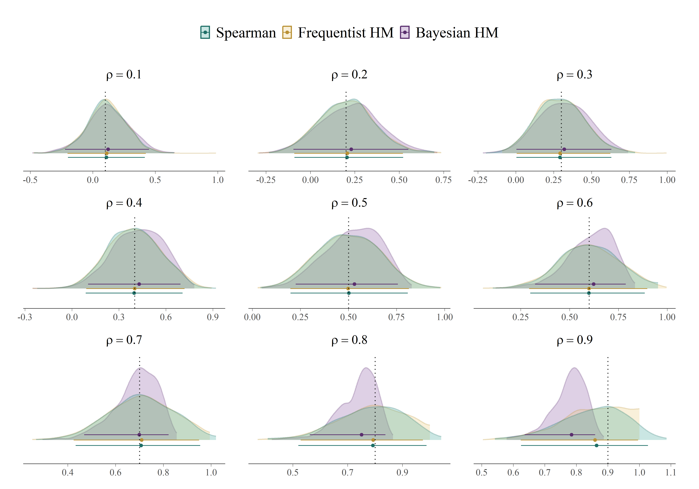
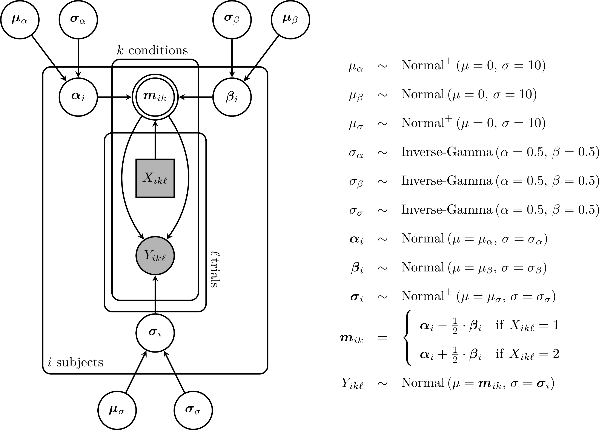
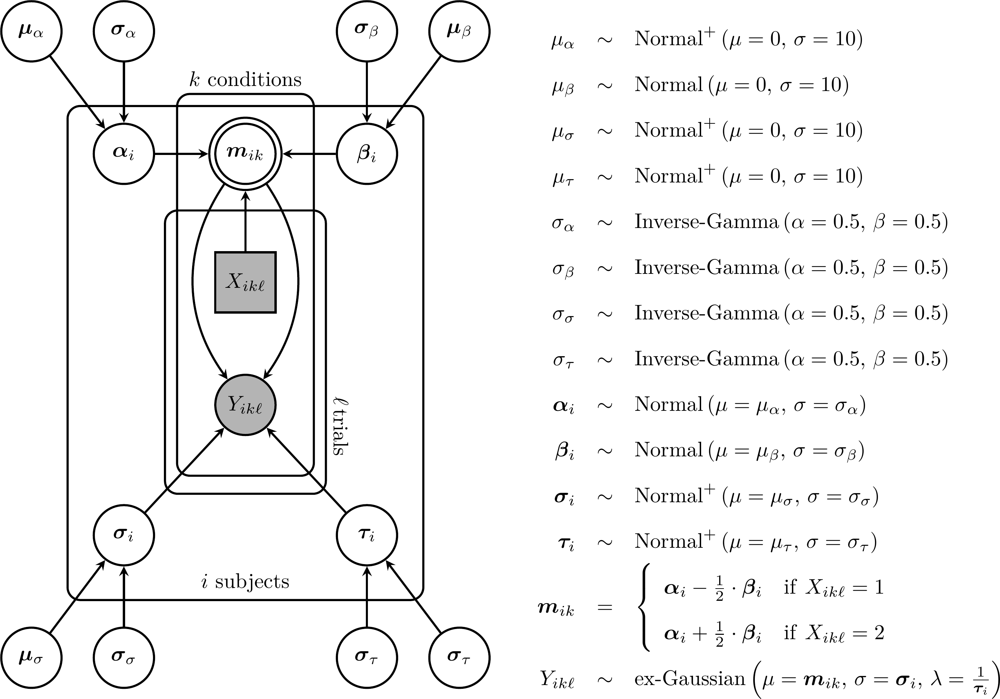
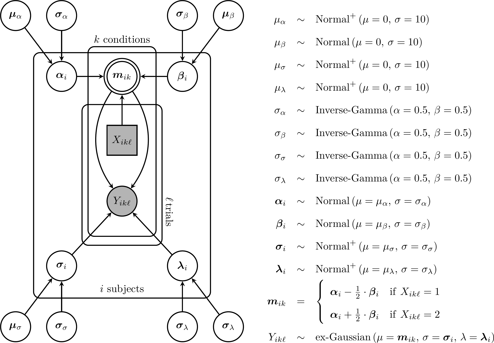
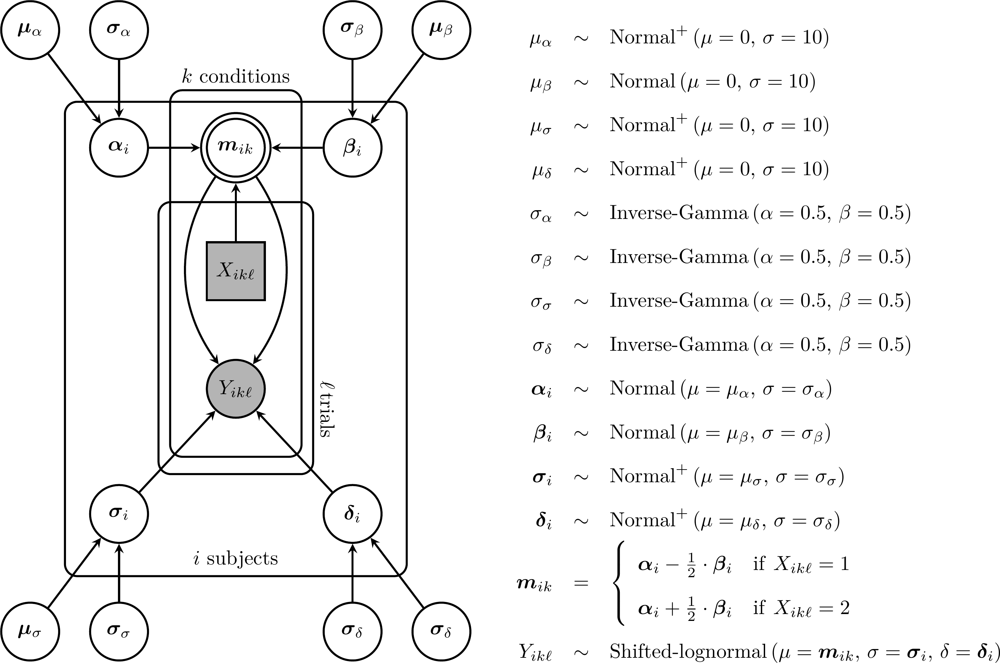

# SM1: Equivalence between Spearman correction for attenuation and frequentist hierarchical models

Previous work has suggested that hierarchical models provide more
precise estimates of correlations between experimental effects than the
traditional Spearman correction for attenuation [@Mehrvarz2025; @rouder2023]. We show, however, that
this apparent gain in precision is not due to the hierarchical structure
per se, but rather to the use of Bayesian estimation, where prior
distributions act as regularizers. Both @rouder2023 and @Mehrvarz2025 model these matrices using an inverse-Wishart prior,
$$
\mathbf{\Sigma}_\beta\sim\text{Inverse-Wishart}\left(\nu = J+1,\,\mathbf\Psi = a^2\cdot\mathbf{I}\right)
$$

\noindent where $\nu$ and $\mathbf\Psi$ are the shape and scale parameters of the inverse Wishart distribution, $J$ is the number of tasks, $\mathbf{I}$ is a $J \times J$ identity matrix and $a^2$ is described by the authors as "a prior setting that corresponds to the prior expected value of variance" [@Mehrvarz2025, p.4]. In their simulation study, the authors set $a^2 = 0.025^2$ as the prior variance parameter while generating the data using the same population variance value, $\sigma^2_\beta=0.025^2$. Consequently, the prior is intended to be centered on the true value used to generate the data in their simulation studies. 

However, it is worth noting that $a^2$ does not correspond strictly to the expected value of the variance in this setting. For an inverse-Wishart prior in $J$ dimensions, the mean $\mathbb{E}\left[\mathbf\Sigma\right]$ exists only if $\nu > J+1$, and the element-wise variances exist only if $\nu > J+3$. With the choice $\nu = J + 1$, neither the mean nor the variance are finite. Therefore, $a^2$ functions as a scale parameter, but its interpretation as a "prior expected variance" is technically imprecise given the selected degrees of freedom.

To better illustrate the influence of the parameter $a$, we simulated 50,000 samples from the inverse-Wishart distribution with $J=2$ and $a^2=0.025^2$, and examined the resulting marginal distribution of the variance components (Figure \ref{fig-variance-dist}). As shown, this prior assigns a large proportion of its probability mass to values very close to zero, while remaining extremely diffuse for larger variances. Approximately 61% of the simulated values fall below $a^2$, whereas the remaining 39% are spread between $0.025^2$ and infinity. Overall, this prior tends to regularize variance estimates toward zero.

```{r}
#| echo: false
#| eval: true
#| message: false
#| warning: false
#| fig-width: 7
#| fig-height: 4
#| fig-cap: "Sampling distribution of variance values drawn from the inverse-Wishart prior"
#| label: fig-variance-dist
# Small demonstration
set.seed(123)
J <- 2; a <- .025^2
nu <- J + 1
Psi <- diag(J) * a
S <- 5e4
# Sampling precission matrices from rWishart
omega <- rWishart(n = S, df = nu, Sigma = solve(Psi))
# Solve precision matrices to obtain covariance matrices
Sigma <- array(apply(omega, 3, solve), c(J, J, S))
# Correlation matrices
R <- array(apply(Sigma, 3, cov2cor), c(J, J, S))
# Select non-exteme sigma values for plotting
sigma_vals <- Sigma[1,1,][Sigma[1,1,] < quantile(Sigma[1,1,], probs = .95)]
# Plotting sigma distribution
library(ggplot2)

df <- data.frame(sigma_vals = sigma_vals)
true_val   <- a
median_val <- median(Sigma[1,1,])
mean_val   <- mean(Sigma[1,1,])

# Datos de las líneas
lines_df <- data.frame(
  value = c(true_val, mean_val, median_val),
  label = c("Parameter a", "Mean", "Median"),
  color = c("steelblue2", "firebrick3", "darkorange"),
  linetype = c("solid", "dotdash", "dashed")
)

ggplot(df, aes(x = sigma_vals)) +
  geom_histogram(aes(y = ..density..),
                 bins = 180, fill = "grey65", color = "white") +
  stat_density(geom = "line", linewidth = 0.8, color = "grey35", alpha = 0.9) +
  geom_vline(data = lines_df,
             aes(xintercept = value, color = label, linetype = label),
             linewidth = 0.8, key_glyph = "path") +
  scale_color_manual(
  values = c("Parameter a" = "steelblue2",
             "Mean"        = "firebrick3",
             "Median"      = "darkorange"),
  labels = c("Parameter a" = expression(paste("Parameter ", a^2)),
             "Mean"        = "Mean",
             "Median"      = "Median")
) +
scale_linetype_manual(
  values = c("Parameter a" = "solid",
             "Mean"        = "dotdash",
             "Median"      = "dashed"),
  labels = c("Parameter a" = expression(paste("Parameter ", a^2)),
             "Mean"        = "Mean",
             "Median"      = "Median")
) +
  labs(x = expression(sigma^2),
       y = "Density",
       color = NULL, linetype = NULL) +
  theme_bw(base_size = 12) +
  theme(
    legend.position = c(0.97, 0.97),
    legend.justification = c("right", "top"),
    legend.background = element_rect(fill = "white", color = "grey70"),
    legend.key.size = unit(0.7, "lines"),
    legend.key.width = unit(1.5, "cm"),
    legend.key.height = unit(0.45, "cm"),
    legend.text = element_text(size = 9),
    panel.grid = element_blank()
  )

# Empirical cumulative density function
# ecdf(Sigma[1,1,])(a)*100
```

Although this inverse-Wishart prior is uniform over the space of correlations, its regularization on the variances affects the posterior distribution of the correlations. To illustrate this point, we replicated the simulation reported by @rouder2023 for estimating the correlation between two tasks, using their original `R` code. The only modification we introduced was to vary the true population correlation between tasks from  $.1$
to $.9$ in increments of $.1$. For each value of the true
correlation, we simulated $1,000$ datasets and estimated the
correlation using three methods: the Spearman correction for
attenuation, a frequentist hierarchical model, and the Bayesian
hierarchical model implementing the exact inverse-Wishart prior parametrization used by @rouder2023 and @Mehrvarz2025. Given that the frequentist hierarchical model relies solely on the likelihood without incorporating prior distributions, this comparison serves to isolate the shrinkage effect introduced specifically by the inverse-Wishart prior.

{#fig-sm2}

Figure \ref{fig-sm2} shows the sampling distributions of the $1,000$ correlation estimates obtained with each method (posterior means for the Bayesian model). Across all values of the true correlation, Spearman’s correction for attenuation and the frequentist hierarchical model yield nearly identical estimates. In contrast, the Bayesian hierarchical model appears increasingly precise as the true correlation grows. Table \ref{tab:se-method} summarizes the standard deviations of these sampling distributions: while Spearman’s correction and the frequentist model produce almost identical variability, the Bayesian model shows larger dispersion when $\rho$ is low and smaller dispersion when $\rho$ is high. However, at high true correlations ($\rho = .8$ and $\rho=.9$), this apparent gain in precision reflects overconfidence rather than accuracy, and the posterior means become systematically biased away from the true value. Only around $\rho=.3$ or $\rho=.4$ do the three methods display comparable uncertainty and accuracy.

```{r}
#| message: false
#| warning: false

library(dplyr)
library(tidyr)
library(kableExtra)

# Load simulation results
sim_res <- readRDS("../Results/Rdata/Supplementary material/lme4_spearman_equiv.rds")

# LaTeX table
sim_res |> 
  select(trueCor, SEs_res.sp_cor, SEs_res.lme4_cor, SEs_res.BHM_cor) |> 
  mutate(across(where(is.numeric), ~round(., 3))) |> 
  mutate(trueCor = paste0("$\\rho = ", trueCor, "$")) |> 
  rename(
    "Spearman" = SEs_res.sp_cor,
    "Frequentist HM" = SEs_res.lme4_cor,
    "Bayesian HM" = SEs_res.BHM_cor
  ) |> 
  pivot_longer(cols = -trueCor, names_to = "Method", values_to = "Value") |>
  pivot_wider(names_from = trueCor, values_from = Value) |> 
  kbl(
    caption = "Sampling standard deviation of the distribution of correlation estimates with Spearman method and both frequentist and Bayesian HM (Hierarchical Models)",
    booktabs = TRUE, escape = FALSE, align = c("lccccccccc"), 
    label = "se-method", format = "latex"
    ) |> 
  kable_styling(latex_options = c("hold_position", "scale_down"),
                font_size = 10)
```

Overall, the practical equivalence between Spearman’s correction and the frequentist hierarchical model, together with their divergence from the Bayesian hierarchical model, indicates that the added precision is a consequence of the prior specification, not of the hierarchical structure itself.

\newpage

# SM2: Expected Values and Variances of Zero-Truncated Normal Distributions

To ensure positive values, the parameters $\sigma$ and $\tau$ were modeled as zero-truncated normal distributions. Let $\alpha = (a - \mu_X)/\sigma_X$, with $a=0$ denoting the lower truncation limit. For a truncated normal variable $X$, the expected value and variance are [@greene2011, p.836]:
$$
\mathbb{E}\left[X\right]=\mu_X + \sigma_X\cdot \lambda\!\left(\alpha\right)\quad\text{and}\quad\mathbb{V}\left[X\right]=\sigma^2\cdot\left[1 - \delta\!\left(\alpha\right)\right]
$${#eq-SM3-01}

where $\mu_X$ and $\sigma_X^2$ denote the mean and variance of the untruncated normal distribution, respectively, and 
$$
\lambda\!\left(\alpha\right)=\frac{\phi(\alpha)}{1-\Phi(\alpha)},\qquad \delta\!\left(\alpha\right)=\lambda\!\left(\alpha\right)\cdot\left[\lambda\!\left(\alpha\right)-\alpha\right],
$${#eq-SM3-02}

\noindent with $\phi(\cdot)$ and $\Phi(\cdot)$ being the standard normal probability density and cumulative distribution functions, respectively.

```{r}
#| eval: false
#| echo: false
# Small demonstration
set.seed(123)
mu <- 1; sigma <- 2
X <- rnorm(1e5, mu, sigma)
X <- X[X>0]
# Set alpha, lambda and delta functions
alpha <- -mu/sigma
lambda <- function(alpha) dnorm(alpha) / (1 - pnorm(alpha))
delta <- function(alpha) lambda(alpha) * (lambda(alpha) - alpha)
# Expected value and variance of truncated X
Ex <- mu + sigma * lambda(alpha)
Vx <- sigma^2 * (1 - delta(alpha))
# Equivalent values
c(mu_x = mean(X), Ex = Ex, var_x = var(X), Vx = Vx)
```

To optimize sampling in *Stan*, we adopted a two-step procedure to define the truncated distribution. First, the variable $Z$ was defined as a standardized normal variable truncated at zero. In this case, $\mu_Z=0$ and $\sigma_Z=1$, $\alpha=0/1=0$, so the standardized truncation point is $\alpha=(0-0)/1=0$. Consequently, 

$$
\lambda(0) = \frac{\phi(0)}{1-\Phi(0)},
$${#eq-SM3-03}

\noindent where $\phi(0)$ and $\Phi(0)$ denote the standard normal density and cumulative distribution evaluated at zero whose values are $1/\sqrt{2\cdot\pi}$ and $1/2$, respectively. Substituting these values yields $\lambda(0)=\sqrt{2/\pi}$, and therefore the expected value and variance of the standardized truncated normal distribution are 

$$
\mathbb{E}\left[Z\right] = \sqrt{\frac{2}{\pi}}\quad\text{and}\quad\mathbb{V}\left[Z\right]=1-\frac{2}{\pi}.
$${#eq-SM3-04}

```{r}
#| eval: false
#| echo: false
# Equivalent values
identical(lambda(0), sqrt(2/pi))
identical(1-delta(0), 1-(2/pi))
```

Next, we defined the variable $Y=\text{shift} + \text{scale} \cdot Z$ where *shift* and *scale* are positive-valued parameters. The expected value and variance of $Y$ can then be obtained by a change of variable:

$$
\mathbb{E}\left[Y\right] = \text{shift} + \text{scale}\cdot \mathbb{E}\left[Z\right],\qquad \mathbb{V}\left[Y\right] = \text{scale}^2\cdot\mathbb{V}\left[Z\right]
$${#eq-SM3-05}

The main limitation of this approximation is that it does not provide direct access to the mean and variance of the corresponding untruncated normal distribution. To recover these quantities, it is necessary to establish the equivalence between *shift* and *scale* and the parameters $\mu_X$ and $\sigma^2_X$ of the untruncated distribution.

## From $\mu_X$ and $\sigma_X$ to *shift* and *scale*

Starting from known values of $\mu_X$ and $\sigma_X$, *shift* and *scale* can be obtained analytically. First, by equating the variances of $Y$ and $X$ and solving for *scale*:

$$
\begin{aligned}
\mathbb{V}\left[Y\right] & = \mathbb{V}\left[X\right]\\
\text{scale}^2\cdot \mathbb{V}\left[Z\right] & = \sigma^2_X\cdot\left[1 - \delta\!\left(\alpha\right)\right]\\
\text{scale}^2\cdot\left[1-\frac{2}{\pi}\right] & = \sigma^2_X\cdot\left[1 - \delta\!\left(\alpha\right)\right]\\
\text{scale}^2 & = \frac{\sigma^2_X\cdot\left[1 - \delta\!\left(\alpha\right)\right]}{\left[1-\frac{2}{\pi}\right]}\\
\text{scale} & = \sigma_X\cdot\sqrt{\frac{1-\delta(\alpha)}{\left[1-\frac{2}{\pi}\right]}}
\end{aligned}
$${#eq-SM3-06}

Once *scale* is known, *shift* can be obtained from the equality of expected values:

$$
\begin{aligned}
\mathbb{E}\left[Y\right] & = \mathbb{E}\left[X\right]\\
\text{shift} + \text{scale}\cdot \mathbb{E}\left[Z\right] & = \mu_X + \sigma_X\cdot\lambda\!\left(\alpha\right) \\
\text{shift} + \text{scale}\cdot \sqrt{\frac{2}{\pi}} & = \mu_X + \sigma_X\cdot\lambda\!\left(\alpha\right) \\
\text{shift} &= \mu_X + \sigma_X\cdot\lambda\!\left(\alpha\right) - \text{scale}\cdot \sqrt{\frac{2}{\pi}}
\end{aligned}
$${#eq-SM3-07}

Although these expressions allow computing *shift* and *scale* given $\mu_X$ and $\sigma_X$, the inverse transformation (i.e., recovering $\mu_X$ and $\sigma_X$ from *shift* and *scale*) has no closed-form solution and must be solved numerically. This is because the parameters are linked through the standardized truncation point, $\alpha$, which simultaneously depends on both $\mu_X$ and $\sigma_X$. Moreover, the functions $\lambda(\alpha)$ and $\delta(\alpha)$ involve the standard normal cumulative distribution, $\Phi(\alpha)$, whose inverse has no analytic expression.

## From *shift* and *scale* to $\mu_X$ and $\sigma_X$

We reparameterized the truncated normal formulation in terms of $\alpha$ and $\sigma_X$.   Since $\alpha = (a - \mu_X)/\sigma_X$ and $a = 0$, it follows that $\mu_X = -\alpha \cdot \sigma_X$.   Using @eq-SM3-06, we can solve for $\sigma_X^2$:

$$
\begin{aligned}
\text{scale}^2 & = \frac{\sigma^2_X\cdot\left[1 - \delta\!\left(\alpha\right)\right]}{\left[1-\frac{2}{\pi}\right]}\\
\frac{\text{scale}^2\cdot \left[1-\frac{2}{\pi}\right]}{1 - \delta\!\left(\alpha\right)} & = \sigma^2_X
\end{aligned}
$${#eq-SM3-08}

Next, from @eq-SM3-07, we can solve for $\sigma_X$:

$$
\begin{aligned}
\text{shift} + \text{scale}\cdot \sqrt{\frac{2}{\pi}} & = \mu_X + \sigma_X\cdot\lambda\!\left(\alpha\right) \\
\text{shift} + \text{scale}\cdot \sqrt{\frac{2}{\pi}} & = -\alpha\cdot\sigma_X + \sigma_X\cdot\lambda\!\left(\alpha\right) \\
\text{shift} + \text{scale}\cdot \sqrt{\frac{2}{\pi}} & = \sigma_X\cdot\left[\lambda\!\left(\alpha\right) -  \alpha\right]\\
\frac{\text{shift} + \text{scale}\cdot \sqrt{\frac{2}{\pi}}}{\lambda\!\left(\alpha\right) -  \alpha} & = \sigma_X
\end{aligned}
$${#eq-SM3-09}

We can now square @eq-SM3-09 and set it equal to @eq-SM3-08, leaving $\alpha$ as the only unknown parameter:

$$
\left(\frac{\text{shift} + \text{scale}\cdot \sqrt{\frac{2}{\pi}}}{\lambda\!\left(\alpha\right) -  \alpha}\right)^2 = \frac{\text{scale}^2\cdot \left[1-\frac{2}{\pi}\right]}{1 - \delta\!\left(\alpha\right)}
$${#eq-SM3-10}

Rearranging, we define the target function $f(\alpha)$:

$$
f\!\left(\alpha\right) = \left(\frac{\text{shift} + \text{scale}\cdot \sqrt{\frac{2}{\pi}}}{\lambda\!\left(\alpha\right) -  \alpha}\right)^2 - \frac{\text{scale}^2\cdot \left[1-\frac{2}{\pi}\right]}{1 - \delta\!\left(\alpha\right)} = 0
$${#eq-SM3-11}

```{r}
#| echo: false
#| eval: false
# Small demonstration
set.seed(123)
mu <- .53; sigma <- 1.43
X <- rnorm(1e5, mu, sigma)
X <- X[X>0]
# Set alpha, lambda and delta functions
alpha <- -mu/sigma
lambda <- function(alpha) dnorm(alpha) / (1 - pnorm(alpha))
delta <- function(alpha) lambda(alpha) * (lambda(alpha) - alpha)
# Derive shift and scale parameters
scale <- sigma * sqrt((1-delta(alpha))/(1-2/pi))
shift <- mu + sigma * lambda(alpha) - scale * sqrt(2/pi)
# Define f(alpha) function using least squares 
f_alpha <- function(alpha, shift, scale){
  # Define lambda and delta functions
  lambda <- function(alpha) dnorm(alpha) / (1 - pnorm(alpha))
  delta  <- function(alpha) lambda(alpha) * (lambda(alpha) - alpha)
  # Variance in each equation
  S2X.Eq.1 <- ((shift + scale * sqrt(2/pi)) / (lambda(alpha) - alpha))^2 
  S2X.Eq.2 <- (scale^2 * (1 - 2/pi)) / (1 - delta(alpha))
  # Least squares target function
  (S2X.Eq.1 - S2X.Eq.2)^2
}
# Minimize f(alpha) function
fit_LS <- optim(par = 0, fn = f_alpha, shift = shift, 
                scale = scale, method = "BFGS")
# Set estimated alpha value
alpha_LS <- fit_LS$par
# Derive mu and sigma parameters
sigma_LS <- (shift + scale * sqrt(2/pi)) / (lambda(alpha_LS) - alpha_LS)
mu_LS <- -alpha_LS * sigma_LS
# Check equivalence
round(c(alpha = alpha, alpha_LS = alpha_LS, mu = mu, 
        mu_LS = mu_LS, sigma = sigma, sigma_LS = sigma_LS), 4)
```

The goal is to identify the value of $\alpha$ that satisfies $f(\alpha) = 0$, which can be done numerically using standard root-finding or standard optimization methods. Once $\alpha$ is estimated, $\sigma_X^2$ can be obtained from either @eq-SM3-08 or @eq-SM3-09, and $\mu_X$ follows directly as $\mu_X = -\alpha \cdot \sigma_X$. The `R` code below implements the function $f(\alpha)$ using a least-squares approach. For demonstration, the example sets $\text{shift}=0.2$ and $\text{scale}=0.3$, although in practice these would be replaced by the values of interest.

\onehalfspacing

```{r}
#| echo: true
#| eval: false
# Shift and scale fixed values
shift <- .2; scale <- .3

# Lambda and delta functions
lambda <- function(alpha) dnorm(alpha) / (1 - pnorm(alpha))
delta  <- function(alpha) lambda(alpha) * (lambda(alpha) - alpha)

# Least-squares objective f(alpha) function
f_alpha <- function(alpha, shift, scale){
  # Variance from Eq. (9)
  S2X_eq1 <- ((shift + scale * sqrt(2/pi)) / (lambda(alpha) - alpha))^2 
  # Variance from Eq. (8)
  S2X_eq2 <- (scale^2 * (1 - 2/pi)) / (1 - delta(alpha))
  # Squared difference between variance estimates
  (S2X_eq1 - S2X_eq2)^2
}

# Minimize f(alpha) function to estimate alpha
fit_LS <- optim(par = 0, fn = f_alpha, shift = shift, scale = scale, 
                method = "BFGS")

# Store the estimated alpha value that minimizes the squared differences
alpha_LS <- fit_LS$par

# Recover mu and sigma parameters from alpha
sigma_LS <- (shift + scale * sqrt(2/pi)) / (lambda(alpha_LS) - alpha_LS)
mu_LS <- -alpha_LS * sigma_LS
```

\doublespacing

\newpage

# SM3: Expected Values for $\sigma^2$ and $\tau^2$

As noted in the main text, reliability calculations depend on $\mu_{\sigma^2}$ for the shifted-lognormal model and on $\mu_{\sigma^2}$ and $\mu_{\tau^2}$ for the ex-Gaussian model. Here, to maintain consistency with the notation introduced in the previous subsection, we denote these quantities as $\mathbb{E}\left[\sigma^2\right]$ and $\mathbb{E}\left[\tau^2\right]$. These expectations, however, are not directly available and cannot be computed simply as $(\mathbb{E}[\sigma])^2$ or $(\mathbb{E}[\tau])^2$. The key point is that the square of the mean is not equivalent to the mean of the squared quantities. In other words, squaring the average of the standard deviation parameters is not the same as averaging the squared values of these standard deviations (i.e., the mean of a distribution of variances).

This distinction arises because the squaring function ($x \mapsto x^2$) is convex, and according to Jensen’s inequality, $\mathbb{E}\left[x^2\right] \ge \left(\mathbb{E}\left[x\right]\right)^2$. As a result, using squared means would systematically underestimate the true expected variances $\mathbb{E}\left[\sigma^2\right]$ and $\mathbb{E}\left[\tau^2\right]$. When applied to reliability calculations, this underestimation of variance leads to inflated reliability estimates.

This quadratic expectation can be obtained directly from the basic definition of the variance of a random variable, $\mathbb{V}\left[X\right] = \mathbb{E}[X^2] - (\mathbb{E}[X])^2$, so that $\mathbb{E}[X^2]$ can be expressed as $\mathbb{E}[X^2] = (\mathbb{E}[X])^2 + \mathbb{V}\left[X\right]$. 

We simply apply this relation to derive the expected quadratic terms $\mathbb{E}[\sigma^2]$ and $\mathbb{E}[\tau^2]$ from the means and variances of their corresponding truncated normal distributions. Substituting the expressions from Equation \ref{eq-SM3-05} for $\mathbb{E}[X]$ and $\mathbb{V}[X]$, the expected square becomes
$$
\begin{aligned}
\mathbb{E}[X^2] & = \left(\text{shift} + \text{scale}\cdot \mathbb{E}\left[Z\right]\right)^2 + \text{scale}^2\cdot\mathbb{V}\left[Z\right]\\
  & = \left(\text{shift} + \text{scale}\cdot \sqrt{\frac{2}{\pi}}\right)^2 + \text{scale}^2\cdot\left[1-\frac{2}{\pi}\right]
\end{aligned}
$${#eq-SM4-01}

This expression provides a closed-form solution for $\mathbb{E}[X^2]$ in terms of the *shift* and *scale* parameters of the truncated normal distribution, which can then be directly used to compute $\mathbb{E}[\sigma^2]$ and $\mathbb{E}[\tau^2]$ for the shifted-lognormal and ex-Gaussian models, respectively.

However, no closed-form solution exists for the expected value $\mathbb{E}\left[1/\text{rate}^2\right]$ in the ex-Gaussian model parameterized with the exponential rate parameter. To compute reliability, we can approximate $\mathbb{E}[\tau^2]$ using an inner Monte Carlo step. For each task $j$ and posterior draw $s$, the expectation $\mathbb{E}[\tau^2]$ can be approximated as

$$
\mathbb{E}[\tau^2_j]^{(s)} = \frac{1}{B}\sum^B_{b=1}\frac{1}{\left(\text{shift}^{(s)}_j + \text{scale}^{(s)}_j\cdot Z_b\right)^2},\qquad Z_b\sim\text{Normal}^+\!\left(0,1\right),
$${#eq-SM4-02}

\noindent that is, the average of $1/rate^2$ evaluated at $B$ samples from the truncated standard normal distribution.

\newpage

# SM4: Rotational indeterminancy and identification

In exploratory factor models, the population covariance matrix is defined as

\noindent $\mathbf\Sigma=\mathbf\Lambda\cdot\mathbf\Lambda^\prime + \mathbf\Psi$. A critical consequence of this definition is that the likelihood is evaluated in terms of $\mathbf\Sigma$, not the particular configuration of factor loadings $\mathbf\Lambda$ that produces it. Therefore, infinitely many combinations of $\mathbf\Lambda$ (via rotation, column permutation, or sign flipping) can yield the exact same covariance matrix.

In Bayesian estimation, this indeterminacy implies that the likelihood surface is multimodal. The MCMC sampler explores these equally valid but differently rotated solutions, exhibiting random sign flips and changing factor orders across iterations. Consequently, standard posterior summaries are meaningless; for example, averaging loadings across unaligned draws causes the means to converge to zero due to symmetry.

To address this, we avoided imposing hard constraints during estimation (e.g., fixing zeros), which can bias the factor structure [@anderson1956inference; @carvalho2008; @papastamoulis2022]. Instead, we employed a *post hoc* strategy using the *MatchAlign* algorithm [@poworoznek2024]. This method allows the sampler to explore the posterior freely and aligns the samples after estimation in three steps: (1) Each posterior draw is orthogonally rotated (using Varimax) to anchor the orientation; (2) a representative draw (pivot) is selected based on the median leading (largest) eigenvalue; finally, (3) all other draws are aligned to the pivot via signed permutations to resolve label switching and sign ambiguity.

For unidimensional and confirmatory models, rotational indeterminacy is resolved by design (due to the single column or fixed zero constraints). However, sign indeterminacy remains. To resolve this, we followed the strategy implemented in `{blavaan}` [@blavaan]: after estimation, we constrained one anchor loading per factor to be strictly positive, flipping the signs of the corresponding factor column (and associated correlations) in any draw where the anchor was negative.

\newpage

# SM5: Scaled-Beta probability density function

Let $X \sim \mathrm{Beta}\left(\alpha,\;\beta\right)$ defined on the interval (0,1). The probability density function of $X$ is

$$
f_X(x) = \frac{1}{\mathrm{B}(\alpha,\beta)} \, x^{\alpha-1}\cdot(1-x)^{\beta-1}, \qquad \alpha>0, \; \beta>0,
$$

\noindent where $\mathrm{B}(\alpha,\beta)$ is the Beta function,

$$
\mathrm{B}(\alpha,\beta)=\frac{\Gamma(\alpha)\cdot\Gamma(\beta)}{\Gamma(\alpha+\beta)}.
$$

We can re-scale this distribution to the interval (-1,1) applying the transformation $Y=2\cdot X-1$. The Jacobian of this transformation is $\left| \frac{dX}{dY} \right| = \frac{1}{2}$. By change of variables, the density of $Y$ becomes

$$
\begin{aligned}
f_Y(y)
&= f_X\!\left( \tfrac{y+1}{2} \right)\cdot \left| \tfrac{dX}{dY} \right| \\[1em]
&= \frac{1}{\mathrm{B}(\alpha,\beta)} \cdot
   \left( \frac{y+1}{2} \right)^{\alpha-1}\cdot
   \left( 1 - \frac{y+1}{2} \right)^{\beta-1}
   \cdot \frac{1}{2} \\[1em]
&= \frac{2^{-(\alpha+\beta-1)}}{\mathrm{B}(\alpha,\beta)}\cdot (1+y)^{\alpha-1}\cdot (1-y)^{\beta-1}, 
   \qquad y \in (-1,1),
\end{aligned}
$$

\noindent and the log-density is given by:

$$
\begin{aligned}
\log f_Y(y) = & \left(\alpha - 1\right)\cdot\log\left(1 + y\right) + \left(\beta-1\right)\cdot\log\left(1-y\right) - \\[0.5em]
& \left(\alpha+\beta-1\right)\cdot\log\left(2\right) - \log\mathrm{B}\left(\alpha,\beta\right)
\end{aligned}
$$

\newpage

# SM6: Bayesian hierarchical model specifications 

## Gaussian hierarchial model



\newpage

## Ex-Gaussian hierarchial model ($\tau$ parameterization)



\newpage

## Ex-Gaussian hierarchial model ($\lambda$ parameterization)



\newpage

## Shifted-lognormal hierarchical model



\newpage

# SM7: meta-analysis results

```{r}
#| message: false
#| warning: false
#| echo: false
library(tidyverse)
library(kableExtra)

# Auxiliar function to create meta-tables
make_meta_table <- function(data, param_map) {
  rows_list <- list()
  tasks <- c("flanker", "simon", "stroop")
  for (param_name in names(param_map)) {
    latex_name <- param_map[[param_name]]
    row_vals <- c(Parameter = latex_name)
    for (t in tasks) {
      task_data <- data %>% filter(task == t)
      col_est <- param_name
      col_ci  <- paste0("CI_", param_name)
      est_val <- sprintf("%.3f", task_data[[col_est]])
      ci_val  <- task_data[[col_ci]]
      row_vals <- c(row_vals, est_val, ci_val)
    }
    rows_list[[length(rows_list) + 1]] <- row_vals
  }
  df_table <- do.call(rbind, rows_list) %>% as.data.frame()
  colnames(df_table) <- c("Param.", rep(c("Est.", "95\\% CI"), 3))
  return(df_table)
}

# Load full meta-parameters
load("../Results/Rdata/meta-parameters/meta_parameters_full.rdata")
```

To synthesize the parameter estimates obtained from the Gaussian, Ex-Gaussian, and Shifted-Lognormal multilevel models across the 59 datasets, we conducted a series of multilevel meta-analyses using the `{metafor}` package [@metafor_pkg]. For each model parameter (e.g., $\mu_\alpha$, $\sigma_\beta$), the posterior mean estimated from the individual dataset fitting was used as the observed effect size, weighted by the posterior variance as the sampling variance. To ensure distributional assumptions were met and to respect the parameter space, strictly positive parameters (e.g., standard deviations of random effects, $\sigma$, $\tau$, shift and scale parameters) were meta-analyzed on the natural logarithmic scale. The resulting pooled estimates and confidence intervals for these parameters were back-transformed (exponentiated) for reporting.

To obtain specific pooled estimates for each experimental paradigm, Task (Flanker, Simon, Stroop) was included as a fixed effect moderator (specified without an intercept). To account for the nested structure of the data -- where multiple datasets often originated from the same published study -- we included task-specific random effects (i.e., random intercepts for each task type) grouped by study. We specified a diagonal covariance structure, which allows for distinct heterogeneity variances for each task. All models were estimated using Restricted Maximum Likelihood (REML), and standard errors and 95% confidence intervals were computed using the Knapp-Hartung adjustment to ensure robust inference.

\newpage

```{r}
#| message: false
#| warning: false
#| echo: false

# ────────────────────────────────────────────────────── #
#    Gaussian hierarchica model meta-analitic results    #
# ────────────────────────────────────────────────────── #

# Gaussian model parameters (change theta for beta)
map_gauss <- c(
  "mu_alpha"    = "$\\mu_\\alpha$",
  "mu_theta"    = "$\\mu_\\beta$",       
  "mu_sigma"    = "$\\mu_\\sigma$",
  "sd_alpha"    = "$\\sigma_\\alpha$",
  "sd_theta"    = "$\\sigma_\\beta$",    
  "sd_sigma"    = "$\\sigma_\\sigma$",
  "shift_sigma" = "$\\text{shift}_\\sigma$", 
  "scale_sigma" = "$\\text{scale}_\\sigma$"  
)

# Gaussian model meta-table
table_gauss <- make_meta_table(
  data = meta_parameters_full$meta_parameters_full_gauss, 
  param_map = map_gauss)

# Generar el Kable
kbl(table_gauss, 
    booktabs = TRUE, 
    escape = FALSE, 
    linesep = "",
    format = "latex",
    align = "lcccccc", 
    caption = "Meta-analysis Results: Gaussian Model Point Estimates and Confidence Intervals",
    label = "meta-gauss"
    ) |> 
  kable_styling(latex_options = c("HOLD_position"), full_width = FALSE) |> 
  add_header_above(c(" " = 1, "Flanker" = 2, "Simon" = 2, "Stroop" = 2)) |> 
  footnote(general = "$\\\\textit{Note.}$ Est. represent meta-analitic pooled point estimates.", 
           general_title = "", escape = FALSE)
```


```{r}
#| message: false
#| warning: false
#| echo: false
# ───────────────────────────────────────────────────────── #
#    Ex-Gaussian hierarchica model meta-analitic results    #
# ───────────────────────────────────────────────────────── #

# Exgaussian model parameters (tau paramet)
map_exgauss_tau <- c(
  "mu_alpha"    = "$\\mu_\\alpha$",
  "mu_theta"    = "$\\mu_\\beta$",
  "mu_sigma"    = "$\\mu_\\sigma$",
  "mu_tau"      = "$\\mu_\\tau$",
  "sd_alpha"    = "$\\sigma_\\alpha$",
  "sd_theta"    = "$\\sigma_\\beta$",
  "sd_sigma"    = "$\\sigma_\\sigma$",
  "sd_tau"      = "$\\sigma_\\tau$",
  "shift_sigma" = "$\\text{shift}_\\sigma$",
  "shift_tau"   = "$\\text{shift}_\\tau$",
  "scale_sigma" = "$\\text{scale}_\\sigma$",
  "scale_tau"   = "$\\text{scale}_\\tau$"
)

# Exgaussian model parameters (rate paramet)
map_exgauss_rate <- c(
  "mu_alpha"     = "$\\mu_\\alpha$",
  "mu_theta"     = "$\\mu_\\beta$",
  "mu_sigma"     = "$\\mu_\\sigma$",
  "mu_lambda"    = "$\\mu_\\lambda^{\\dagger}$",
  "sd_alpha"     = "$\\sigma_\\alpha$",
  "sd_theta"     = "$\\sigma_\\beta$",
  "sd_sigma"     = "$\\sigma_\\sigma$",
  "sd_lambda"    = "$\\sigma_\\lambda^{\\dagger}$",
  "shift_sigma"  = "$\\text{shift}_\\sigma$",
  "shift_lambda" = "$\\text{shift}_\\lambda^{\\dagger}$",
  "scale_sigma"  = "$\\text{scale}_\\sigma$",
  "scale_lambda" = "$\\text{scale}_\\lambda^{\\dagger}$"
)

# Results for each parameterization
table_tau <- make_meta_table(
  data = meta_parameters_full$meta_parameters_full_exgauss_tau, 
  param_map = map_exgauss_tau)
table_rate <- make_meta_table(
  data = meta_parameters_full$meta_parameters_full_exgauss_rate, 
  param_map = map_exgauss_rate)

# Final ex-gaussian table
table_exgauss <- rbind(
  table_tau[1:4,], table_rate[4,],
  table_tau[5:8,], table_rate[8,],
  table_tau[9:10,], table_rate[10,],
  table_tau[11:12,], table_rate[12,]
)
rownames(table_exgauss) <- NULL

# Generar el Kable
kbl(table_exgauss, 
    booktabs = TRUE, 
    escape = FALSE, 
    format = "latex", 
    linesep = "",
    align = "lcccccc", 
    caption = "Meta-analysis Results: Ex-Gaussian Model Point Estimates and Confidence Intervals",
    label = "meta-exgauss"
    ) |> 
  kable_styling(latex_options = c("HOLD_position"), full_width = FALSE) |> 
  add_header_above(c(" " = 1, "Flanker" = 2, "Simon" = 2, "Stroop" = 2)) |> 
  footnote(general = "\\\\textit{Note.} Est. represents meta-analytic pooled point estimates. $^\\\\dagger$ These parameters were estimated using a model with rate ($\\\\lambda$) parameterization rather than a $\\\\tau$-based formulation.", 
           general_title = "", escape = FALSE, threeparttable = TRUE)
```


```{r}
#| message: false
#| warning: false
#| echo: false
# Shifted-lognormal model parameters (change theta for beta)
map_shlog <- c(
  "mu_alpha"    = "$\\mu_\\alpha$",
  "mu_theta"    = "$\\mu_\\beta$",
  "mu_delta"    = "$\\mu_\\delta$", 
  "mu_sigma"    = "$\\mu_\\sigma$",
  "sd_alpha"    = "$\\sigma_\\alpha$",
  "sd_theta"    = "$\\sigma_\\beta$",
  "sd_delta"    = "$\\sigma_\\delta$",
  "sd_sigma"    = "$\\sigma_\\sigma$",
  "shift_sigma" = "$\\text{shift}_\\sigma$",
  "scale_sigma" = "$\\text{scale}_\\sigma$"
)

# sh-lognormal model meta-table
table_shlognormal <- make_meta_table(
  data = meta_parameters_full$meta_parameters_full_shlognormal, 
  param_map = map_shlog)

# Generar el Kable
kbl(table_shlognormal, 
    booktabs = TRUE, 
    escape = FALSE, 
    format = "latex", 
    linesep = "",
    align = "lcccccc", 
    caption = "Meta-analysis Results: Shifted-lognormal Model Point Estimates and Confidence Intervals",
    label = "meta-shlog"
    ) |> 
  kable_styling(latex_options = c("HOLD_position"), full_width = FALSE) |> 
  add_header_above(c(" " = 1, "Flanker" = 2, "Simon" = 2, "Stroop" = 2)) |> 
  footnote(general = "$\\\\textit{Note.}$ Est. represent meta-analitic pooled point estimates.", 
           general_title = "", escape = FALSE)
```


\newpage

# SM8: population correlation matrices in the simulation study

```{r}
#| echo: false
#| eval: false

# True correlations: unidimensional
L1 <- rep(.3, 6); tcrossprod(L1)
L2 <- rep(.5, 6); tcrossprod(L2)
L3 <- rep(.7, 6); tcrossprod(L3)

# True correlations: EFA models
D <- matrix(c(rep(1,3), rep(.3,6), rep(1,3)),ncol=2)
L1 <- D * .3; tcrossprod(L1)
L2 <- D * .5; tcrossprod(L2)
L3 <- D * .7; tcrossprod(L3)

# True correlations: CFA models
P <- matrix(c(1,.5,.5,1), ncol = 2)
D <- matrix(c(rep(1,3), rep(0,6), rep(1,3)),ncol=2)
L1 <- D * .3; L1 %*% P %*% t(L1)
L2 <- D * .5; L2 %*% P %*% t(L2)
L3 <- D * .7; L3 %*% P %*% t(L3)
```

## Unidimensional models

### $\mathbf{\Lambda}=.3$

$$
\mathbf{R}_{\text{uni},\, .3} =
\begin{bmatrix}
1.000 & 0.090 & 0.090 & 0.090 & 0.090 & 0.090 \\
0.090 & 1.000 & 0.090 & 0.090 & 0.090 & 0.090 \\
0.090 & 0.090 & 1.000 & 0.090 & 0.090 & 0.090 \\
0.090 & 0.090 & 0.090 & 1.000 & 0.090 & 0.090 \\
0.090 & 0.090 & 0.090 & 0.090 & 1.000 & 0.090 \\
0.090 & 0.090 & 0.090 & 0.090 & 0.090 & 1.000 \\
\end{bmatrix}
$$

### $\mathbf{\Lambda}=.5$

$$
\mathbf{R}_{\text{uni},\, .5} =
\begin{bmatrix}
1.000 & 0.250 & 0.250 & 0.250 & 0.250 & 0.250 \\
0.250 & 1.000 & 0.250 & 0.250 & 0.250 & 0.250 \\
0.250 & 0.250 & 1.000 & 0.250 & 0.250 & 0.250 \\
0.250 & 0.250 & 0.250 & 1.000 & 0.250 & 0.250 \\
0.250 & 0.250 & 0.250 & 0.250 & 1.000 & 0.250 \\
0.250 & 0.250 & 0.250 & 0.250 & 0.250 & 1.000 \\
\end{bmatrix}
$$

### $\mathbf{\Lambda}=.7$

$$
\mathbf{R}_{\text{uni},\, .7} =
\begin{bmatrix}
1.000 & 0.490 & 0.490 & 0.490 & 0.490 & 0.490 \\
0.490 & 1.000 & 0.490 & 0.490 & 0.490 & 0.490 \\
0.490 & 0.490 & 1.000 & 0.490 & 0.490 & 0.490 \\
0.490 & 0.490 & 0.490 & 1.000 & 0.490 & 0.490 \\
0.490 & 0.490 & 0.490 & 0.490 & 1.000 & 0.490 \\
0.490 & 0.490 & 0.490 & 0.490 & 0.490 & 1.000 \\
\end{bmatrix}
$$

## Exploratory Factor Models

### $\mathbf{\Lambda}=.3$

$$
\mathbf{R}_{\text{uni},\, .3} =
\begin{bmatrix}
1.000 & 0.098 & 0.098 & 0.054 & 0.054 & 0.054 \\
0.098 & 1.000 & 0.098 & 0.054 & 0.054 & 0.054 \\
0.098 & 0.098 & 1.000 & 0.054 & 0.054 & 0.054 \\
0.054 & 0.054 & 0.054 & 1.000 & 0.098 & 0.098 \\
0.054 & 0.054 & 0.054 & 0.098 & 1.000 & 0.098 \\
0.054 & 0.054 & 0.054 & 0.098 & 0.098 & 1.000 \\
\end{bmatrix}
$$

### $\mathbf{\Lambda}=.5$

$$
\mathbf{R}_{\text{uni},\, .5} =
\begin{bmatrix}
1.000 & 0.273 & 0.273 & 0.150 & 0.150 & 0.150 \\
0.273 & 1.000 & 0.273 & 0.150 & 0.150 & 0.150 \\
0.273 & 0.273 & 1.000 & 0.150 & 0.150 & 0.150 \\
0.150 & 0.150 & 0.150 & 1.000 & 0.273 & 0.273 \\
0.150 & 0.150 & 0.150 & 0.273 & 1.000 & 0.273 \\
0.150 & 0.150 & 0.150 & 0.273 & 0.273 & 1.000 \\
\end{bmatrix}
$$

### $\mathbf{\Lambda}=.7$

$$
\mathbf{R}_{\text{uni},\, .7} =
\begin{bmatrix}
1.000 & 0.534 & 0.534 & 0.294 & 0.294 & 0.294 \\
0.534 & 1.000 & 0.534 & 0.294 & 0.294 & 0.294 \\
0.534 & 0.534 & 1.000 & 0.294 & 0.294 & 0.294 \\
0.294 & 0.294 & 0.294 & 1.000 & 0.534 & 0.534 \\
0.294 & 0.294 & 0.294 & 0.534 & 1.000 & 0.534 \\
0.294 & 0.294 & 0.294 & 0.534 & 0.534 & 1.000 \\
\end{bmatrix}
$$

## Confirmatory Factor Models

### $\mathbf{\Lambda}=.3$

$$
\mathbf{R}_{\text{uni},\, .3} =
\begin{bmatrix}
1.000 & 0.090 & 0.090 & 0.045 & 0.045 & 0.045 \\
0.090 & 1.000 & 0.090 & 0.045 & 0.045 & 0.045 \\
0.090 & 0.090 & 1.000 & 0.045 & 0.045 & 0.045 \\
0.045 & 0.045 & 0.045 & 1.000 & 0.090 & 0.090 \\
0.045 & 0.045 & 0.045 & 0.090 & 1.000 & 0.090 \\
0.045 & 0.045 & 0.045 & 0.090 & 0.090 & 1.000 \\
\end{bmatrix}
$$

### $\mathbf{\Lambda}=.5$

$$
\mathbf{R}_{\text{uni},\, .5} =
\begin{bmatrix}
1.000 & 0.250 & 0.250 & 0.125 & 0.125 & 0.125 \\
0.250 & 1.000 & 0.250 & 0.125 & 0.125 & 0.125 \\
0.250 & 0.250 & 1.000 & 0.125 & 0.125 & 0.125 \\
0.125 & 0.125 & 0.125 & 1.000 & 0.250 & 0.250 \\
0.125 & 0.125 & 0.125 & 0.250 & 1.000 & 0.250 \\
0.125 & 0.125 & 0.125 & 0.250 & 0.250 & 1.000 \\
\end{bmatrix}
$$

### $\mathbf{\Lambda}=.7$

$$
\mathbf{R}_{\text{uni},\, .7} =
\begin{bmatrix}
1.000 & 0.490 & 0.490 & 0.245 & 0.245 & 0.245 \\
0.490 & 1.000 & 0.490 & 0.245 & 0.245 & 0.245 \\
0.490 & 0.490 & 1.000 & 0.245 & 0.245 & 0.245 \\
0.245 & 0.245 & 0.245 & 1.000 & 0.490 & 0.490 \\
0.245 & 0.245 & 0.245 & 0.490 & 1.000 & 0.490 \\
0.245 & 0.245 & 0.245 & 0.490 & 0.490 & 1.000 \\
\end{bmatrix}
$$
\newpage

# SM9: ANOVA meta-models results

```{r}
#| eval: true
#| echo: false
#| warning: false
#| message: false

library(kableExtra)
library(dplyr)
library(stringr)
load("../Results/Rdata/Tables/ANOVA_table.rdata")
clean_colnames <- c("Predictor", "ASRMR", "AAB", "APSD", "AECR", 
                    "ARMSE", "AAB", "APSD", "AECR", "$\\phi$")

ANOVA_tbl_sorted <- ANOVA_tbl |> 
  mutate(
    Predictor = str_replace_all(Predictor, ":", " x "),
    Level = str_count(Predictor, " x ")
  ) |> 
  arrange(Level, Predictor) |> 
  dplyr::select(-Level)


kbl(ANOVA_tbl_sorted, 
    booktabs = TRUE, 
    escape = FALSE,        
    col.names = clean_colnames, 
    longtable = TRUE,
    linesep = "", 
    align = c("l", rep("c", 9)),
    caption = "Effect sizes ($\\omega^2_p$) for Correlations and Factor Loadings") |> 
  add_header_above(c(" " = 1, 
                     "Correlations" = 4, 
                     "Factor loadings" = 5), 
                   bold = TRUE) |> 
  kable_styling(latex_options = c("repeat_header"), 
                font_size = 10) |>  
  footnote(general = c("$\\\\textit{Note.}$ Effect sizes equal or higuer than .14 are marked in bold. I = Sample size (100 or 200). LF = Latent factors (unidimensional, two-factor CFA and two-factor CFA). DGM = Data-Generation Model (ex-Gaussian or Shifted-lognormal). R = Reliability (0.3, 0.5 or 0.7). L = Standardized factor loadings (0.3, 0.5 or 0.7). M = Estimation method (Gaussian HFM or True GenHFM). ASRMR = Average Standardized Root Mean Residuals. AAB = Average Absolute Bias. APSD = Average Posterior Standard Deviation (Average Standard Error in frequentist correlations). AECR = Average Empirical Coverage Rate. $\\\\phi$ = Tucker Congruence Index."),
           general_title = "",
           footnote_as_chunk = TRUE, 
           threeparttable = TRUE,
           escape = FALSE)
```


\newpage

# SM10: Prior distributions used in Viviani et al. reanalysis

Table \ref{tab-priors-viviani} shows the prior distributios used in the hierarchical component of the exploratory GenHFMs. In all cases, we set uniform priors for all latent factor component parameters (i.e., $h^2$, $\mathbf\Lambda$ and $\mathbf\Psi$). 

::: {=latex}
\begin{table}[!h]
\renewcommand{\arraystretch}{1.1} % Un poco más de aire para leer los números
\centering
\small % Fuente un poco más pequeña para que quepa bien
\begin{threeparttable}
\caption{Prior distributions used in the Viviani et al. reanalysis for the hierarchical component}
  \label{tab-priors-viviani}
\setlength{\tabcolsep}{10pt}
\begin{tabular}{ll l} % 3 columnas: Modelo, Parámetro, Prior
\toprule
\textbf{Model} & \textbf{Parameter} & \textbf{Prior Distribution} \\
\midrule

% ======================= GAUSSIAN =======================
\multirow{7}{*}{Gaussian}
  & $\mu_{\alpha}$ & $\mathrm{Normal}(\mu = 0.654, \sigma = 0.453)$ \\
  & $\mu_{\beta}$  & $\mathrm{Normal}(\mu = 0.064, \sigma = 0.074)$ \\
  & $\mathrm{shift}_{\sigma}$ & $\mathrm{Normal}^+(\mu = 0.092,\sigma = 0.101)$ \\
  & $\sigma_{\alpha}$ & $\mathrm{Student}\text{-}t^+(\nu = 3, \mu = 0.115, \sigma = 0.105)$ \\
  & $\sigma_{\beta}$  & $\mathrm{Student}\text{-}t^+(\nu = 3, \mu = 0.036, \sigma = 0.019)$ \\
  & $\mathrm{scale}_{\sigma}$ & $\mathrm{Student}\text{-}t^+(\nu = 3, \mu = 0.117, \sigma = 0.034)$\\
\midrule

% ======================= EX-GAUSSIAN (RATE) ====================
\multirow{9}{*}{Ex-Gaussian}
  & $\mu_{\alpha}$ & $\mathrm{Normal}(\mu = 0.483, \sigma =0.451)$ \\
  & $\mu_{\beta}$  & $\mathrm{Normal}(\mu = 0.038, \sigma =0.079)$ \\
  & $\mathrm{shift}_{\sigma}$ & $\mathrm{Normal}^+(\mu = 0.032, \sigma =0.021)$ \\
  & $\mathrm{shift}_{\lambda}$ & $\mathrm{Normal}^+(\mu = 2.841, \sigma =1.570)$ \\
  & $\sigma_{\alpha}$ & $\mathrm{Student}\text{-}t^+(\nu = 3, \mu = 0.084, \sigma =0.132)$ \\
  & $\sigma_{\beta}$  & $\mathrm{Student}\text{-}t^+(\nu = 3, \mu = 0.025, \sigma =0.022)$ \\
  & $\mathrm{scale}_{\sigma}$ & $\mathrm{Student}\text{-}t^+(\nu = 3, \mu = 0.041, \sigma =0.025)$ \\
  & $\mathrm{scale}_{\lambda}$ & $\mathrm{Student}\text{-}t^+(\nu = 3, \mu = 4.735, \sigma =4.783)$ \\
\midrule

% ======================= SHIFTED-LOGNORMAL ====================
\multirow{9}{*}{Shifted-Lognormal}
  & $\mu_{\alpha}$ & $\mathrm{Normal}(\mu = -1.105, \sigma = 0.862)$ \\
  & $\mu_{\beta}$  & $\mathrm{Normal}(\mu = 0.157, \sigma = 0.156)$ \\
  & $\mu_{\delta}$ & $\mathrm{Normal}^+(\mu = 0.259, \sigma = 0.150)$ \\
  & $\mathrm{shift}_{\sigma}$ & $\mathrm{Normal}^+(\mu = 0.289, \sigma = 0.266)$ \\
  & $\sigma_{\alpha}$ & $\mathrm{Student}\text{-}t^+(\nu = 3, \mu = 0.275, \sigma = 0.071)$ \\
  & $\sigma_{\beta}$  & $\mathrm{Student}\text{-}t^+(\nu = 3, \mu = 0.074, \sigma = 0.021)$ \\
  & $\sigma_{\delta}$ & $\mathrm{Student}\text{-}t^+(\nu = 3, \mu = 0.063, \sigma = 0.046)$ \\
  & $\mathrm{scale}_{\sigma}$ & $\mathrm{Student}\text{-}t^+(\nu = 3, \mu = 0.155, \sigma = 0.045)$ \\
\bottomrule
\end{tabular}
\begin{tablenotes}[para,flushleft]
\footnotesize
\textit{Note}. Values in parentheses denote location and scale parameters (for Normal) or degrees of freedom, location, and scale (for Student-t).
\textbf{Ex-Gaussian:} Parameterized using rate ($\lambda$) instead of $\tau$, where $\lambda = 1/\tau$.
\textbf{Notation:} $\mathrm{Normal}^+$ and $\mathrm{Student}\text{-}t^+$ denote distributions truncated at zero.
\end{tablenotes}
\end{threeparttable}
\end{table}
:::

\newpage

\newpage

# SM11: Performance of GenHFMs under a Gaussian Data-Generating Process

Although the main goal of the simulation study was to evaluate the sensitivity of the Gaussian model when data were generated from asymmetric distributions, in this section we addressed the reverse question: how sensitive GenHFMs are when the data-generating process is Gaussian. To do so, we used the meta-parameters of the Gaussian model reported in Table 1 of the main text to generate data from a one-factor model with 100 subjects, varying reliability (.30, .50, and .70) and true factor loadings (.30, .50, and .70). However, the Gaussian model produced some negative observed values, which are incompatible with the nature of RT data and also prevented fitting the shifted-lognormal model. This issue simply reflects a known limitation of the Gaussian model for RTs. To prevent negative values, all simulated RTs were increased by a constant 200 ms, without altering the between-condition differences central to this study.

The results are summarized in Table \ref{tab:gaussian-dgp-emmeans}. Overall, the shifted-lognormal GenHFM showed a relatively robust behaviour under this form of model misspecification. Across most fit and recovery indices, its performance was only slightly worse than that of the Gaussian model, and in some cases the differences were negligible. This suggests that the shifted-lognormal model can still recover a broadly similar latent structure even when the data are in fact generated from a Gaussian process. This finding is particularly noteworthy given that, in the main simulation study, fitting a Gaussian model to data generated from a shifted-lognormal process led to much larger discrepancies in parameter estimates. At the same time, however, its convergence diagnostics were clearly less favourable. Although the $\hat{R}$ values remained only moderately elevated, the percentage of divergent transitions was systematically close to 10%, indicating that the sampler encountered persistent difficulties exploring the posterior. In practice, this means that, despite the seemingly acceptable recovery results, interpreting the shifted-lognormal model in this setting would still be risky.

::: {=latex}
\begin{table}[!ht]
\centering
\caption{\label{tab:gaussian-dgp-emmeans}Estimated marginal means for fit measures and convergence diagnostics across generating conditions and fitted models under the Gaussian data-generating process}
\begin{threeparttable}

\resizebox{\linewidth}{!}{%
\begin{minipage}{\linewidth}
\centering
\fontsize{8.5}{10}\selectfont
\setlength{\tabcolsep}{4.5pt}
\renewcommand{\arraystretch}{1.05}

\begin{tabular}[t]{l l ccc ccc ccc ccc}
\toprule
\multicolumn{14}{l}{\textbf{Fit measures: true correlations}} \\
\addlinespace[0.3em]
& & \multicolumn{3}{c}{ASRMR} & \multicolumn{3}{c}{AAB} & \multicolumn{3}{c}{APSD} & \multicolumn{3}{c}{AECR} \\
\cmidrule(l{3pt}r{3pt}){3-5}
\cmidrule(l{3pt}r{3pt}){6-8}
\cmidrule(l{3pt}r{3pt}){9-11}
\cmidrule(l{3pt}r{3pt}){12-14}
Factor & Level & G & SL & EG & G & SL & EG & G & SL & EG & G & SL & EG \\
\midrule
Reliability & .3 & \textbf{.12} & .14 & .22 & \textbf{.06} & .09 & .25 & .17 & .16 & \textbf{.04} & \textbf{.97} & .91 & .07 \\
Reliability & .5 & \textbf{.09} & .09 & .19 & \textbf{.04} & .06 & .21 & .12 & .12 & \textbf{.04} & \textbf{.96} & .94 & .07 \\
Reliability & .7 & \textbf{.08} & .08 & .17 & \textbf{.04} & .05 & .20 & .09 & .09 & \textbf{.03} & \textbf{.93} & .92 & .07 \\
True $\mathbf{\Lambda}$ & .3 & .09 & .09 & \textbf{.08} & \textbf{.04} & .04 & .08 & .13 & .12 & \textbf{.03} & .97 & \textbf{.96} & .16 \\
True $\mathbf{\Lambda}$ & .5 & \textbf{.10} & .11 & .18 & \textbf{.06} & .07 & .20 & .13 & .13 & \textbf{.03} & \textbf{.93} & .90 & .04 \\
True $\mathbf{\Lambda}$ & .7 & \textbf{.10} & .11 & .32 & \textbf{.05} & .08 & .38 & .13 & .12 & \textbf{.04} & \textbf{.96} & .91 & .00 \\
\bottomrule
\end{tabular}

\begin{tabular}[t]{l l ccc ccc ccc ccc ccc}
\toprule
\multicolumn{17}{l}{\textbf{Fit measures: factor loadings}} \\
\addlinespace[0.3em]
& & \multicolumn{3}{c}{ARMSE} & \multicolumn{3}{c}{AAB} & \multicolumn{3}{c}{APSD} & \multicolumn{3}{c}{Tucker's $\phi$} & \multicolumn{3}{c}{AECR} \\
\cmidrule(l{3pt}r{3pt}){3-5}
\cmidrule(l{3pt}r{3pt}){6-8}
\cmidrule(l{3pt}r{3pt}){9-11}
\cmidrule(l{3pt}r{3pt}){12-14}
\cmidrule(l{3pt}r{3pt}){15-17}
Factor & Level & G & SL & EG & G & SL & EG & G & SL & EG & G & SL & EG & G & SL & EG \\
\midrule
Reliability & .3 & \textbf{.23} & .26 & .46 & \textbf{.13} & .16 & .39 & .30 & .30 & \textbf{.13} & \textbf{.76} & .74 & .35 & .99 & \textbf{.96} & .12 \\
Reliability & .5 & \textbf{.19} & .20 & .37 & \textbf{.10} & .12 & .30 & .23 & .24 & \textbf{.10} & \textbf{.83} & .80 & .58 & .98 & \textbf{.98} & .14 \\
Reliability & .7 & \textbf{.17} & .18 & .32 & \textbf{.09} & .09 & .26 & .18 & .18 & \textbf{.09} & \textbf{.85} & .85 & .68 & \textbf{.94} & .94 & .15 \\
True $\mathbf{\Lambda}$ & .3 & \textbf{.26} & .26 & .31 & \textbf{.18} & .18 & .23 & .32 & .32 & \textbf{.12} & \textbf{.54} & .53 & .28 & .99 & \textbf{.99} & .25 \\
True $\mathbf{\Lambda}$ & .5 & \textbf{.21} & .24 & .40 & \textbf{.10} & .13 & .34 & .25 & .25 & \textbf{.11} & \textbf{.92} & .87 & .53 & .97 & \textbf{.95} & .12 \\
True $\mathbf{\Lambda}$ & .7 & \textbf{.12} & .14 & .44 & \textbf{.04} & .06 & .39 & .14 & .14 & \textbf{.09} & \textbf{.99} & .98 & .80 & .96 & \textbf{.94} & .04 \\
\bottomrule
\end{tabular}

\begin{tabular}[t]{l l ccc ccc ccc ccc}
\toprule
\multicolumn{14}{l}{\textbf{Convergence diagnostics}} \\
\addlinespace[0.3em]
& & \multicolumn{3}{c}{$\hat{R}$} & \multicolumn{3}{c}{Divergences (\%)} & \multicolumn{3}{c}{Max. Treedepth (\%)} & \multicolumn{3}{c}{ESS (\%)} \\
\cmidrule(l{3pt}r{3pt}){3-5}
\cmidrule(l{3pt}r{3pt}){6-8}
\cmidrule(l{3pt}r{3pt}){9-11}
\cmidrule(l{3pt}r{3pt}){12-14}
Factor & Level & G & SL & EG & G & SL & EG & G & SL & EG & G & SL & EG \\
\midrule
Reliability & .3 & \textbf{1.01} & 1.04 & 2.30 & \textbf{.00} & 10.49 & .00 & \textbf{.00} & 10.64 & 100.00 & \textbf{21.06} & 13.37 & 0.13 \\
Reliability & .5 & \textbf{1.01} & 1.04 & 2.28 & \textbf{.00} & 10.32 & .00 & \textbf{.00} & 7.54 & 100.00 & \textbf{19.05} & 12.83 & 0.13 \\
Reliability & .7 & \textbf{1.01} & 1.06 & 2.29 & \textbf{.00} & 11.48 & .00 & \textbf{.00} & 11.47 & 100.00 & \textbf{16.19} & 11.07 & 0.13 \\
True $\mathbf{\Lambda}$ & .3 & \textbf{1.01} & 1.04 & 2.29 & \textbf{.00} & 9.29 & .00 & \textbf{.00} & 11.78 & 100.00 & \textbf{18.97} & 12.10 & 0.13 \\
True $\mathbf{\Lambda}$ & .5 & \textbf{1.01} & 1.04 & 2.30 & \textbf{.00} & 10.79 & .00 & \textbf{.00} & 7.23 & 100.00 & \textbf{17.39} & 11.81 & 0.13 \\
True $\mathbf{\Lambda}$ & .7 & \textbf{1.01} & 1.05 & 2.28 & \textbf{.00} & 12.22 & .00 & \textbf{.00} & 10.65 & 100.00 & \textbf{19.94} & 13.36 & 0.13 \\
\bottomrule
\end{tabular}

\end{minipage}%
}

\vspace{0.35em}
\begin{minipage}{\linewidth}
\footnotesize
\textit{Note.} G = Gaussian, SL = shifted-lognormal, and EG = ex-Gaussian. Values are estimated marginal means under the Gaussian data-generating process across the levels of Reliability and True $\mathbf{\Lambda}$. ASRMR = average standardized root mean square residual, ARMSE = average root mean square error, AAB = average absolute bias, APSD = average posterior standard deviation, AECR = average empirical coverage rate, and Tucker's $\phi$ = coefficient of factor congruence. $\hat{R}$ is the Gelman-Rubin diagnostic. Divergences, Max. Treedepth, and ESS denote the percentages of post-warmup draws with divergent transitions, reaching the maximum treedepth of 10, and contributing to the effective sample size, respectively. Boldface indicates the best-performing fitted model in each row. Lower values are better, except for ESS and Tucker's $\phi$; AECR and $\hat{R}$ are preferred when closer to .95 and 1, respectively.
\end{minipage}
\end{threeparttable}
\end{table}
:::

The ex-Gaussian GenHFM behaved substantially worse. Although the Gaussian model is nested within the ex-Gaussian model, estimating a task- and participant-specific $\tau$ parameter when its true value is zero appears to create serious difficulties for Hamiltonian Monte Carlo. Fit and recovery measures were consistently poor, and the convergence diagnostics indicated that the chains failed to mix adequately. In particular, $\hat{R}$ values were far from acceptable, all post-warmup draws reached the maximum treedepth, and the proportion of effective samples was nearly zero. Taken together, these results indicate that the ex-Gaussian model did not function properly under a Gaussian data-generating process.

However, both forms of misspecification also highlighted an important practical advantage: they were accompanied by diagnostic warnings that clearly indicated that the fitted model was not well suited to the data. This stands in contrast to the original simulations in the main text, where the Gaussian model often absorbed asymmetry without producing similarly severe warnings. Here, by contrast, the Stan diagnostics offer applied researchers a useful safeguard: if the data were actually generated by a Gaussian process, the diagnostics would indicate that the shifted-lognormal or ex-Gaussian specification may be inappropriate. It is also worth noting that none of these convergence problems emerged in the empirical illustrations, which further supports the practical adequacy of GenHFMs in applied RT settings, where the assumption of normality is rarely plausible.

\newpage

# SM12: A contamination-mixture extension of the shifted-lognormal GenHFM

As noted in the main text, the shifted-lognormal GenHFM assumes that RTs are generated by a shifted-lognormal model with participant- and task-specific parameters. Although this specification is appropriate when all observed RTs are assumed to arise from the model, it can become problematic in the presence of contaminated responses, such as anticipations, accidental key presses, or lapse-related responses. In such cases, even a small number of implausibly fast observations may pull the shift parameter $\delta_{ij}$ toward unrealistically low values, thereby distorting the estimation of the remaining parameters.

To address this issue, we incorporated into our GenHFM framework the contamination-mixture extension of the shifted-lognormal model proposed by @Haines2025. Specifically, we assume that each observed RT may arise from one of two components: a shifted-lognormal component, corresponding to the substantive model of interest, and a contamination component, represented by a uniform distribution^[Importantly, this extension modifies only the trial-level distributional assumption of the shifted-lognormal GenHFM, while leaving the hierarchical and latent factor structure unchanged. The interpretation of the remaining model parameters therefore remains the same as in the original shifted-lognormal GenHFM.]. Formally, for participant $i$, task $j$, condition $k$, and trial $\ell$, we assume
$$
p\!\left(Y_{ijk\ell}\right)=
\begin{cases}
\pi_{ij}\cdot 
f_{\mathcal U}\!\left(Y_{ijk\ell}\mid 0,\,
\max\!\left(Y_{ij\bullet\bullet}\right)\right),
& \text{if } Y_{ijk\ell}<\delta_{ij}, \\
\pi_{ij}\cdot 
f_{\mathcal U}\!\left(Y_{ijk\ell}\mid 0,\,
\max\!\left(Y_{ij\bullet\bullet}\right)\right)
+
\left(1-\pi_{ij}\right)\cdot
f_{\mathcal{SLN}}\!\left(Y_{ijk\ell}\mid m_{ijk},\sigma_{ij},\delta_{ij}\right),
& \text{if } Y_{ijk\ell}\geq\delta_{ij}.
\end{cases}
$$

Here, $f_{\mathcal U}\!\left(Y_{ijk\ell}\mid 0,\max\!\left(Y_{ij\bullet\bullet}\right)\right)$ denotes the density of a uniform distribution ranging from 0 to the maximum RT observed for participant $i$ in task $j$ across all conditions and trials, and $f_{\mathcal{SLN}}\!\left(Y_{ijk\ell}\mid m_{ijk},\sigma_{ij},\delta_{ij}\right)$ denotes the density of the shifted-lognormal distribution with location parameter $m_{ijk}=\alpha_{ij}+\beta_{ij}\cdot X_k$, scale parameter $\sigma_{ij}$, and shift parameter $\delta_{ij}$. The parameter $\pi_{ij}$ represents the probability that an RT from participant $i$ in task $j$ arises from the contamination component rather than from the shifted-lognormal component. Under this specification, any observed RT below $\delta_{ij}$ is necessarily attributed to the contamination component, because such values fall outside the support of the shifted-lognormal distribution. Thus, the model allows unusually fast observations to be absorbed by the contamination process without forcing the shifted-lognormal component to accommodate them through unrealistically small values of $\delta_{ij}$.

By contrast, RTs greater than or equal to $\delta_{ij}$ may still arise either from the contamination component or from the shifted-lognormal component. Still, we expect contamination to remain rare, regardless of whether an RT falls below or above $\delta_{ij}$. Following Haines et al. [-@Haines2025], we formalized this assumption by assigning $\pi_{ij}$ a prior centered on a low contamination rate, approximately $5\%$. Specifically, we modeled the probit-transformed contamination probability as
$$
\Phi^{-1}(\pi_{ij}) \sim \mathcal{N}(\mu_{\pi_j}, \sigma_{\pi_j}),
$$
with task-specific hyperpriors
$$
\mu_{\pi_j} \sim \mathcal{N}(-1.65,\,0.1),
\qquad
\sigma_{\pi_j} \sim \text{Student-}t^+(4,\,0,\,0.5).
$$

These priors regularize the model toward low contamination rates unless the data provide clear evidence for a larger contamination component.

We reanalyzed the data from both empirical illustrations using the contamination-mixture extension of the shifted-lognormal GenHFM. Parameter estimates for the shifted-lognormal model and its mixture extension are reported in Tables \ref{tab:params-shlognormal-mix} and \ref{tab:params-shlognormal-mix-2f}. In general, the differences between the two models were subtle, and both led to the same substantive inferences about the latent structure. This may be interpreted as evidence that the main conclusions of our reanalyses using the shifted-lognormal GenHFM are fairly robust to contamination processes.

::: {=latex}
\begin{table}[!h]
\centering
\caption{\label{tab:params-shlognormal-mix}Parameter estimates for the shifted-lognormal GHFM and its mixture extension across experiments}
\centering
\resizebox{\ifdim\width>\linewidth\linewidth\else\width\fi}{!}{
\fontsize{10}{12}\selectfont
\begin{threeparttable}
\setlength{\tabcolsep}{6pt}
\begin{tabular}[t]{l @{\hspace{6mm}} cccccccccccc}
\toprule
\multicolumn{1}{c}{ } &
\multicolumn{6}{c}{Shifted-lognormal} &
\multicolumn{6}{c}{Mixture Shifted-lognormal} \\
\cmidrule(l{3pt}r{3pt}){2-7}
\cmidrule(l{3pt}r{3pt}){8-13}
Task &
\multicolumn{2}{c}{$\mu_\delta$} &
\multicolumn{2}{c}{$\sigma_\delta$} &
\multicolumn{2}{c}{$\mathbf{\Lambda}$} &
\multicolumn{2}{c}{$\mu_\delta$} &
\multicolumn{2}{c}{$\sigma_\delta$} &
\multicolumn{2}{c}{$\mathbf{\Lambda}$} \\
\cmidrule(l{3pt}r{3pt}){2-3}
\cmidrule(l{3pt}r{3pt}){4-5}
\cmidrule(l{3pt}r{3pt}){6-7}
\cmidrule(l{3pt}r{3pt}){8-9}
\cmidrule(l{3pt}r{3pt}){10-11}
\cmidrule(l{3pt}r{3pt}){12-13}
& Mean & 95\% CI & Mean & 95\% CI & Mean & 95\% CI & Mean & 95\% CI & Mean & 95\% CI & Mean & 95\% CI \\
\midrule

\multicolumn{13}{l}{\textbf{Experiment 1}} \\
\hspace{1em}Simon   & .24 & {}[.23, .24] & .05 & {}[.05, .06] & .19 & {}[.01, .75] & .20 & {}[.19, .21] & .07 & {}[.06, .08] & .21 & {}[.01, .79] \\
\hspace{1em}Flanker & .26 & {}[.24, .27] & .09 & {}[.08, .10] & .02 & {}[-.87, .83] & .25 & {}[.23, .26] & .10 & {}[.09, .11] & .07 & {}[-.80, .83] \\
\hspace{1em}Stroop  & .23 & {}[.22, .24] & .07 & {}[.06, .08] & .11 & {}[-.77, .91] & .23 & {}[.21, .24] & .09 & {}[.08, .10] & .14 & {}[-.75, .88] \\
\addlinespace[1em]

\multicolumn{13}{l}{\textbf{Experiment 2}} \\
\hspace{1em}Simon   & .27 & {}[.26, .27] & .05 & {}[.04, .05] & .32 & {}[.01, .91] & .25 & {}[.24, .26] & .04 & {}[.04, .05] & .31 & {}[.01, .91] \\
\hspace{1em}Flanker & .29 & {}[.28, .30] & .06 & {}[.05, .06] & .12 & {}[-.66, .82] & .29 & {}[.28, .30] & .05 & {}[.05, .06] & .10 & {}[-.63, .81] \\
\hspace{1em}Stroop  & .26 & {}[.25, .27] & .04 & {}[.04, .05] & .20 & {}[-.52, .87] & .26 & {}[.26, .27] & .03 & {}[.03, .04] & .17 & {}[-.57, .87] \\
\addlinespace[1em]

\multicolumn{13}{l}{\textbf{Experiment 3}} \\
\hspace{1em}Simon   & .26 & {}[.25, .27] & .04 & {}[.04, .05] & .50 & {}[.24, .85] & .24 & {}[.23, .24] & .03 & {}[.03, .04] & .58 & {}[.28, .94] \\
\hspace{1em}Flanker & .27 & {}[.27, .28] & .06 & {}[.05, .06] & .38 & {}[.06, .69] & .27 & {}[.26, .28] & .05 & {}[.04, .05] & .36 & {}[.05, .69] \\
\hspace{1em}Stroop  & .25 & {}[.24, .26] & .04 & {}[.04, .05] & .72 & {}[.36, .98] & .24 & {}[.24, .25] & .04 & {}[.04, .05] & .66 & {}[.33, .97] \\
\addlinespace[1em]

\multicolumn{13}{l}{\textbf{All experiments}} \\
\hspace{1em}Simon   & .25 & {}[.25, .26] & .05 & {}[.05, .05] & .60 & {}[.46, .75] & .23 & {}[.22, .24] & .05 & {}[.05, .05] & .64 & {}[.51, .80] \\
\hspace{1em}Flanker & .27 & {}[.27, .28] & .07 & {}[.07, .07] & .52 & {}[.37, .66] & .27 & {}[.26, .27] & .07 & {}[.07, .08] & .55 & {}[.40, .68] \\
\hspace{1em}Stroop  & .25 & {}[.24, .25] & .05 & {}[.05, .06] & .68 & {}[.52, .85] & .24 & {}[.24, .25] & .06 & {}[.05, .06] & .63 & {}[.49, .78] \\
\bottomrule
\end{tabular}
\begin{tablenotes}[flushleft]
\item \textit{Note.} Mean denotes the posterior mean estimate and CI denotes the 95\% credible interval. Rows correspond to tasks, shown separately for each experiment and for the model fitted across all data without distinguishing between experiments. The factor loading for the Simon task was constrained to be positive to identify factor reflection.
\end{tablenotes}
\end{threeparttable}}
\end{table}

\begin{table}[!h]
\centering
\caption{\label{tab:params-shlognormal-mix-2f}Parameter estimates for the shifted-lognormal GHFM and its mixture extension}
\centering
\fontsize{10}{12}\selectfont
\begin{threeparttable}
\setlength{\tabcolsep}{10pt}
\begin{tabular}[t]{l l c c c c}
\toprule
& & \multicolumn{2}{c}{Shifted-lognormal} & \multicolumn{2}{c}{Mixture Shifted-lognormal} \\
\cmidrule(l{3pt}r{3pt}){3-4}
\cmidrule(l{3pt}r{3pt}){5-6}
Task & Parameter & Mean & 95\% CI & Mean & 95\% CI \\
\midrule

\multirow[t]{4}{*}{Peripheral}
& $\mu_\delta$    & .27 & {}[.25, .28] & .23 & {}[.20, .25] \\
& $\sigma_\delta$ & .03 & {}[.01, .05] & .01 & {}[.00, .03] \\
& $\lambda_1$     & .92 & {}[.73, .99] & .91 & {}[.72, .99] \\
& $\lambda_2$     & .06 & {}[-.14, .27] & .06 & {}[-.14, .26] \\
\addlinespace[1.5em]

\multirow[t]{4}{*}{Perifoveal}
& $\mu_\delta$    & .23 & {}[.22, .25] & .21 & {}[.19, .23] \\
& $\sigma_\delta$ & .03 & {}[.02, .05] & .02 & {}[.01, .04] \\
& $\lambda_1$     & .89 & {}[.68, .99] & .90 & {}[.69, .99] \\
& $\lambda_2$     & .01 & {}[-.20, .21] & -.01 & {}[-.22, .19] \\
\addlinespace[1.5em]

\multirow[t]{4}{*}{Navon}
& $\mu_\delta$    & .32 & {}[.31, .34] & .30 & {}[.28, .31] \\
& $\sigma_\delta$ & .05 & {}[.03, .06] & .03 & {}[.02, .05] \\
& $\lambda_1$     & .34 & {}[.00, .68] & .32 & {}[-.02, .67] \\
& $\lambda_2$     & .44 & {}[.10, .75] & .42 & {}[.06, .75] \\
\addlinespace[1.5em]

\multirow[t]{4}{*}{Figure-Ground}
& $\mu_\delta$    & .24 & {}[.23, .26] & .17 & {}[.13, .20] \\
& $\sigma_\delta$ & .03 & {}[.02, .04] & .02 & {}[.00, .03] \\
& $\lambda_1$     & -.03 & {}[-.25, .18] & -.05 & {}[-.27, .17] \\
& $\lambda_2$     & .94 & {}[.82, 1.00] & .90 & {}[.71, .99] \\
\addlinespace[1.5em]

\multirow[t]{4}{*}{Flanker}
& $\mu_\delta$    & .26 & {}[.25, .28] & .21 & {}[.19, .24] \\
& $\sigma_\delta$ & .03 & {}[.02, .04] & .02 & {}[.00, .03] \\
& $\lambda_1$     & .08 & {}[-.12, .29] & .06 & {}[-.15, .28] \\
& $\lambda_2$     & .94 & {}[.82, 1.00] & .90 & {}[.73, .99] \\
\addlinespace[1.5em]

\multirow[t]{4}{*}{Saliency}
& $\mu_\delta$    & .24 & {}[.22, .25] & .21 & {}[.18, .23] \\
& $\sigma_\delta$ & .03 & {}[.02, .04] & .02 & {}[.01, .03] \\
& $\lambda_1$     & .08 & {}[-.23, .39] & .09 & {}[-.22, .43] \\
& $\lambda_2$     & .74 & {}[.44, .96] & .71 & {}[.38, .96] \\
\bottomrule
\end{tabular}
\begin{tablenotes}[flushleft]
\item \textit{Note.} Mean denotes the posterior mean estimate and CI denotes the 95\% credible interval. $\lambda_1$ and $\lambda_2$ denote the standardized factor loadings on Factors 1 and 2, respectively.
\end{tablenotes}
\end{threeparttable}
\end{table}
:::

# References

::: {#refs}
:::
